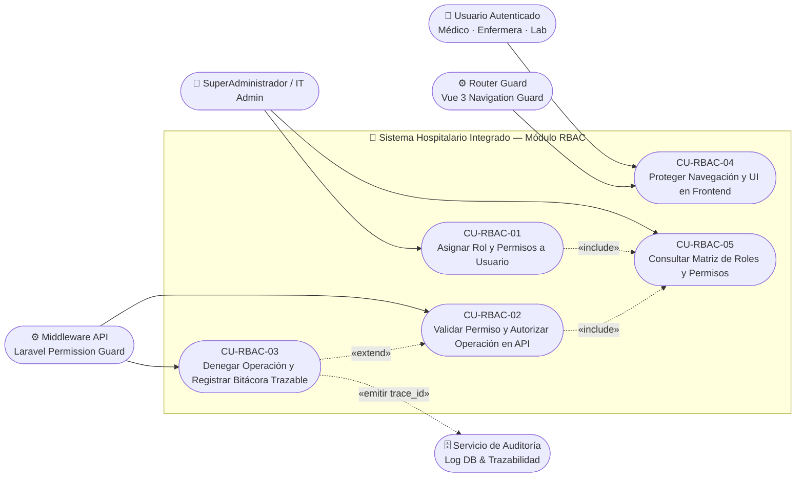
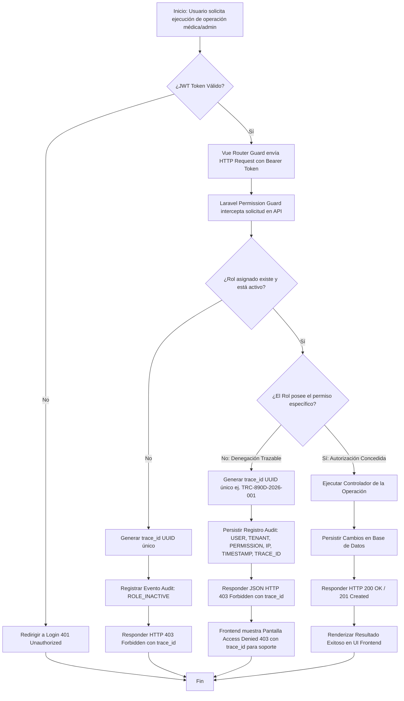
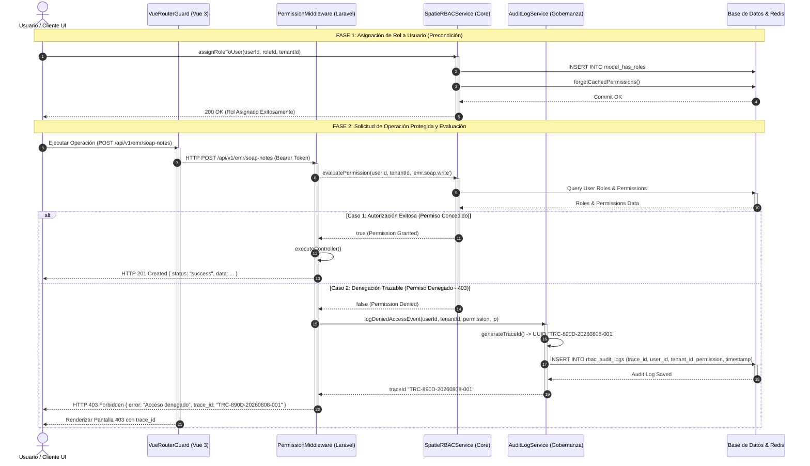

# Repositorio Evaluado: RBAC (Roles, Permisos y Protección de Rutas)

---

## 📌 Portada Oficial de Entrega

* **Estudiante:** LUIS DAVID AROCHE CONTRERAS
* **Usuario GitHub:** [`Luis890D`](https://github.com/Luis890D)
* **Nombre del Repositorio:** `RBAC_roles_permisos_y_proteccion_de_rutas_Luis_Aroche`
* **URL Oficial del Repositorio:** [`https://github.com/Luis890D/RBAC_roles_permisos_y_proteccion_de_rutas_Luis_Aroche`](https://github.com/Luis890D/RBAC_roles_permisos_y_proteccion_de_rutas_Luis_Aroche)
* **Rama Evaluada:** `main`
* **Etiqueta / Tag Evaluado:** `v1.0.0`
* **Módulo Oficial:** RBAC: roles, permisos y protección de rutas
* **Alcance Usado en la Actividad:** RBAC: roles, permisos y protección de rutas
* **Curso:** Análisis de Sistemas II (ASII) — 2026
* **Institución:** Universidad (ASII)

---

## 🎯 Consigna Individual Resuelta

> **"Modele el proceso «asignación de rol, autorización de una operación y denegación trazable». El diagrama de casos de uso debe delimitar actores y objetivo; el de actividad debe incluir decisiones, excepciones y resultado; el de secuencia debe mostrar participantes, mensajes, validaciones y respuesta. Mantenga trazabilidad entre los tres diagramas."**

---

## 📁 Estructura del Repositorio y Fuentes Editables

```text
RBAC_roles_permisos_y_proteccion_de_rutas_Luis_Aroche/
├── .gitignore
├── .env.example                                 # Configuración de entorno (sin secretos)
├── README.md                                    # Portada Oficial y Documento Principal
├── DECLARACION_IA.md                            # Declaración transparente de uso de IA
├── composer.json                                # Dependencias PHP (PHPUnit dev)
├── phpunit.xml                                  # Configuración de pruebas automatizadas
├── bootstrap.php                                # DI manual: autoloader + PDO + contenedor
│
├── src/                                         # Código fuente PHP 8.2+ vanilla
│   ├── Domain/                                  # Capa de Dominio (pura, sin dependencias)
│   │   ├── Entity/
│   │   │   ├── User.php                         # Entidad Usuario
│   │   │   ├── Role.php                         # Entidad Rol
│   │   │   ├── Permission.php                   # Value Object Permiso
│   │   │   └── AuditLog.php                     # Entidad de Auditoría trazable
│   │   ├── Exception/
│   │   │   ├── AccessDeniedException.php        # Denegación con trace_id
│   │   │   ├── RoleNotFoundException.php
│   │   │   └── UserNotFoundException.php
│   │   └── Repository/                          # Interfaces (puertos)
│   │       ├── UserRepositoryInterface.php
│   │       ├── RoleRepositoryInterface.php
│   │       └── AuditLogRepositoryInterface.php
│   │
│   ├── Application/                             # Capa de Aplicación (casos de uso)
│   │   ├── UseCase/
│   │   │   ├── AssignRoleUseCase.php            # CU-RBAC-01
│   │   │   └── AuthorizeOperationUseCase.php    # CU-RBAC-02 / CU-RBAC-03
│   │   └── DTO/
│   │       ├── AssignRoleRequest.php
│   │       ├── AuthorizeRequest.php
│   │       └── AuthorizeResponse.php
│   │
│   ├── Persistence/                             # Capa de Persistencia (adaptadores PDO)
│   │   ├── PdoUserRepository.php
│   │   ├── PdoRoleRepository.php
│   │   └── PdoAuditLogRepository.php
│   │
│   └── Presentation/                            # Capa de Presentación (CLI)
│       └── CliRunner.php                        # Ejecuta los 3 escenarios demostrables
│
├── database/
│   ├── schema.sql                               # Esquema SQLite (6 tablas + índices)
│   └── seed.sql                                 # Datos ficticios (usuarios, roles, permisos)
│
├── tests/
│   ├── Stub/                                    # Dobles de prueba (sin BD real)
│   │   ├── InMemoryUserRepository.php
│   │   ├── InMemoryRoleRepository.php
│   │   └── InMemoryAuditLogRepository.php
│   └── Unit/
│       ├── AuthorizeOperationTest.php           # 4 pruebas: happy path, dominio, persistencia
│       └── AssignRoleTest.php                   # 4 pruebas: happy path, dominio, usuario, persistencia
│
└── docs/
    ├── INFORME_EVALUACION_RBAC.md               # Informe Técnico Completo
    ├── README-INSTALACION-BACKEND.md            # Guía de instalación PHP
    ├── PlantUML/                                # Fuentes Editables PlantUML (.puml)
    │   ├── casodeuso_rbac.puml
    │   ├── actividad_rbac.puml
    │   └── secuencia_rbac.puml
    └── diagramas/                               # Fuentes Editables Mermaid (.mmd)
        ├── casodeuso_rbac.mmd
        ├── actividad_rbac.mmd
        └── secuencia_rbac.mmd
```

---

## 🚀 Instrucciones de Ejecución

### Requisitos

- PHP 8.2+ (XAMPP en Windows o nativo en Linux/macOS)
- Composer (para PHPUnit)
- SQLite incluido en PHP por defecto

### 1. Instalar dependencias de desarrollo

```bash
composer install
```

### 2. Ejecutar demostración CLI (los 3 escenarios del flujo RBAC)

```bash
php src/Presentation/CliRunner.php
```

**Salida esperada:**

```
════════════════════════════════════════════════════════════
   Micro-HIS RBAC — Demostración de Flujos
   Estudiante: Luis David Aroche Contreras (Luis890D)
════════════════════════════════════════════════════════════

── Escenario 1: Asignación de Rol ──────────────────────────
[ASSIGN OK]  Rol 'medico' (id=1) asignado a 'dr.garcia' (id=1)

── Escenario 2: Autorización Exitosa (Happy Path) ──────────
[ALLOW  200]  dr.garcia → emr.soap.write
              → HTTP 200 OK | Operación autorizada correctamente.

── Escenario 3: Denegación Trazable ────────────────────────
[DENY   403]  dr.garcia → admin.user.delete
              → HTTP 403 Forbidden
              → trace_id: TRC-890D-20260821-XXXXXX

── Auditoría persistida en base de datos ────────────────────
  ✗ [DENIED] user=1 perm=admin.user.delete ip=192.168.10.55 trace=TRC-890D-20260821-XXXXXX
```

### 3. Ejecutar pruebas unitarias

```bash
./vendor/bin/phpunit tests/ --testdox
```

**Resultado esperado:** 8 pruebas, 0 fallos.

---

## 📊 Visualización de Diagramas UML

### 1. Diagrama de Casos de Uso (Delimitación de Actores y Objetivos)



---

### 2. Diagrama de Actividad (Decisiones, Excepciones y Denegación Trazable)



---

### 3. Diagrama de Secuencia (Participantes, Mensajes y Respuesta Trazable)



---

## 🔗 Matriz de Trazabilidad UML

| Caso de Uso | Nodo en Diagrama de Actividad | Mensaje en Diagrama de Secuencia | Justificación |
|---|---|---|---|
| **CU-RBAC-01** (Asignar Rol) | `:Seleccionar Usuario y Asignar Rol en el Tenant` | `assignRoleToUser()` & `forgetCachedPermissions()` | Sincronización inmediata de permisos. |
| **CU-RBAC-02** (Autorizar Operación) | `:¿El Rol posee el permiso específico?` (Sí) | `evaluatePermission() -> true` & `HTTP 201 Created` | Continuidad del flujo asistencial autorizado. |
| **CU-RBAC-03** (Denegación Trazable) | `:Generar trace_id` & `:Persistir Registro Audit` | `logDeniedAccessEvent()` & `HTTP 403 Forbidden con trace_id` | Trazabilidad completa auditada en base de datos. |
| **CU-RBAC-04** (Protección UI) | `:Redirigir a Login 401` / `:Pantalla 403` | `RouterGuard` & `Renderizar Pantalla 403 con trace_id` | Protección defensiva en capas. |

---

## 🤖 Declaración Transparente de Uso de IA

* **Herramienta:** Antigravity AI Agent (Google DeepMind / Gemini 3.6 Flash).
* **Propósito:** Estructuración sintáctica PlantUML/Mermaid y formato de documentación técnica.
* **Validación Humana:** El estudiante revisó y ajustó el modelo multi-tenant, la invalidación de caché Spatie y el identificador `trace_id`.

---

## 📜 Evidencia Git Verificada (`git log --oneline`)

```text
d0130b7 (HEAD -> main, tag: v1.1.0) fix(persistence): corregir alias SQL en PdoUserRepository y require en CliRunner
af4e249 feat(src): implementar capas Domain y Application RBAC — entidades, excepciones, interfaces y casos de uso
8ad3f4c docs(readme): agregar evidencia verificada de git log e historial de commits
6b2983a docs(informe): actualizar hashes reales de git log
358dce8 (tag: v1.0.0) chore(release): preparar portada oficial y crear etiqueta v1.0.0
73b6ee1 docs(informe): consolidar matriz de trazabilidad, declaracion de IA y guia de defensa oral
a46ca2f docs(uml): agregar diagrama de secuencia con autorizacion y denegacion trazable
096a0d2 docs(uml): agregar diagrama de actividad con flujo de decisiones, excepciones y trazabilidad
7dc7a86 docs(uml): agregar diagrama de casos de uso (PlantUML y Mermaid) y delimitacion de actores
e79ff4a feat(init): inicializar repositorio RBAC y estructura de documentos
```

* **Etiqueta Evaluada (código ejecutable):** `v1.1.0` (`Código PHP 8.2 RBAC ejecutable — 8 pruebas PHPUnit OK`)
* **Etiqueta Previa (solo UML):** `v1.0.0`

---

## 🛠️ Comandos Git de Creación y Sincronización Remota

Para verificar y subir este repositorio a GitHub (`Luis890D`):

```bash
# 1. Verificar estado del repositorio e historial
git status
git log --oneline

# 2. Verificar la etiqueta evaluada
git tag -n

# 3. Vincular con el repositorio remoto de GitHub y publicar
git remote add origin https://github.com/Luis890D/RBAC_roles_permisos_y_proteccion_de_rutas_Luis_Aroche.git
git branch -M main
git push -u origin main --tags
```
