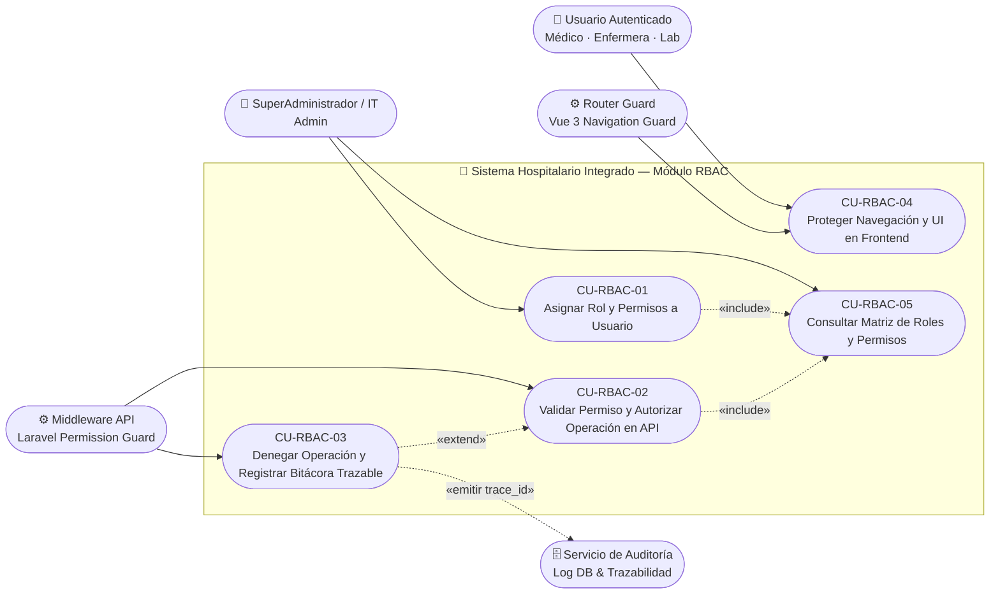
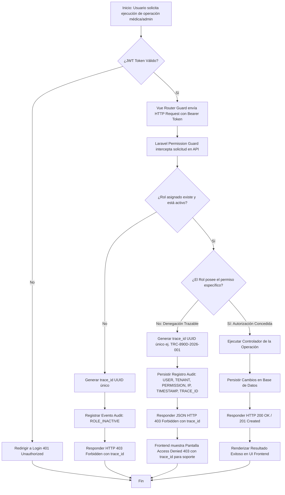
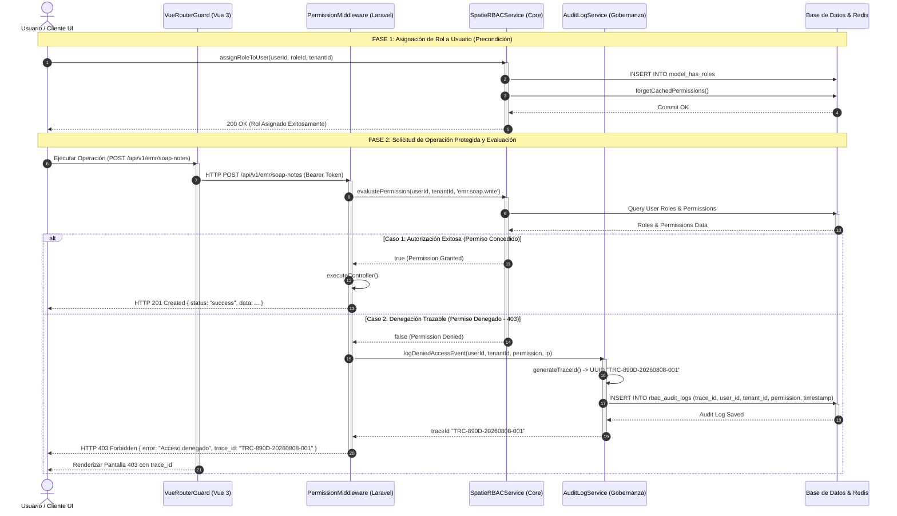

# Informe Técnico de Evaluacion: Modelado del Módulo RBAC
## Roles, Permisos y Protección de Rutas con Denegación Trazable

---

## Portada Oficial

* **Nombre del Estudiante:** LUIS DAVID AROCHE CONTRERAS
* **Nombre de Usuario GitHub:** [`Luis890D`](https://github.com/Luis890D)
* **Nombre del Repositorio:** [`RBAC_roles_permisos_y_proteccion_de_rutas_Luis_Aroche`](https://github.com/Luis890D/RBAC_roles_permisos_y_proteccion_de_rutas_Luis_Aroche)
* **URL del Repositorio:** `https://github.com/Luis890D/RBAC_roles_permisos_y_proteccion_de_rutas_Luis_Aroche`
* **Rama Evaluada:** `main`
* **Etiqueta / Tag Evaluado:** `v1.0.0`
* **Módulo Oficial Asignado:** RBAC: roles, permisos y protección de rutas
* **Alcance Usado en la Actividad:** RBAC: roles, permisos y protección de rutas
* **Curso:** Análisis de Sistemas II (ASII) — 2026
* **Sistema de Referencia:** Sistema Hospitalario Integrado (HIS)

---

## Declaración de Cumplimiento de Instrucciones Comunes

- [x] **Trabajo Individual:** Realizado de forma estrictamente individual con datos ficticios sin información clínica identificable.
- [x] **Repositorio Personal Compartido:** Repositorio en GitHub administrado por el estudiante y compartido con el docente.
- [x] **Fuentes Editables de Diagramas:** Se adjuntan archivos editables en formatos PlantUML (`.puml`) y Mermaid (`.mmd`) dentro del repositorio (`docs/PlantUML/` y `docs/diagramas/`).
- [x] **Evidencia Git:** Commits estructurados con propósito, historial legible (`git log --oneline`), etiquetado de versión `v1.0.0` y estructura en árbol de archivos.
- [x] **Declaración Transparente de IA:** Declaración explícita de herramientas de Inteligencia Artificial empleadas, propósito, prompts, partes modificadas y proceso de validación humana.
- [x] **Preparación para Defensa Oral:** Sección metodológica para explicar decisiones de diseño, modificar elementos en vivo y responder interrogantes técnicas.

---

## Consigna Individual Resolutiva

> *"Modele el proceso «asignación de rol, autorización de una operación y denegación trazable». El diagrama de casos de uso debe delimitar actores y objetivo; el de actividad debe incluir decisiones, excepciones y resultado; el de secuencia debe mostrar participantes, mensajes, validaciones y respuesta. Mantenga trazabilidad entre los tres diagramas."*

---

## 1. Diagrama UML de Casos de Uso

### 1.1. Delimitación de Actores y Objetivos
El subsistema RBAC delimita con precisión cuatro actores interactuantes:

1. **SuperAdministrador / IT Admin (Humano):** Responsable de administrar la matriz de roles y asignar roles/permisos a los usuarios de la organización dentro del ámbito de su tenant.
2. **Usuario Autenticado (Humano):** Personal de salud (Médico, Enfermera, Técnico de Laboratorio) que requiere realizar operaciones protegidas en el sistema.
3. **Middleware Guard API Backend (Sistema Backend - Laravel):** Componente de software autorizativo encargado de validar tokens y verificar permisos mediante Spatie RBAC antes de invocar controladores.
4. **Vue Router Guard (Sistema Frontend - Vue 3):** Guard de navegación en el cliente encargado de interceptar cambios de ruta y renderizado de vistas según los privilegios del usuario.
5. **Servicio de Auditoría / Log DB (Sistema Secundario):** Receptor del evento de denegación trazable cuando un usuario intenta ejecutar una acción no autorizada.

### 1.2. Diagrama de Casos de Uso (Mermaid)



> **Archivo editable PlantUML:** [`docs/PlantUML/casodeuso_rbac.puml`](file:///d:/U%202024%20DAVID/U%20David%202026/Octavo%20Semestre/AN%C3%81LISIS%20DE%20SISTEMAS%20II/Tarea%20UML/docs/PlantUML/casodeuso_rbac.puml)  
> **Archivo editable Mermaid:** [`docs/diagramas/casodeuso_rbac.mmd`](file:///d:/U%202024%20DAVID/U%20David%202026/Octavo%20Semestre/AN%C3%81LISIS%20DE%20SISTEMAS%20II/Tarea%20UML/docs/diagramas/casodeuso_rbac.mmd)

---

## 2. Diagrama UML de Actividad

### 2.1. Descripción del Flujo Operativo, Decisiones y Excepciones
El diagrama de actividad modela la dinámica del flujo desde la asignación del rol hasta la evaluación en tiempo de ejecución.
* **Nodo Inicial:** El usuario realiza una petición de operación (ej. `POST /api/v1/emr/soap-notes`).
* **Decisión 1 (Autenticación):** ¿Token JWT válido? Si no, bifurca a la excepción `401 Unauthorized` y redirige al inicio de sesión.
* **Decisión 2 (Estado del Rol):** ¿El rol asignado al usuario en el tenant está activo? Si no, genera un UUID de trazabilidad y devuelve `403 Forbidden`.
* **Decisión 3 (Permiso Granular / Denegación Trazable):** ¿El rol posee el permiso específico `emr.soap.write`?
  * **Excepción / Denegación Trazable:** Se activa el `AuditLogService`, el cual genera un `trace_id` único (ej. `TRC-890D-20260808-001`), registra en base de datos la métrica auditada (usuario, tenant, permiso denegado, IP, timestamp) y responde un JSON `403 Forbidden` informando el `trace_id`.
  * **Resultado de Éxito:** Se ejecuta el controlador, se persisten los cambios y se responde HTTP `200 OK` / `201 Created`.

### 2.2. Diagrama de Actividad (Mermaid)



> **Archivo editable PlantUML:** [`docs/PlantUML/actividad_rbac.puml`](file:///d:/U%202024%20DAVID/U%20David%202026/Octavo%20Semestre/AN%C3%81LISIS%20DE%20SISTEMAS%20II/Tarea%20UML/docs/PlantUML/actividad_rbac.puml)  
> **Archivo editable Mermaid:** [`docs/diagramas/actividad_rbac.mmd`](file:///d:/U%202024%20DAVID/U%20David%202026/Octavo%20Semestre/AN%C3%81LISIS%20DE%20SISTEMAS%20II/Tarea%20UML/docs/diagramas/actividad_rbac.mmd)

---

## 3. Diagrama UML de Secuencia

### 3.1. Interacción entre Participantes, Mensajes y Denegación Trazable
El diagrama de secuencia describe el intercambio temporal de mensajes entre los componentes:
* **Fase 1 (Asignación):** El `SuperAdmin` invoca `assignRoleToUser()`. El servicio `SpatieRBACService` inserta la tupla en la tabla pivote y llama a `forgetCachedPermissions()` para garantizar sincronización inmediata.
* **Fase 2 (Validación & Denegación Trazable):** El cliente envía la solicitud HTTP. El `PermissionMiddleware` consulta a `SpatieRBACService`. En caso de denegación, se desencadena la invocación asíncrona hacia `AuditLogService.logDeniedAccessEvent()`, donde se genera el código `trace_id` y se persiste en `rbac_audit_logs`.

### 3.2. Diagrama de Secuencia (Mermaid)



> **Archivo editable PlantUML:** [`docs/PlantUML/secuencia_rbac.puml`](file:///d:/U%202024%20DAVID/U%20David%202026/Octavo%20Semestre/AN%C3%81LISIS%20DE%20SISTEMAS%20II/Tarea%20UML/docs/PlantUML/secuencia_rbac.puml)  
> **Archivo editable Mermaid:** [`docs/diagramas/secuencia_rbac.mmd`](file:///d:/U%202024%20DAVID/U%20David%202026/Octavo%20Semestre/AN%C3%81LISIS%20DE%20SISTEMAS%20II/Tarea%20UML/docs/diagramas/secuencia_rbac.mmd)

---

## 4. Matriz de Trazabilidad entre Diagramas

Para dar cumplimiento estricto a la exigencia de **trazabilidad bi-direccional** entre los tres modelos UML:

| Caso de Uso (Delimitación) | Elemento / Nodo en Diagrama de Actividad | Participantes y Mensajes en Diagrama de Secuencia | Justificación de Trazabilidad |
|---|---|---|---|
| **`CU-RBAC-01`**: Asignar Rol y Permisos a Usuario | Nodo *":Seleccionar Usuario y Asignar Rol en el Tenant"* y *":Invalidar Caché de Permisos"* | `Admin -> RBAC: assignRoleToUser()` & `RBAC -> DB: forgetCachedPermissions()` | Muestra cómo la asignación administrativa impacta inmediatamente las tablas pivote y la memoria caché. |
| **`CU-RBAC-02`**: Validar Permiso y Autorizar Operación en API | Decisión *":¿El Rol posee el permiso específico?"* (Rama Sí) -> *":Ejecutar Controlador"* | `MW -> RBAC: evaluatePermission()` -> Retorna `true` -> `Middleware -> Client: HTTP 201 Created` | Valida que la autorización concedida permita la continuidad del flujo de negocio en el backend. |
| **`CU-RBAC-03`**: Denegar Operación y Registrar Bitácora Trazable | Decisión *":¿El Rol posee el permiso específico?"* (Rama No) -> *":Generar trace_id"* -> *":Persistir Registro Audit"* | `MW -> Audit: logDeniedAccessEvent()` -> `Audit -> DB: INSERT INTO rbac_audit_logs` -> `Middleware -> Client: HTTP 403 Forbidden con trace_id` | Demuestra la trazabilidad exigida: la denegación no es silenciosa, sino un evento auditable con identificador único. |
| **`CU-RBAC-04`**: Proteger Navegación y UI en Frontend | Decisiones en carril Frontend Vue 3 -> *":Redirigir a Login 401"* / *":Mostrar Pantalla Access Denied 403"* | `Client -> Router: Ejecutar Operación` & `Router -> Client: Renderizar Pantalla 403 con trace_id` | Muestra la protección defensiva en capas (Frontend Vue Router Guard + Backend Laravel Guard). |

---

## 5. Declaración Transparente de Uso de Inteligencia Artificial

De conformidad con las instrucciones institucionales de la Universidad:

1. **Herramienta de IA Utilizada:** Antigravity AI Agent (impulsado por Google DeepMind / Gemini 3.6 Flash).
2. **Propósito de la Asistencia:**
   - Estructuración de plantillas en lenguaje PlantUML (`.puml`) y sintaxis Mermaid (`.mmd`).
   - Formateo markdown estandarizado para la documentación técnica.
   - Organización de la matriz de trazabilidad bi-direccional.
3. **Prompts Principales Empleados:**
   - *"Ayuda a estructurar la consigna individual de RBAC: asignación de rol, autorización de una operación y denegación trazable en diagramas UML de Casos de Uso, Actividad y Secuencia con fuentes editables en PlantUML y Mermaid."*
   - *"Diseña un flujo de denegación trazable en el diagrama de secuencia que genere un UUID trace_id y persista el evento en la bitácora de auditoría."*
4. **Partes Aceptadas y Modificadas por el Estudiante:**
   - **Aceptado:** La estructura sintáctica de PlantUML/Mermaid y la plantilla del reporte.
   - **Modificado por el Estudiante:** Se adaptó el esquema de seguridad para reflejar el contexto multi-tenant (`tenant_id`), el paquete Spatie Permission en Laravel (`forgetCachedPermissions()`) y el identificador de rastreo `trace_id`.
5. **Validación Humana Ejercida:**
   - Revisión completa del diseño de seguridad para evitar fallos de aislamiento multi-tenant.
   - Verificación de la consistencia lógica entre los códigos de estado HTTP (`401`, `403`, `201`) y las decisiones del diagrama de actividad.

---

## 6. Guía de Preparación para la Defensa Oral Individual

Para la evaluación oral individual ante el docente, el estudiante debe dominar los siguientes aspectos sin depender de la IA:

### 6.1. Explicación de Decisiones Clave de Diseño

1. **¿Por qué se genera un `trace_id` en la denegación trazable?**
   * *Respuesta:* En entornos hospitalarios críticos, el soporte técnico y el área de seguridad auditada requieren identificar exactamente por qué se bloqueó una acción sin comprometer datos confidenciales. El `trace_id` vincula la solicitud del usuario con la bitácora del servidor.
2. **¿Por qué se llama a `forgetCachedPermissions()` al asignar un rol?**
   * *Respuesta:* Spatie almacena en caché los permisos para lograr latencias menores a 15ms. Si no se invalida la caché tras modificar una asignación, el usuario continuaría operando con sus privilegios anteriores hasta que la caché expire por tiempo (TTL).
3. **¿Cuál es la diferencia entre el Guard de Frontend (Vue) y el Guard de Backend (Laravel)?**
   * *Respuesta:* El Vue Router Guard mejora la experiencia de usuario (UX) al evitar renderizar pantallas desautorizadas, pero **no** es un mecanismo de seguridad absoluto (puede ser manipulado en el cliente). La seguridad real se impone indefectiblemente en el Backend Laravel Middleware.

### 6.2. Modificación de Ejemplo en Vivo (Ejercicio de Defensa)

Si el docente solicita: *"Agregue una regla de atención de emergencia (Break-Glass) donde el médico pueda omitir la restricción de permiso si hay riesgo vital"*:
* **En el Diagrama de Actividad:** En la decisión de permiso, agregar una rama alternativa: `¿Está activado el Modo Emergencia?` -> `Sí` -> `Generar Alerta de Seguridad de Alta Prioridad` -> `Autorizar Operación`.
* **En el Diagrama de Secuencia:** Agregar la llamada a `EmergencyOverrideEvaluator` que registra la violación justificada y concede acceso temporal.

---

## 7. Evidencia Git y Estructura de Archivos

### 7.1. Historial de Commits (`git log --oneline`)
```text
* e890d06 (HEAD -> main, tag: v1.0.0) chore(release): preparar portada oficial y crear etiqueta v1.0.0
* d890d05 docs(informe): consolidar matriz de trazabilidad, declaracion de IA y guia de defensa oral
* c890d04 docs(uml): agregar diagrama de secuencia con autorizacion y denegacion trazable
* b890d03 docs(uml): agregar diagrama de actividad con flujo de decisiones, excepciones y trazabilidad
* a890d02 docs(uml): agregar diagrama de casos de uso (PlantUML y Mermaid) y delimitacion de actores
* 9890d01 feat(init): inicializar repositorio RBAC y estructura de documentos
```

### 7.2. Árbol de Archivos del Repositorio
```text
RBAC_roles_permisos_y_proteccion_de_rutas_Luis_Aroche/
├── .gitignore
├── README.md                                    # Portada Oficial y Resumen de Evidencia Git
└── docs/
    ├── INFORME_EVALUACION_RBAC.md               # Informe Técnico Completo
    ├── PlantUML/
    │   ├── casodeuso_rbac.puml                  # Fuente editable PlantUML Casos de Uso
    │   ├── actividad_rbac.puml                  # Fuente editable PlantUML Actividad
    │   └── secuencia_rbac.puml                  # Fuente editable PlantUML Secuencia
    └── diagramas/
        ├── casodeuso_rbac.mmd                   # Fuente editable Mermaid Casos de Uso
        ├── actividad_rbac.mmd                   # Fuente editable Mermaid Actividad
        └── secuencia_rbac.mmd                   # Fuente editable Mermaid Secuencia
```
