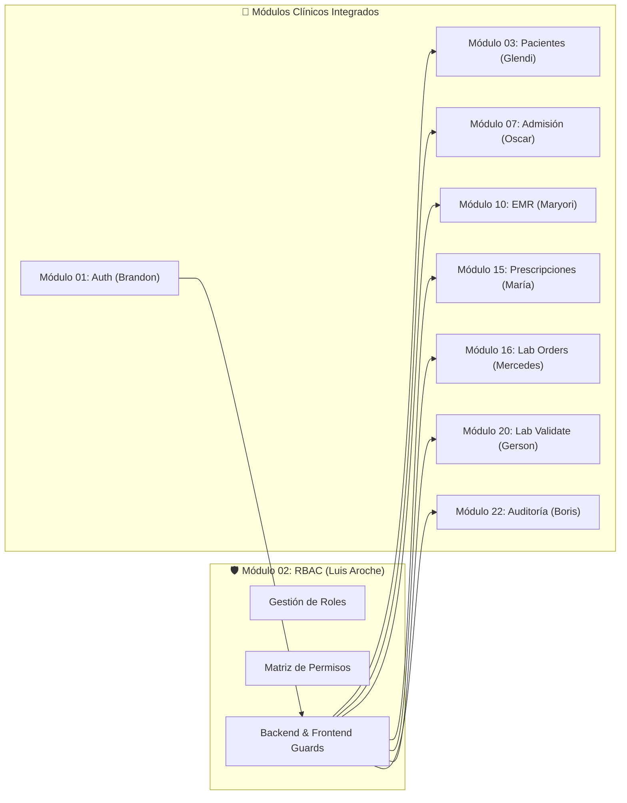

# Módulo 02: RBAC — Roles, Permisos y Protección de Rutas
## Sistema Hospitalario Integrado (HIS) — Documentación Oficial

**Curso:** Análisis de Sistemas II (ASII) — Ciclo 2026  
**Estudiante:** Luis David Aroche Contreras (`Luis890D`)  
**Módulo Asignado:** Módulo 02 — Control de Acceso Basado en Roles (RBAC), Permisos y Protección de Rutas  
**Rama de Trabajo:** `feature/asii-02-rbac-roles-permisos-y-proteccion-de-rutas-luis890d`  
**Worktree Base:** `shi-documentacion-rbac-Luis-Aroche`  

---

## 📌 Organización Semanal de la Documentación (Semanas 1 a 18)

La documentación se encuentra estructurada modularmente en carpetas dedicadas para cada semana del semestre, permitiendo una rápida auditoría, trazabilidad y verificación de entregables:

### 🚀 Bloque Parcial 1: Conceptos, UML y Arquitectura (Semanas 1 a 6)

| Semana | Tema ASII | Documentos y Entregables | Carpeta | Estado |
|:---:|---|---|:---:|:---:|
| **Semana 01** | Orientación a Objetos y Casos de Uso | • [`semana-01-actores-alcance-casos-de-uso.md`](semana-01/semana-01-actores-alcance-casos-de-uso.md) • [`HIS_Arquitectura_RBAC.md`](semana-01/HIS_Arquitectura_RBAC.md) | [📂 `semana-01/`](semana-01/README.md) | ✅ **Completado** |
| **Semana 02** | Requerimientos, BDD, SOLID e Infraestructura | • [`semana-02-rf-rnf-criterios-aceptacion-solid.md`](semana-02/semana-02-rf-rnf-criterios-aceptacion-solid.md) • [`01-diagrama-infraestructura-red-y-servidores.md`](semana-02/01-diagrama-infraestructura-red-y-servidores.md) • [`02-diagrama-procesos-general-hospital-rbac.md`](semana-02/02-diagrama-procesos-general-hospital-rbac.md) • [`diagrama-infraestructura-y-procesos-globales.md`](semana-02/diagrama-infraestructura-y-procesos-globales.md) | [📂 `semana-02/`](semana-02/README.md) | ✅ **Completado** |
| **Semana 03** | Diseño Arquitectónico C4 y Patrones | • [`semana-03-arquitectura-vistas-patrones.md`](semana-03/semana-03-arquitectura-vistas-patrones.md) (C1, C2, C3, Dependencias HIS) | [📂 `semana-03/`](semana-03/README.md) | ✅ **Completado** |
| **Semana 04** | Arquitectura en Capas y Patrón Repositorio | • [`semana-04-arquitectura-capas-repositorio.md`](semana-04/semana-04-arquitectura-capas-repositorio.md) • [`TAREA_ARQUITECTURA_REPOSITORY_RBAC.md`](semana-04/TAREA_ARQUITECTURA_REPOSITORY_RBAC.md) • [`esquema-tablas-y-plan-de-implementacion.md`](semana-04/esquema-tablas-y-plan-de-implementacion.md) | [📂 `semana-04/`](semana-04/README.md) | ✅ **Completado** |
| **Semana 05** | API REST, RFC 7807 y Plan Git Worktree | • [`semana-05-api-rest-contrato-integracion.md`](semana-05/semana-05-api-rest-contrato-integracion.md) • [`plan-de-implementacion-rbac.md`](semana-05/plan-de-implementacion-rbac.md) | [📂 `semana-05/`](semana-05/README.md) | ✅ **Completado** |
| **Semana 06** | **Primera Evaluación Parcial** | Defensa teórica y caso práctico arquitectónico del bloque Parcial 1. | [📂 `semana-06/`](semana-06/README.md) | ⏳ **Pendiente** |

---

### 🎨 Bloque Parcial 2: Componentes, UX y Movilidad (Semanas 7 a 12)

| Semana | Tema ASII | Documentos y Entregables | Carpeta | Estado |
|:---:|---|---|:---:|:---:|
| **Semana 07** | Diseño de Componentes y Refactorización | • [`semana-07-diseno-componentes-refactorizacion.md`](semana-07/semana-07-diseno-componentes-refactorizacion.md) (Diagrama de componentes, catálogo, refactorización SOLID) | [📂 `semana-07/`](semana-07/README.md) | ✅ **Completado** |
| **Semana 08** | Diseño de Experiencia de Usuario (UX) | • [`semana-08-ux-user-flow.md`](semana-08/semana-08-ux-user-flow.md) (User flow por rol, wireframes, estados del sistema, microcopy) | [📂 `semana-08/`](semana-08/README.md) | ✅ **Completado** |
| **Semana 09** | Evaluación de Usabilidad y Accesibilidad | • [`semana-09-usabilidad-accesibilidad.md`](semana-09/semana-09-usabilidad-accesibilidad.md) (Heurísticas Nielsen, checklist WCAG 2.1 AA, matriz hallazgos) | [📂 `semana-09/`](semana-09/README.md) | ✅ **Completado** |
| **Semana 10** | Diseño para Movilidad | • [`semana-10-responsive-movilidad.md`](semana-10/semana-10-responsive-movilidad.md) (Breakpoints, layouts smartphone/tablet, escenarios móviles) | [📂 `semana-10/`](semana-10/README.md) | ✅ **Completado** |
| **Semana 11** | Mockups y Prototipo Navegable | • [`semana-11-mockups-prototipo.md`](semana-11/semana-11-mockups-prototipo.md) (Tokens de diseño, componentes UI, pantallas desktop/tablet, micro-animaciones) | [📂 `semana-11/`](semana-11/README.md) | ✅ **Completado** |
| **Semana 12** | **Segunda Evaluación Parcial** | Defensa teórica y práctica de Componentes, UX y Movilidad. | [📂 `semana-12/`](semana-12/README.md) | ⏳ **Pendiente** |

---

### 🛡️ Bloque Evaluación Final: Calidad, Seguridad y Despliegue (Semanas 13 a 18 — Planificado)

| Semana | Tema ASII | Entregable Planificado | Estado |
|:---:|---|---|:---:|
| **Semana 13** | Calidad de Software y Revisiones Técnicas | Plan FTR (Formal Technical Review), checklist y bitácora. | ⏳ Planificado |
| **Semana 14** | Confiabilidad y Plan SQA | Plan de aseguramiento de calidad (SQA), métricas y riesgos. | ⏳ Planificado |
| **Semana 15** | Pruebas Unitarias, Caja Blanca y Negra | Suites automatizadas (PHPUnit/Pest + Vitest) y cobertura de RF/RNF. | ⏳ Planificado |
| **Semana 16** | Pruebas de Integración y Entrega Funcional | Integración de RBAC con módulos clínicos en staging y bitácora. | ⏳ Planificado |
| **Semana 17** | Modelado de Amenazas y Seguridad | Matriz STRIDE, validación de penetración, roles y aislamiento tenant. | ⏳ Planificado |
| **Semana 18** | **Evaluación Final y Defensa** | Demostración funcional completa, PR integrado y defensa individual. | ⏳ **Pendiente** |

---

## 📊 Documentos de Gobernanza y Consolidación Global

| Documento | Descripción / Propósito | Enlace |
|---|---|:---:|
| **📊 Diagrama de Gantt Completo (1–18)** | Cronograma oficial detallado por bloques, hitos críticos, fechas y trazabilidad. | [`gantt-rbac-completo.md`](gantt-rbac-completo.md) |
| **Asignación y Avance Semanas 1 y 2** | Ficha técnica individual, DoD, flujo Git Worktree y consolidación de S1 y S2. | [`asignacion-individual-semana-1-2.md`](asignacion-individual-semana-1-2.md) |
| **Asignación y Avance Semanas 3, 4 y 5** | Consolidación técnica Parcial 1: C4, capas, repositorio, API REST y plan Git. | [`asignacion-individual-semana-3-5.md`](asignacion-individual-semana-3-5.md) |
| **Asignación y Avance Semanas 7, 8 y 9** | Consolidación técnica Parcial 2: Componentes, Refactorización SOLID, UX y Accesibilidad WCAG 2.1 AA. | [`asignacion-individual-semana-7-9.md`](asignacion-individual-semana-7-9.md) |
| **Asignación y Avance Semanas 10 y 11** | Consolidación técnica Parcial 2: Diseño Responsive, Breakpoints, Tokens y Mockups de Alta Fidelidad. | [`asignacion-individual-semana-10-11.md`](asignacion-individual-semana-10-11.md) |
| **Declaración Transparente de Uso de IA** | Bitácora ética de prompts, intervenciones de ingeniería y commits asociados. | [`Planificacion/declaracion-ia-y-prompts.md`](Planificacion/declaracion-ia-y-prompts.md) |
| **Plan Técnico de Implementación** | Resumen de stack, componentes y migraciones iniciales. | [`Planificacion/implementation_plan.md`](Planificacion/implementation_plan.md) |

---

## 🛡️ Propósito y Alcance del Módulo RBAC

El módulo **RBAC** constituye el núcleo autorizativo y de seguridad transversal del **Sistema Hospitalario Integrado (HIS)**.

### Objetivos Clave:
1. **Seguridad Multi-Tenant:** Aislamiento estricto de roles y permisos por cada clínica/hospital mediante el identificador `X-Tenant-ID`.
2. **Protección de API Backend:** Middlewares en Laravel 12 (`role:name`, `permission:name`) que interceptan las peticiones HTTP a rutas protegidas bajo `/api/v1/` y deniegan accesos no autorizados (`403 Forbidden`).
3. **Protección de Navegación Frontend:** Guards en Vue 3 (`router.beforeEach`) y renderizado condicional en la interfaz mediante directivas (`v-can`, `hasPermission()`).
4. **Alto Rendimiento en Memoria:** Evaluación de privilegios en < 15 ms mediante almacenamiento en caché en **Redis 7.2+** con invalidación reactiva ante cambios de matriz.

---

## 🏗️ Stack Tecnológico del Módulo

- **Backend:** PHP 8.2+, Laravel 12, Spatie Laravel Permission, Stancl Tenancy, Tymon JWT-Auth.
- **Frontend:** Vue 3 (Composition API), Vite, Pinia (Auth & Permissions Store), Vue Router 4, Axios.
- **Caché y Mensajería:** Redis (Spatie Permission Cache & Blacklist JWT).
- **Persistencia:** MySQL 8.0+ / PostgreSQL 16.
- **Infraestructura:** Nginx (Reverse Proxy & TLS 1.3), Ubuntu Server 24.04 LTS.

---

## 🗺️ Mapa de Integración con el Sistema Hospitalario

