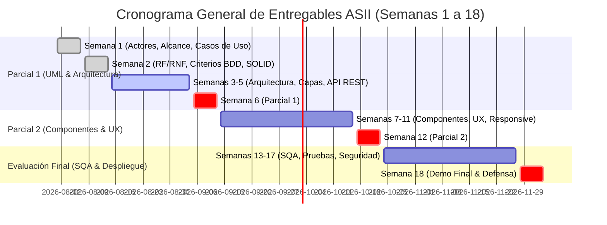
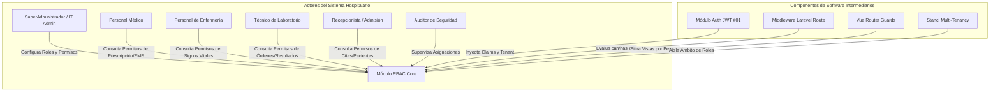
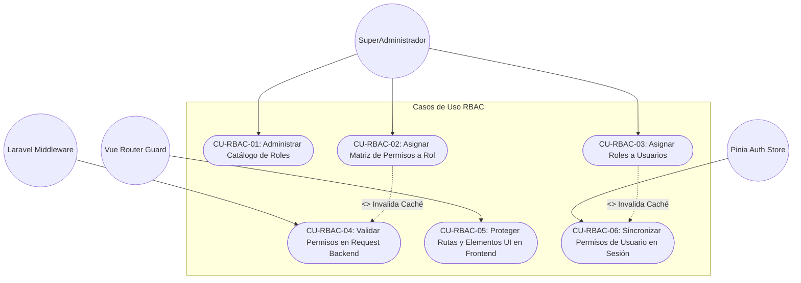

# Asignación Individual y Registro de Avance — Módulo RBAC (Semanas 1 y 2)

**Curso:** Análisis de Sistemas II (ASII) — Ciclo 2026  
**Sistema:** Sistema Hospitalario Integrado (HIS)  
**Institución:** Universidad / Facultad de Ingeniería en Sistemas  

---

## 1. Ficha Técnica de Asignación Individual

| Campo | Valor |
|---|---|
| **Estudiante** | **LUIS DAVID AROCHE CONTRERAS** |
| **GitHub** | [`@Luis890D`](https://github.com/Luis890D) |
| **Módulo Asignado** | **Módulo 02: RBAC (Roles, Permisos y Protección de Rutas)** |
| **Rama Sugerida** | `feature/asii-02-rbac-roles-permisos-y-proteccion-de-rutas-luis890d` |
| **Worktree Local** | `../shi-asii-02-rbac-roles-permisos-y-proteccion-de-rutas` |
| **Rama Base de Integración** | `origin/develop` |

---

## 2. Flujo de Trabajo Obligatorio (Worktree & Git Workflow)

Para garantizar aislamiento en el desarrollo y evitar colisiones entre ramas de los diferentes módulos del Sistema Hospitalario Integrado (HIS), se ejecuta el siguiente flujo estandarizado con Git Worktrees:

```bash
# 1. Obtener las últimas referencias del repositorio remoto
git fetch origin

# 2. Crear el worktree vinculado a la nueva rama basada en origin/develop
git worktree add ../shi-asii-02-rbac-roles-permisos-y-proteccion-de-rutas -b feature/asii-02-rbac-roles-permisos-y-proteccion-de-rutas-luis890d origin/develop

# 3. Acceder al directorio de trabajo aislado
cd ../shi-asii-02-rbac-roles-permisos-y-proteccion-de-rutas
```

### Reglas y Políticas de Flujo:
1. **Origen estricto:** Todo desarrollo debe iniciar y ramificarse a partir de `origin/develop`.
2. **Nomenclatura de ramas:** `feature/asii-XX-slug-usuario` (en este caso `feature/asii-02-rbac-roles-permisos-y-proteccion-de-rutas-luis890d`).
3. **Registro de Evidencia:** Adjuntar la evidencia semanal correspondiente en el Issue ASII asignado.
4. **Pull Requests (PR):** Abrir PR hacia `develop` únicamente cuando exista una unidad de trabajo verificable y documentada.
5. **Cierre de Issue:** No cerrar el Issue de forma manual mientras falten evidencias semanales, pruebas o integración pendiente.

---

## 3. Cronograma General y Evidencia Semanal Requerida



| Bloque / Semana | Entregable / Evidencia Requerida | Estado de Cumplimiento |
|---|---|:---:|
| **Semana 1** | **Actores, alcance, límites y casos de uso del módulo RBAC dentro del HIS.** | ✅ **Completado y Documentado** |
| **Semana 2** | **Requerimientos Funcionales (RF), No Funcionales (RNF), Criterios de Aceptación (BDD) y Ejemplos de Principios SOLID ([MVP Cluster](https://mvpcluster.com/diseno-de-software-2/)).** | ✅ **Completado y Documentado** |
| **Semanas 3-5** | Arquitectura, modelo en capas, diseño de contrato API REST y plan de integración. | ⏳ *Planificado / En curso* |
| **Semana 6** | Primera evaluación parcial: defensa conceptual, arquitectura y UML. | ⏳ *Pendiente* |
| **Semanas 7-11** | Diseño de componentes, refactorización, flujo UX, accesibilidad, diseño responsive y mockups interactivos. | ⏳ *Planificado* |
| **Semana 12** | Segunda evaluación parcial: componentes, UX y movilidad. | ⏳ *Pendiente* |
| **Semanas 13-17** | Revisión técnica formal, plan SQA, pruebas unitarias / integración / sistema, seguridad (roles, permisos, tenant) y despliegue. | ⏳ *Planificado* |
| **Semana 18** | Demo final funcional, PR integrado a `develop` y defensa individual. | ⏳ *Pendiente* |

---

## 4. Definition of Done (DoD)

Para considerar una fase o hito como completado satisfactoriamente, se auditan los siguientes criterios de calidad:

- [x] **RF/RNF documentados:** Especificación clara y detallada de capacidades funcionales y restricciones técnicas.
- [x] **Diseño de casos de uso y criterios de aceptación:** Escenarios estructurados bajo sintaxis Gherkin (Dado-Cuando-Entonces).
- [x] **Fundamentación SOLID:** Aplicación demostrada de principios de diseño orientado a objetos con base en MVP Cluster.
- [ ] **Diseño arquitectónico y de componentes:** Diagramas C4 / UML y modelos por capas (Semanas 3-5).
- [ ] **Contrato API documentado:** Endpoints, métodos HTTP, códigos de estado, esquemas JSON y políticas de autorización.
- [ ] **Implementación mínima funcional:** Código Backend (Laravel) y Frontend (Vue 3 / Pinia) en ejecución.
- [ ] **Pruebas y evidencia adjunta:** Suites de pruebas automatizadas y bitácora de ejecución.
- [ ] **Seguridad integral validada:** Aislamiento multi-tenant estricto (`tenant_id`), protección de rutas y mitigación de fugas de datos.
- [ ] **Pull Request hacia `develop`:** PR con descripción técnica completa, evidencia visual y resolución de revisiones.
- [ ] **Issue ASII registrado y actualizado:** Trazabilidad completa en la plataforma de gestión del curso.

---

## 5. Documentación Técnica — Semana 1: Actores, Alcance y Casos de Uso

### 5.1. Caracterización de Actores del Módulo RBAC



| Actor | Clasificación | Responsabilidades e Interacción con RBAC |
|---|---|---|
| **SuperAdministrador / IT Admin** | Humano (Directo) | Administra el catálogo de roles, asigna matrices de permisos por módulo y asocia roles a los usuarios del hospital/tenant. |
| **Personal Médico (General / Especialista)** | Humano (Consumidor) | Consume permisos granulares como `emr.soap.write`, `prescriptions.create`. No puede modificar roles. |
| **Personal de Enfermería** | Humano (Consumidor) | Consume permisos asistenciales (`vital_signs.create`, `triage.evaluate`, `beds.view`). |
| **Técnico de Laboratorio** | Humano (Consumidor) | Consume permisos de procesamiento clínico (`lab.orders.receive`, `lab.results.validate`). |
| **Recepcionista / Admisión** | Humano (Consumidor) | Consume permisos administrativos (`patients.create`, `appointments.schedule`). |
| **Auditor de Seguridad** | Humano (Supervisor) | Acceso de sólo lectura para consultar la matriz de privilegios y asignaciones históricas. |
| **Auth Subsystem (JWT)** | Sistema Externo | Valida la identidad del usuario y provee el payload criptográfico con `user_id` y `tenant_id`. |
| **Stancl Tenancy Engine** | Sistema Interno | Garantiza que las consultas de roles y permisos se ejecuten en el contexto de la base de datos de cada clínica. |

---

### 5.2. Alcance del Módulo (In Scope vs Out of Scope)

#### Dentro del Alcance (In Scope):
1. **Gestión de Roles del Tenant (CRUD):** Creación, modificación, consulta y desactivación de roles institucionales.
2. **Matriz de Permisos Granulares:** Asignación dinámica de permisos a roles organizados por módulos hospitalarios.
3. **Asignación de Roles a Usuarios:** Asociación de múltiples roles por usuario dentro de un tenant.
4. **Protección Middleware Backend:** Middlewares `role:*` y `permission:*` en Laravel para proteger endpoints `/api/v1/...`.
5. **Protección de Navegación Frontend:** `Vue Router Navigation Guards` (`router.beforeEach`) para restringir vistas.
6. **Directivas y Helpers de UI:** Directiva personalizada `v-can` y helper `hasPermission()` para renderizado condicional en componentes Vue 3.
7. **Caché Reactiva de Permisos:** Almacenamiento en Redis para evaluación ultrarrápida (< 15 ms) con invalidación automática ante cambios.

#### Fuera del Alcance (Out of Scope / Dependencias Externas):
- **Autenticación primaria y login con credenciales:** Responsabilidad del **Módulo #01 (Autenticación JWT)**.
- **Registro persistente de bitácora de auditoría histórica:** Responsabilidad del **Módulo #22 (Auditoría y Logs)**.
- **Lógica de negocio asistencial (Historias clínicas, citas, laboratorio):** Módulos verticales respectivos. RBAC sólo provee el veredicto de acceso (`Allow / Deny`).

---

### 5.3. Casos de Uso del Módulo RBAC (UML & Narrativa)



#### Resumen de Casos de Uso:
1. **CU-RBAC-01 — Administrar Catálogo de Roles:** El administrador crea y configura perfiles institucionales (médicos, enfermeros, etc.) aislados por tenant.
2. **CU-RBAC-02 — Asignar Matriz de Permisos a Rol:** El administrador marca o desmarca privilegios específicos mediante una matriz visual organizada por módulos.
3. **CU-RBAC-03 — Asignar Roles a Usuarios:** El administrador asocia uno o más roles al personal hospitalario activo.
4. **CU-RBAC-04 — Validar Permisos en Backend:** El Middleware intercepta peticiones entrantes, consulta la caché en Redis y permite (`200/201`) o bloquea (`403 Forbidden`).
5. **CU-RBAC-05 — Proteger Rutas y UI Frontend:** Vue Router verifica si el usuario posee los permisos requeridos antes de renderizar la vista, y `v-can` oculta botones restringidos.
6. **CU-RBAC-06 — Sincronizar Permisos en Sesión:** Al autenticarse o refrescar perfil, el frontend obtiene la lista consolidada de permisos para hidratar el estado reactivo.

---

## 6. Documentación Técnica — Semana 2: RF, RNF, Criterios de Aceptación y SOLID

### 6.1. Matriz de Requerimientos Funcionales (RF)

| Código | Requerimiento Funcional | Descripción Técnica | Prioridad |
|---|---|---|:---:|
| **RF-RBAC-01** | **Gestión de Roles por Tenant** | CRUD completo de roles (`id`, `name`, `guard_name`, `tenant_id`, `description`) garantizando unicidad por hospital. | **Alta** |
| **RF-RBAC-02** | **Matriz de Permisos a Roles** | Sincronización masiva (`syncPermissions`) de capacidades granulares a un rol seleccionado. | **Alta** |
| **RF-RBAC-03** | **Asignación de Roles a Usuarios** | Vinculación y desvinculación inmediata de roles al modelo `User` en la base de datos del tenant. | **Alta** |
| **RF-RBAC-04** | **Middleware de Protección API** | Interceptor HTTP en Laravel (`CheckPermissionMiddleware`) que valida privilegios y responde `403 Forbidden` si no se cumplen. | **Crítica** |
| **RF-RBAC-05** | **Guards de Navegación y UI Dinámica** | Protección de rutas en Vue Router 4 y control de renderizado en tiempo real con directiva personalizada `v-can`. | **Alta** |
| **RF-RBAC-06** | **Endpoint de Perfil de Permisos** | Servicio `GET /api/v1/rbac/my-permissions` que retorna roles, permisos y contexto multi-tenant del usuario activo. | **Crítica** |
| **RF-RBAC-07** | **Invalidación Reactiva de Caché** | Vaciado y refresco automático de la caché de permisos (`app()->make(PermissionRegistrar::class)->forgetCachedPermissions()`) al alterar matrices. | **Media** |

---

### 6.2. Matriz de Requerimientos No Funcionales (RNF)

| Código | Atributo | Requerimiento No Funcional | Métrica / Estándar |
|---|---|---|---|
| **RNF-RBAC-01** | **Seguridad** | **Aislamiento Multi-Tenant Estricto:** Prohibición absoluta de visibilidad cruzada de roles/permisos entre centros hospitalarios. | Cobertura de tests multi-tenant al 100%. |
| **RNF-RBAC-02** | **Rendimiento** | **Latencia Mínima de Autorización:** La comprobación de permisos en el Middleware no debe exceder **15 ms**. | Medición con Laravel Telescope / Redis benchmark. |
| **RNF-RBAC-03** | **Mantenibilidad** | **Arquitectura Limpia y SOLID:** Desacoplamiento entre capas de transporte (HTTP Controllers), negocio (Services) y persistencia (Repositories). | Análisis estático PHPStan Nivel 8 y SonarQube. |
| **RNF-RBAC-04** | **Usabilidad** | **Matriz Visual Eficiente:** La asignación de permisos debe soportar filtrado por módulo hospitalario y selección masiva en menos de 2 clics. | Test de usabilidad System Usability Scale (SUS) > 85. |
| **RNF-RBAC-05** | **Confiabilidad** | **Diseño Fail-Closed:** Ante cualquier excepción no controlada o caída de caché, el sistema debe denegar el acceso por defecto (`403`). | Verificación mediante Chaos Testing de permisos. |

---

### 6.3. Criterios de Aceptación (Formato BDD Gherkin)

```gherkin
Feature: Control de Acceso Basado en Roles (RBAC) en el Sistema Hospitalario

  Scenario: SuperAdministrador crea un nuevo rol en el hospital
    Given que el usuario "admin@hospital.com" tiene el permiso "rbac.roles.create" en el Tenant "Sede Central"
    When envía una solicitud POST a "/api/v1/rbac/roles" con nombre "Cirujano_Jefe"
    Then el sistema responde con HTTP 201 Created
    And el rol queda registrado exclusivamente para el Tenant "Sede Central"

  Scenario: Personal de Recepción intenta acceder a una ruta de expediente clínico
    Given que el usuario "recepcion@hospital.com" tiene el rol "Recepcionista"
    And dicho rol NO posee el permiso "emr.soap.write"
    When realiza una solicitud POST a "/api/v1/emr/soap-notes" con un token JWT válido
    Then el Middleware de Laravel intercepta la petición
    And retorna inmediatamente un código HTTP 403 Forbidden
    And la solicitud no llega a ejecutarse en el controlador de expedientes

  Scenario: Ocultamiento reactivo de botón sensible en la interfaz de usuario
    Given que la interfaz de usuario evalúa la directiva v-can="'patients.delete'"
    When inicia sesión un usuario con rol "Enfermera" que carece de dicho permiso
    Then el botón "Eliminar Paciente" es removido del árbol DOM por el guard de Vue 3
```

---

### 6.4. Aplicación Práctica de Principios SOLID en el Módulo RBAC

Basado en la guía de diseño de software del curso ([MVP Cluster — Diseño de Software 2](https://mvpcluster.com/diseno-de-software-2/)), a continuación se documenta la aplicación de los principios en el módulo:

#### 1. Single Responsibility Principle (SRP) — Responsabilidad Única
* **Concepto:** Cada clase debe tener una sola razón para cambiar.
* **Aplicación en RBAC:** El `RoleService` se encarga **única y exclusivamente** de la lógica de negocio de roles y su asociación con permisos. No maneja respuestas HTTP, ni validaciones de request, ni envío de correos o generación de tokens.

```php
// app/Services/RBAC/RoleService.php
namespace App\Services\RBAC;

use App\Repositories\Contracts\RoleRepositoryInterface;
use Spatie\Permission\PermissionRegistrar;

class RoleService
{
    public function __construct(
        protected RoleRepositoryInterface $roleRepository,
        protected PermissionRegistrar $permissionRegistrar
    ) {}

    public function createRoleWithPermissions(string $name, array $permissionNames, string $tenantId): Role
    {
        $role = $this->roleRepository->create([
            'name' => $name,
            'guard_name' => 'api',
            'tenant_id' => $tenantId,
        ]);

        $role->syncPermissions($permissionNames);
        $this->permissionRegistrar->forgetCachedPermissions();

        return $role;
    }
}
```

#### 2. Open/Closed Principle (OCP) — Abierto para Extensión, Cerrado para Modificación
* **Concepto:** Las entidades deben estar abiertas a la extensión de nuevos comportamientos sin modificar su código base.
* **Aplicación en RBAC:** Si en el futuro se incorpora autorización basada en atributos (ABAC) o políticas de horarios médicos, se implementan nuevos evaluadores mediante una interfaz común (`PermissionEvaluatorInterface`), sin modificar el middleware principal.

```php
// app/Contracts/RBAC/PermissionEvaluatorInterface.php
interface PermissionEvaluatorInterface
{
    public function canAccess(User $user, string $permission, array $context = []): bool;
}

// app/Services/RBAC/Evaluators/RbacPermissionEvaluator.php
class RbacPermissionEvaluator implements PermissionEvaluatorInterface
{
    public function canAccess(User $user, string $permission, array $context = []): bool
    {
        return $user->hasPermissionTo($permission, 'api');
    }
}
```

#### 3. Liskov Substitution Principle (LSP) — Sustitución de Liskov
* **Concepto:** Los subtipos deben ser sustituibles por sus tipos base sin alterar el correcto funcionamiento del sistema.
* **Aplicación en RBAC:** Si se implementa un `TenantAwareRoleRepository` o un `CachedRoleRepository`, ambos implementan `RoleRepositoryInterface` y pueden intercambiarse sin que el `RoleService` note la diferencia ni genere fallos.

#### 4. Interface Segregation Principle (ISP) — Segregación de Interfaces
* **Concepto:** Los clientes no deben verse forzados a depender de interfaces que no utilizan.
* **Aplicación en RBAC:** Se segregan los contratos en interfaces específicas (`RoleReaderInterface`, `RoleWriterInterface`, `PermissionCheckerInterface`) en lugar de una interfaz monolítica gigante.

```php
// app/Contracts/RBAC/RoleReaderInterface.php
interface RoleReaderInterface
{
    public function findById(int|string $id): ?Role;
    public function listByTenant(string $tenantId): Collection;
}

// app/Contracts/RBAC/RoleWriterInterface.php
interface RoleWriterInterface
{
    public function create(array $attributes): Role;
    public function syncPermissions(Role $role, array $permissions): void;
    public function delete(Role $role): bool;
}
```

#### 5. Dependency Inversion Principle (DIP) — Inversión de Dependencias
* **Concepto:** Los módulos de alto nivel no deben depender de módulos de bajo nivel; ambos deben depender de abstracciones.
* **Aplicación en RBAC:** Los controladores de Laravel dependen de interfaces (`RoleRepositoryInterface`), no de implementaciones concretas de Eloquent. Esto permite inyectar repositorios simulados (Mocks) en los tests unitarios.

```php
// app/Http/Controllers/Api/V1/RBAC/RoleController.php
namespace App\Http\Controllers\Api\V1\RBAC;

use App\Contracts\RBAC\RoleRepositoryInterface;
use App\Http\Controllers\Controller;
use Illuminate\Http\JsonResponse;

class RoleController extends Controller
{
    public function __construct(
        protected RoleRepositoryInterface $roleRepository
    ) {}

    public function index(): JsonResponse
    {
        $roles = $this->roleRepository->listByTenant(tenant('id'));
        return response()->json(['data' => $roles]);
    }
}
```

---

## 7. Documentos Complementarios del Módulo RBAC

Para una revisión en profundidad, consultar los documentos técnicos detallados ubicados en las carpetas de cada semana:

1. [Semana 01 — Detalle Completo de Actores, Alcance y Casos de Uso UML](semana-01/semana-01-actores-alcance-casos-de-uso.md)
2. [Semana 02 — Detalle Completo de RF, RNF, Criterios BDD y SOLID](semana-02/semana-02-rf-rnf-criterios-aceptacion-solid.md)
3. [Topología de Infraestructura de Red y Servidores del HIS](semana-02/01-diagrama-infraestructura-red-y-servidores.md)
4. [Diagrama de Procesos Asistenciales Globales y Compuertas RBAC](semana-02/02-diagrama-procesos-general-hospital-rbac.md)
5. [Consolidado de Infraestructura y Procesos Globales](semana-02/diagrama-infraestructura-y-procesos-globales.md)
6. [Esquema de Tablas de Base de Datos y Persistencia](semana-04/esquema-tablas-y-plan-de-implementacion.md)

---

## 8. Verificación de Entorno Local

```bash
# Verificación de rama actual y estado limpio
git branch --show-current
# Salida esperada: feature/asii-02-rbac-roles-permisos-y-proteccion-de-rutas-luis890d

# Verificación de worktree
git worktree list
```
