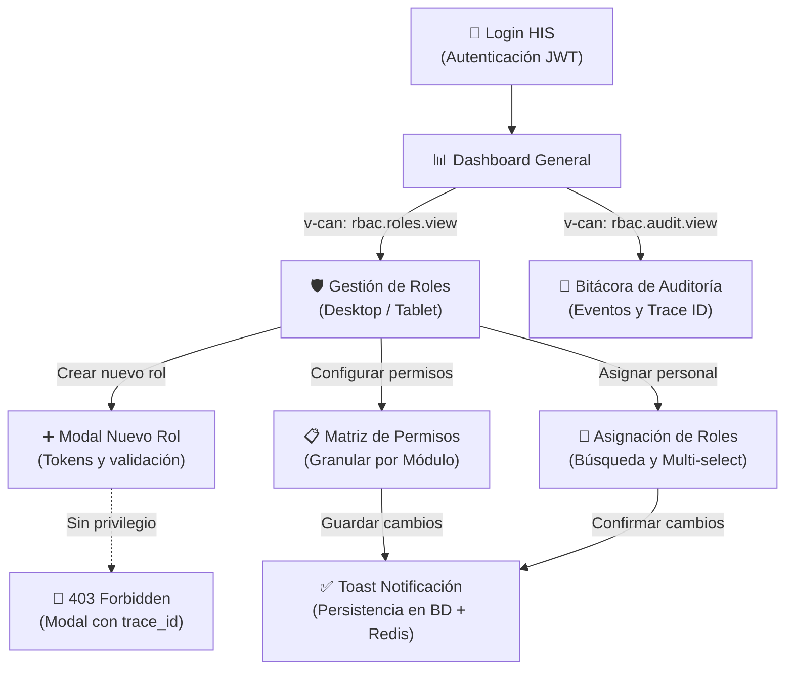

# Asignación Individual y Registro de Avance — Módulo RBAC (Semanas 10 y 11)

**Curso:** Análisis de Sistemas II (ASII) — Ciclo 2026  
**Sistema:** Sistema Hospitalario Integrado (HIS)  
**Institución:** Universidad / Facultad de Ingeniería en Sistemas  

---

## 1. Ficha Técnica de Asignación Individual

| Campo | Valor |
|---|---|
| **Estudiante** | **LUIS DAVID AROCHE CONTRERAS** |
| **GitHub** | [`@Luis890D`](https://github.com/Luis890D) |
| **Módulo Asignado** | **Módulo 02: RBAC (Roles, Permisos y Protección de Rutas)** |
| **Rama de Trabajo** | `feature/asii-02-rbac-roles-permisos-y-proteccion-de-rutas-luis890d` |
| **Worktree Local** | `../shi-documentacion-rbac-Luis-Aroche` |
| **Rama Base de Integración** | `origin/develop` |
| **Hito Evaluativo** | Cierre del Bloque Parcial 2 (Diseño Responsive, Movilidad Hospitalaria, Sistema de Diseño y Mockups de Alta Fidelidad) |

---

## 2. Resumen Ejecutivo del Bloque Semanas 10-11

Este documento consolida el cierre de entregables de diseño del **Módulo 02: RBAC** previo a la Segunda Evaluación Parcial (Semana 12), enfocado en la adaptación a movilidad clínica y la especificación de prototipado de alta fidelidad:

1. **Semana 10 — Diseño para Movilidad y Responsive:**
   - Estrategia *Mobile First* adaptativa basada en 5 breakpoints formales (`xs` a `xl`) ajustados al entorno hospitalario.
   - Especificación de capacidades y vistas por factor de forma (estaciones desktop, tablets clínicas de 10–12" y smartphones clínicos de 5–6.7").
   - Wireframes para smartphone (4 vistas compactas con tarjetas colapsables) y tablet (2 layouts con panel lateral y matriz resumida).
   - Documentación de 5 escenarios móviles críticos (urgencia médica en guardia, auditoría en ronda, reasignación por relevo de turno, desconexión intermitente y revocación de emergencia).
   - Directrices táctiles y ergonomía: área táctil mínima de `44×44px`, formularios adaptados con teclados virtuales correctos y prevención de toques accidentales en acciones destructivas.

2. **Semana 11 — Mockups y Prototipo Navegable:**
   - Sistema de diseño integral con 8 tokens fundamentales (tipografía Inter, paleta cromática clínica, bordes, sombras y espaciado).
   - Catálogo de 7 componentes UI reutilizables (`Badge` de estado de rol, `Toggle` interactivo de permiso, `Toast` de feedback temporal, `SkeletonLoader`, `EmptyState`, modal `AccessDenied` 403 con `trace_id` y tabla con ordenamiento accesible).
   - Especificación de 5 pantallas desktop de alta fidelidad y 2 pantallas adaptadas para tablet con acordeones modulares.
   - Diagrama de flujo de navegación completo del prototipo en Mermaid.
   - Especificación técnica de 7 micro-animaciones (duraciones entre `150ms` y `300ms`, curvas `cubic-bezier` y soporte estricto de `prefers-reduced-motion`).

---

## 3. Navegación de Documentos Técnicos Específicos

| Semana | Tema ASII | Documento Entregable | Enlace Carpeta | Estado |
|:---:|---|---|:---:|:---:|
| **Semana 10** | Diseño para Movilidad y Responsive | [`semana-10-responsive-movilidad.md`](semana-10/semana-10-responsive-movilidad.md) | [📂 `semana-10/`](semana-10/README.md) | **Completado** ✅ |
| **Semana 11** | Mockups y Prototipo Navegable | [`semana-11-mockups-prototipo.md`](semana-11/semana-11-mockups-prototipo.md) | [📂 `semana-11/`](semana-11/README.md) | **Completado** ✅ |

---

## 4. Síntesis Técnica y de Interfaz

### 4.1. Estrategia de Breakpoints y Funcionalidades por Dispositivo (Semana 10)

| Breakpoint | Ancho (px) | Dispositivo Objetivo | Perfil de Usuario | Alcance Funcional RBAC |
|:---:|:---:|---|---|---|
| **xs** | `320–479` | Smartphone S | Personal clínico / Auditor | Consulta rápida: mis roles, mis permisos activos y búsqueda de usuario. |
| **sm** | `480–767` | Smartphone L | Auditor / Supervisor | Consulta detallada de roles del tenant y bitácora resumida. |
| **md** | `768–1023` | Tablet (Portrait) | Supervisor / Jefe Enfermería | Asignación y cambio rápido de roles a personal clínico en piso. |
| **lg** | `1024–1279` | Tablet (Landscape) / Laptop | Administrador Hospitalario | Edición de roles, asignación de permisos por módulo y filtros avanzados. |
| **xl** | `1280+` | Desktop Full | IT / SuperAdmin | Administración integral: matriz completa de permisos, auditoría forense con `trace_id`. |

### 4.2. Flujo de Navegación del Prototipo (Semana 11)

### 4.3. Tokens del Sistema de Diseño (Semana 11)

| Token | Valor CSS | Uso en RBAC |
|---|---|---|
| **Primary** | `#2563EB` | Acciones principales, botones activos, foco de accesibilidad. |
| **Success** | `#16A34A` | Permiso concedido, estado activo, toast de confirmación. |
| **Danger** | `#DC2626` | Permiso denegado, revocación, eliminación de rol. |
| **Surface** | `#FFFFFF` | Tarjetas de rol, filas de matriz, modales. |
| **Background** | `#F8FAFC` | Fondo de la aplicación. |
| **Text Primary** | `#0F172A` | Títulos y etiquetas de alta legibilidad (ratio > 7:1). |
| **Radius MD** | `8px` | Botones, toggles, inputs. |
| **Shadow Card** | `0 1px 3px rgba(0,0,0,0.1)` | Elevación para jerarquía visual sin saturar. |

---

## 5. Control de Cambios y Versionamiento

| Versión | Fecha | Autor | Descripción de Cambios |
|:---:|:---:|---|---|
| `v1.0.0` | 2026-08-14 | Luis David Aroche Contreras | Documentación Semanas 1 y 2 (Actores, RF/RNF, SOLID). |
| `v2.0.0` | 2026-08-20 | Luis David Aroche Contreras | Documentación Semanas 3, 4 y 5 (C4, Capas, API REST y Plan Git). |
| `v3.0.0` | 2026-09-14 | Luis David Aroche Contreras | Documentación Semanas 7, 8 y 9 (Componentes, Refactorización, UX y Accesibilidad). |
| `v4.0.0` | 2026-09-14 | Luis David Aroche Contreras | Documentación Semanas 10 y 11 (Diseño Responsive, Breakpoints Clínicos, Tokens y Mockups de Alta Fidelidad). Cierre de entregables para Parcial 2. |
