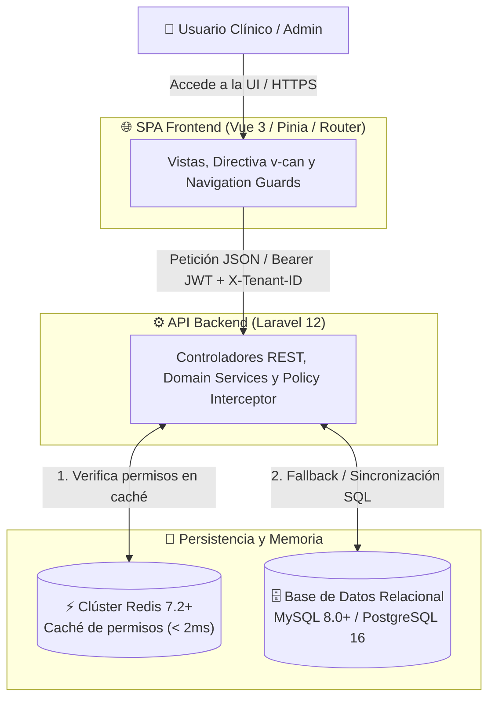

# Asignación Individual y Registro de Avance — Módulo RBAC (Semanas 3, 4 y 5)

**Curso:** Análisis de Sistemas II (ASII) — Ciclo 2026  
**Sistema:** Sistema Hospitalario Integrado (HIS)  
**Institución:** Universidad / Facultad de Ingeniería en Sistemas  

---

## 1. Ficha Técnica de Asignación Individual

| Campo | Valor |
|---|---|
| **Estudiante** | **LUIS DAVID AROCHE CONTRERAS** |
| **GitHub** | [`@Luis890D`](https://github.com/Luis890D) |
| **Módulo Asignado** | **Módulo 02: RBAC (Roles, Permisos y Protección de Rutas)** |
| **Rama de Trabajo** | `feature/asii-02-rbac-roles-permisos-y-proteccion-de-rutas-luis890d` |
| **Worktree Local** | `../shi-documentacion-rbac-Luis-Aroche` |
| **Rama Base de Integración** | `origin/develop` |
| **Hito Evaluativo** | Cierre del Bloque Parcial 1 (Arquitectura, Capas, API REST e Integración) |

---

## 2. Resumen Ejecutivo del Bloque Semanas 3-5

Este documento consolida la arquitectura, diseño por capas, contrato de interfaz y estrategia de integración técnica del **Módulo 02: RBAC** dentro del Sistema Hospitalario Integrado (HIS):

1. **Semana 3:** Diseño arquitectónico formal con el Modelo C4 (Contexto C1, Contenedores C2, Componentes C3), mapa de dependencias y patrones de diseño (RBAC, Pipeline Middleware, Cache-Aside en Redis, Decorator UI `v-can`).
2. **Semana 4:** Arquitectura en capas (Presentación UI, API Gateway, Lógica de Dominio/Servicios, Persistencia/Repositorio, Infraestructura), catálogo de objetos reutilizables (DTOs, Value Objects, Enums) y diagramas de secuencia.
3. **Semana 5:** Contrato de API RESTful con especificación de endpoints, payloads JSON de entrada/salida, catálogo estandarizado de códigos de error RFC 7807, matriz de permisos requeridos y plan de integración técnica (Issue, Branching, Git Worktree y Pull Request).

---

## 3. Navegación de Documentos Técnicos Específicos

| Semana | Tema ASII | Documento Entregable | Estado |
|:---:|---|---|:---:|
| **Semana 3** | Diseño arquitectónico, vistas C4 y patrones | [semana-03-arquitectura-vistas-patrones.md](semana-03/semana-03-arquitectura-vistas-patrones.md) | **Completado** ✅ |
| **Semana 4** | Arquitectura en capas y patrón repositorio | [semana-04-arquitectura-capas-repositorio.md](semana-04/semana-04-arquitectura-capas-repositorio.md) | **Completado** ✅ |
| **Semana 5** | API REST, contrato y plan de integración | [semana-05-api-rest-contrato-integracion.md](semana-05/semana-05-api-rest-contrato-integracion.md) | **Completado** ✅ |

---

## 4. Síntesis Arquitectónica y de Integración

### 4.1. Vista de Contenedores y Flujo de Autorización

### 4.2. Matriz de Endpoints Principales

| Endpoint | Método | Permiso | Descripción |
|---|:---:|---|---|
| `/api/v1/rbac/roles` | `GET` | `rbac.roles.view` | Lista de roles por tenant |
| `/api/v1/rbac/roles` | `POST` | `rbac.roles.manage` | Creación de rol en el tenant |
| `/api/v1/rbac/roles/{id}/permissions` | `PUT` | `rbac.permissions.assign` | Sincronización atómica de matriz de permisos |
| `/api/v1/rbac/users/{id}/roles` | `POST` | `rbac.users.assign` | Asignación de roles a usuario |
| `/api/v1/auth/me/permissions` | `GET` | Autenticado | Hidratación del store Pinia frontend |

---

## 5. Control de Cambios y Versionamiento

| Versión | Fecha | Autor | Descripción de Cambios |
|:---:|:---:|---|---|
| `v1.0.0` | 2026-08-14 | Luis David Aroche Contreras | Creación de documentación de Semanas 1 y 2 (Actores, RF/RNF, SOLID). |
| `v2.0.0` | 2026-08-20 | Luis David Aroche Contreras | Completación de Semanas 3, 4 y 5 (C4, Arquitectura en Capas, Contrato API REST y Plan de Integración Git/Worktree). |
