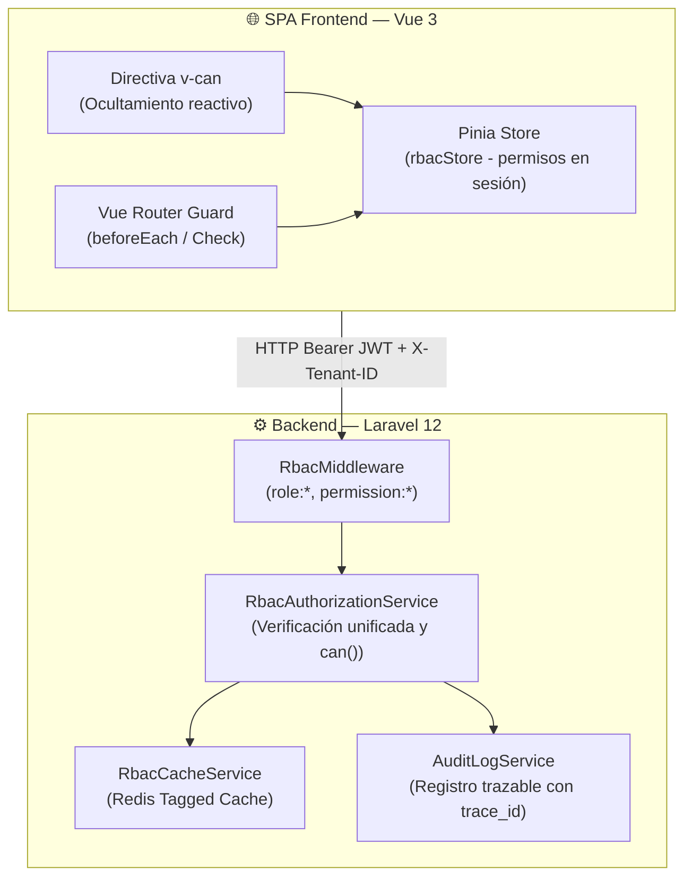

# Asignación Individual y Registro de Avance — Módulo RBAC (Semanas 7, 8 y 9)

**Curso:** Análisis de Sistemas II (ASII) — Ciclo 2026  
**Sistema:** Sistema Hospitalario Integrado (HIS)  
**Institución:** Universidad / Facultad de Ingeniería en Sistemas  

---

## 1. Ficha Técnica de Asignación Individual

| Campo | Valor |
|---|---|
| **Estudiante** | **LUIS DAVID AROCHE CONTRERAS** |
| **GitHub** | [`@Luis890D`](https://github.com/Luis890D) |
| **Módulo Asignado** | **Módulo 02: RBAC (Roles, Permisos y Protección de Rutas)** |
| **Rama de Trabajo** | `feature/asii-02-rbac-roles-permisos-y-proteccion-de-rutas-luis890d` |
| **Worktree Local** | `../shi-documentacion-rbac-Luis-Aroche` |
| **Rama Base de Integración** | `origin/develop` |
| **Hito Evaluativo** | Avance Bloque Parcial 2 (Diseño de Componentes, Refactorización, UX, Usabilidad y Accesibilidad WCAG 2.1 AA) |

---

## 2. Resumen Ejecutivo del Bloque Semanas 7-9

Este documento consolida el avance técnico, de experiencia de usuario y de accesibilidad del **Módulo 02: RBAC** dentro del Sistema Hospitalario Integrado (HIS) correspondiente a la primera mitad del Bloque Parcial 2:

1. **Semana 07 — Diseño de Componentes y Refactorización:**
   - Diagrama integral de componentes desacoplados para el Backend (Laravel 12) y Frontend (Vue 3 / Pinia).
   - Catálogo exhaustivo de componentes con responsabilidades únicas y dependencias directas.
   - Refactorización de la lógica dispersa hacia el servicio centralizado `RbacAuthorizationService` con caché en Redis 7.2+.
   - Implementación y refactorización de la directiva reactiva `v-can` para autorización declarativa en UI.
   - Justificación técnica formal basada en los principios SOLID (SRP, OCP, DIP).

2. **Semana 08 — Diseño de Experiencia de Usuario (UX):**
   - Definición de actores y contextos de uso: SuperAdministrador (IT), Administrador Hospitalario y Auditor de Seguridad.
   - User Flows paso a paso modelados con diagramas de flujo interactivos.
   - Wireframes esquemáticos de las cuatro pantallas clave: Gestión de Roles, Matriz de Permisos, Asignación a Usuario y Auditoría de Accesos.
   - Especificación formal de los estados del sistema: Carga (*skeleton loaders*), Vacío (*empty state*), Error de Red, Acceso Denegado (403 con `trace_id`) y Éxito.
   - Reglas de interacción, prevención de bloqueos accidentales (*lockout*) y microcopy contextual.

3. **Semana 09 — Evaluación de Usabilidad y Accesibilidad:**
   - Evaluación heurística de Nielsen aplicada a flujos clínicos críticos (18 ítems evaluados en 5 heurísticas clave).
   - Checklist exhaustivo de cumplimiento de accesibilidad bajo el estándar internacional **WCAG 2.1 Nivel AA** (12 criterios auditados: perceptibilidad, operabilidad, comprensibilidad y robustez).
   - Matriz de 12 hallazgos de usabilidad y accesibilidad priorizados por severidad (2 críticos, 6 altos, 4 medios).
   - Plan de mitigación y mejoras concretas con estimación de esfuerzo técnico e impacto clínico.

---

## 3. Navegación de Documentos Técnicos Específicos

| Semana | Tema ASII | Documento Entregable | Enlace Carpeta | Estado |
|:---:|---|---|:---:|:---:|
| **Semana 07** | Diseño de Componentes y Refactorización | [`semana-07-diseno-componentes-refactorizacion.md`](semana-07/semana-07-diseno-componentes-refactorizacion.md) | [📂 `semana-07/`](semana-07/README.md) | **Completado** ✅ |
| **Semana 08** | Diseño de Experiencia de Usuario (UX) | [`semana-08-ux-user-flow.md`](semana-08/semana-08-ux-user-flow.md) | [📂 `semana-08/`](semana-08/README.md) | **Completado** ✅ |
| **Semana 09** | Evaluación de Usabilidad y Accesibilidad | [`semana-09-usabilidad-accesibilidad.md`](semana-09/semana-09-usabilidad-accesibilidad.md) | [📂 `semana-09/`](semana-09/README.md) | **Completado** ✅ |

---

## 4. Síntesis Técnica y de Interfaz

### 4.1. Arquitectura de Componentes Centralizados (Semana 07)

### 4.2. Resumen de Flujos UX y Pantallas Clave (Semana 08)

| Vista / Flujo | Rol Principal | Objetivo Crítico | Mecanismo de Seguridad UX |
|---|---|---|---|
| **Gestión de Roles** | SuperAdmin / Admin | Listar, crear y editar roles por tenant. | Protección contra eliminación de roles protegidos del sistema. |
| **Matriz de Permisos** | SuperAdmin | Asignar permisos granulares por módulo a roles. | Guardado por lotes con indicador de cambios no guardados. |
| **Asignación a Usuarios** | Admin Hospitalario | Asignar roles a personal médico y administrativo. | Modal de confirmación con detalle de permisos heredados. |
| **Bitácora de Auditoría** | Auditor / IT | Consultar intentos de acceso y denegaciones. | Filtro multicriterio y exportación inmutable con `trace_id`. |

### 4.3. Resumen de Evaluación de Accesibilidad WCAG 2.1 AA (Semana 09)

| Principio WCAG | Criterios Auditados | Estado Inicial | Solución Implementada / Planificada |
|---|:---:|:---:|---|
| **Perceptible** | 1.1.1 (Texto alternativo), 1.4.3 (Contraste 4.5:1), 1.4.1 (Uso de color) | ⚠️ 2 Hallazgos | Contraste elevado a 5.2:1 en badges y agregado de iconos informativos independientes del color. |
| **Operable** | 2.1.1 (Teclado completo), 2.4.3 (Orden de foco), 2.4.7 (Foco visible) | ⚠️ 3 Hallazgos | Indicador de foco `ring-2 ring-primary-500` visible y navegación cíclica en modales. |
| **Comprensible** | 3.2.2 (Al recibir entradas), 3.3.1 (Identificación de errores), 3.3.2 (Etiquetas) | ⚠️ 2 Hallazgos | Mensajes de error claros RFC 7807 asociados con `aria-describedby` en formularios. |
| **Robusto** | 4.1.2 (Nombre, función, valor - ARIA), 4.1.3 (Mensajes de estado) | ⚠️ 1 Hallazgo | `aria-live="polite"` en alertas dinámicas y roles semánticos correctos en tablas. |

---

## 5. Control de Cambios y Versionamiento

| Versión | Fecha | Autor | Descripción de Cambios |
|:---:|:---:|---|---|
| `v1.0.0` | 2026-08-14 | Luis David Aroche Contreras | Creación de documentación de Semanas 1 y 2 (Actores, RF/RNF, SOLID). |
| `v2.0.0` | 2026-08-20 | Luis David Aroche Contreras | Completación de Semanas 3, 4 y 5 (C4, Arquitectura en Capas, Contrato API REST y Plan de Integración Git/Worktree). |
| `v3.0.0` | 2026-09-14 | Luis David Aroche Contreras | Incorporación y consolidación de Semanas 7, 8 y 9 (Diseño de Componentes, Refactorización SOLID, UX User Flows, Usabilidad Heurística y Accesibilidad WCAG 2.1 AA). |
