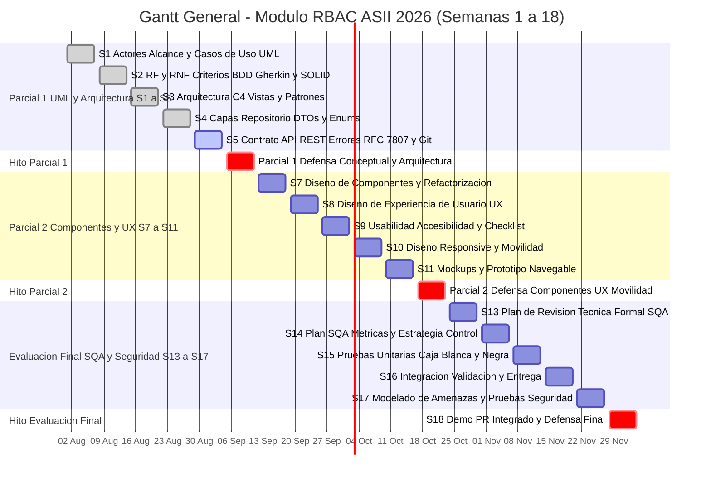
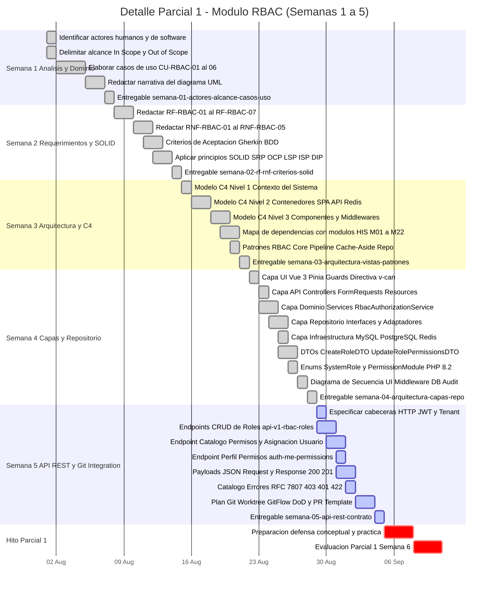
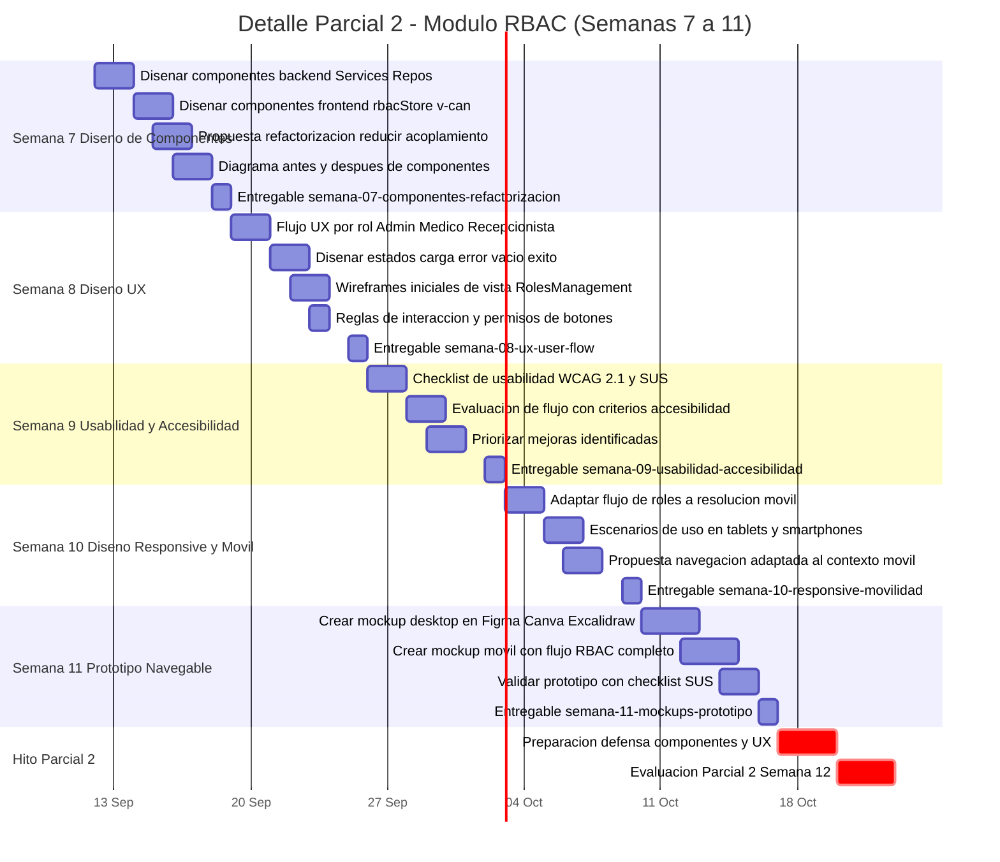
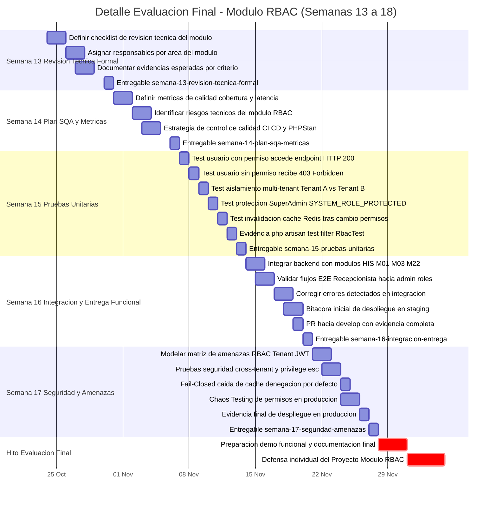

# Diagrama de Gantt - Modulo RBAC (Semanas 1 a 18)
## Roles, Permisos y Proteccion de Rutas - Sistema Hospitalario Integrado (HIS)

**Curso:** Analisis de Sistemas II (ASII) — Ciclo 2026  
**Estudiante:** Luis David Aroche Contreras (`Luis890D`)  
**Modulo:** 02 — Control de Acceso Basado en Roles (RBAC)  
**Rama:** `feature/asii-02-rbac-roles-permisos-y-proteccion-de-rutas-luis890d`  

---

## Gantt General — Ciclo Completo ASII (Semanas 1 a 18)

---

## Gantt Detallado — Parcial 1 (Semanas 1 a 5)

---

## Gantt Detallado — Parcial 2 (Semanas 7 a 11)

---

## Gantt Detallado — Evaluacion Final SQA Pruebas y Seguridad (Semanas 13 a 18)

---

## Resumen de Bloques Evaluativos

| Bloque | Semanas | Tareas Principales | Puntos | Estado |
|---|:---:|---|:---:|:---:|
| **Parcial 1** | 1-5 | Actores, RF/RNF, C4, Capas, API REST | 6 pts | Completado |
| **Evaluacion Parcial 1** | 6 | Defensa conceptual y practica arquitectonica | Parcial | Pendiente |
| **Parcial 2** | 7-11 | Componentes, UX, Usabilidad, Responsive, Mockups | 7 pts | Planificado |
| **Evaluacion Parcial 2** | 12 | Defensa componentes, UX y movilidad | Parcial | Pendiente |
| **Evaluacion Final** | 13-17 | SQA, Pruebas, Integracion, Seguridad, Despliegue | 7 pts | Planificado |
| **Proyecto Individual** | 1-18 | Modulo RBAC completo implementado | 15 pts | En curso |
| **Defensa Final** | 18 | Demo, PR integrado a develop y defensa individual | Final | Pendiente |

---

## Hitos Criticos del Proyecto

| Fecha | Hito | Entregables Clave |
|:---:|---|---|
| **2026-09-04** | Fin Semana 5 | Contrato API REST completo, Plan Git/Worktree |
| **2026-09-11** | PARCIAL 1 | Defensa UML y Arquitectura, Semanas 1-5 validadas |
| **2026-10-16** | Fin Semana 11 | Prototipo navegable, Mockups desktop y movil |
| **2026-10-23** | PARCIAL 2 | Defensa Componentes y UX, Semanas 7-11 validadas |
| **2026-11-20** | Semana 16 | Primera entrega funcional, PR integrado en develop |
| **2026-11-27** | Semana 17 | Pruebas de seguridad, Despliegue final verificado |
| **2026-12-04** | EVALUACION FINAL | Demo funcional completa, Defensa individual Modulo RBAC |

---

## Trazabilidad de Documentos por Semana

| Semana | Entregable | Carpeta / Archivo | Estado |
|:---:|---|---|:---:|
| **S1** | Actores, Alcance y Casos de Uso UML | [`semana-01/semana-01-actores-alcance-casos-de-uso.md`](semana-01/semana-01-actores-alcance-casos-de-uso.md) | ✅ Completado |
| **S2** | RF/RNF, Criterios BDD Gherkin y SOLID | [`semana-02/semana-02-rf-rnf-criterios-aceptacion-solid.md`](semana-02/semana-02-rf-rnf-criterios-aceptacion-solid.md) | ✅ Completado |
| **S3** | Arquitectura C4, Vistas y Patrones | [`semana-03/semana-03-arquitectura-vistas-patrones.md`](semana-03/semana-03-arquitectura-vistas-patrones.md) | ✅ Completado |
| **S4** | Capas, Repositorio, DTOs y Enums | [`semana-04/semana-04-arquitectura-capas-repositorio.md`](semana-04/semana-04-arquitectura-capas-repositorio.md) | ✅ Completado |
| **S5** | Contrato API REST y Plan Git/Worktree | [`semana-05/semana-05-api-rest-contrato-integracion.md`](semana-05/semana-05-api-rest-contrato-integracion.md) | ✅ Completado |
| **S6** | Evaluación Parcial 1 | [`semana-06/README.md`](semana-06/README.md) | ⏳ Pendiente |
| **S7** | Diseño Componentes y Refactorización | [`semana-07/README.md`](semana-07/README.md) | ⏳ Planificado |
| **S8** | Flujo UX por Rol y Wireframes | [`semana-08/README.md`](semana-08/README.md) | ⏳ Planificado |
| **S9** | Usabilidad, Accesibilidad y Checklist | [`semana-09/README.md`](semana-09/README.md) | ⏳ Planificado |
| **S10** | Diseño Responsive y Movilidad | [`semana-10/README.md`](semana-10/README.md) | ⏳ Planificado |
| **S11** | Mockup y Prototipo Navegable | [`semana-11/README.md`](semana-11/README.md) | ⏳ Planificado |
| **S12** | Evaluación Parcial 2 | [`semana-12/README.md`](semana-12/README.md) | ⏳ Pendiente |
| **S13** | Plan de Revisión Técnica Formal | [`semana-13/README.md`](semana-13/README.md) | ⏳ Planificado |
| **S14** | Plan SQA, Métricas y Riesgos | [`semana-14/README.md`](semana-14/README.md) | ⏳ Planificado |
| **S15** | Pruebas Unitarias y Casos de Prueba | [`semana-15/README.md`](semana-15/README.md) | ⏳ Planificado |
| **S16** | Integración, Validación y Entrega Funcional | [`semana-16/README.md`](semana-16/README.md) | ⏳ Planificado |
| **S17** | Modelado de Amenazas y Pruebas de Seguridad | [`semana-17/README.md`](semana-17/README.md) | ⏳ Planificado |
| **S18** | Demo Final, PR y Defensa | [`semana-18/README.md`](semana-18/README.md) | ⏳ Pendiente |

---

## Leyenda de Estados

| Simbolo | Estado |
|:---:|---|
| ✅ | Completado y documentado |
| 🔄 | Activo / En ejecucion |
| ⏳ | Planificado / Pendiente |

---

*Documento del Modulo 02 — RBAC — Sistema Hospitalario Integrado (HIS)*  
*Analisis de Sistemas II — Ciclo 2026 — Luis David Aroche Contreras (Luis890D)*
