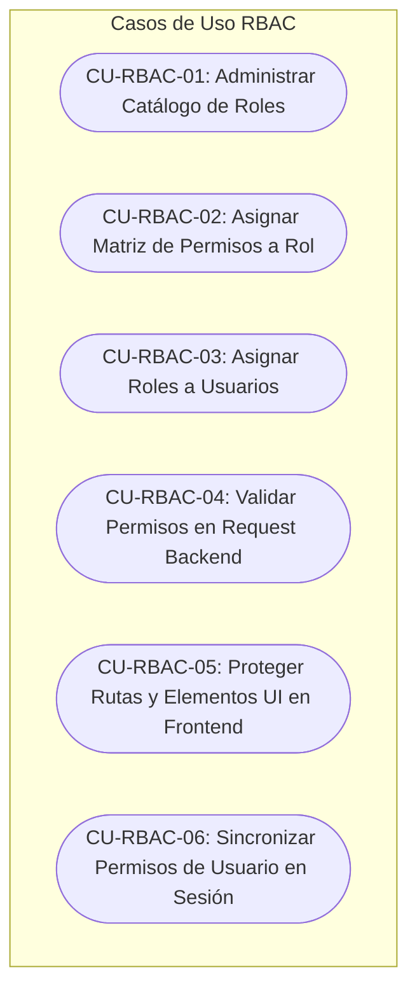

# 📋 Evidencia Semana 1: Actores, Alcance y Casos de Uso — RBAC

**Estudiante:** LUIS DAVID AROCHE CONTRERAS  
**Módulo:** RBAC (Roles, Permisos y Protección de Rutas)  
**Rama:** `feature/asii-02-rbac-roles-permisos-y-proteccion-de-rutas-luis890d`

---

### ✅ Entregables Completados

| Entregable | Estado | Descripción |
|---|---|---|
| **Caracterización de Actores** | ✅ Completado | Identificación de 6 actores humanos y 2 sistemas externos que interactúan con el módulo RBAC |
| **Definición de Alcance** | ✅ Completado | Delimitación clara de *In Scope* (7 ítems) vs *Out of Scope* (2 dependencias externas) |
| **Diagrama de Casos de Uso** | ✅ Completado | 6 casos de uso principales con flujos UML y narrativa técnica |
| **Documento Técnico Detallado** | ✅ Completado | Archivo `semana-01-actores-alcance-casos-de-uso.md` |

---

### 📊 Resumen de Actores Identificados

| Actor | Clasificación | Responsabilidad Principal en RBAC |
|---|---|---|
| **SuperAdministrador / IT Admin** | Humano (Directo) | Administra roles, permisos y asignaciones |
| **Personal Médico** | Humano (Consumidor) | Consume permisos clínicos (EMR, prescripciones) |
| **Personal de Enfermería** | Humano (Consumidor) | Consume permisos asistenciales (signos vitales, triaje) |
| **Técnico de Laboratorio** | Humano (Consumidor) | Consume permisos de procesamiento clínico |
| **Recepcionista / Admisión** | Humano (Consumidor) | Consume permisos administrativos (citas, pacientes) |
| **Auditor de Seguridad** | Humano (Supervisor) | Acceso de solo lectura a matriz de privilegios |
| **Auth Subsystem (JWT)** | Sistema Externo | Provee payload con `user_id` y `tenant_id` |
| **Stancl Tenancy Engine** | Sistema Interno | Aísla roles y permisos por tenant |

---

### 🎯 Casos de Uso del Módulo RBAC

---

### ✅ Verificación de DoD — Semana 1

- [x] Actores identificados y caracterizados.
- [x] Alcance delimitado (*In Scope / Out of Scope*).
- [x] Casos de uso documentados con UML.
- [x] Documento técnico de evidencia elaborado.
- [x] Evidencia adjunta en el Issue.

---

### 📌 Resultado

**Semana 1 completada satisfactoriamente.**

Se cuenta con la identificación de actores, definición del alcance y documentación de los principales casos de uso necesarios para continuar con el desarrollo del módulo **RBAC (Roles, Permisos y Protección de Rutas)**.

**Estado:** 🟢 **COMPLETADO**
