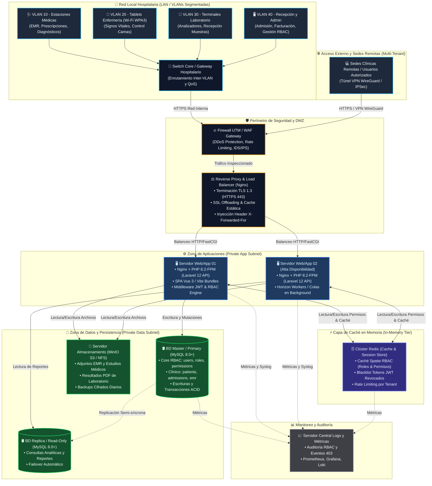

# Diagrama de Infraestructura de Red y Servidores
## Sistema Hospitalario Integrado (HIS) — Módulo 02: RBAC

**Curso:** Análisis de Sistemas II (ASII) — 2026  
**Estudiante:** Luis David Aroche Contreras (`Luis890D`)  
**Módulo:** RBAC (Roles, Permisos y Protección de Rutas)  
**Entorno:** Arquitectura Multi-Tenant (Stancl Tenancy + Spatie Permissions)  

---

## 1. Descripción de la Infraestructura

La infraestructura del **Sistema Hospitalario Integrado (HIS)** está diseñada con base en una arquitectura por capas de seguridad (**Defense in Depth**), garantizando **alta disponibilidad**, **aislamiento multi-tenant** y **latencia mínima de autorización (< 15 ms)** para el módulo de control de acceso (RBAC).

### Capas y Zonas de Seguridad:
1. **Red Local Hospitalaria (VLANs Segmentadas):**
   - **VLAN 10 (Médica):** Estaciones de trabajo médicas para consulta de EMR, prescripciones y diagnósticos.
   - **VLAN 20 (Enfermería):** Tablets y dispositivos móviles conectados a red Wi-Fi WPA3 Enterprise para toma de signos vitales y visualización de camas.
   - **VLAN 30 (Laboratorio):** Equipos y analizadores clínicos para recepción de muestras e ingreso de resultados.
   - **VLAN 40 (Administración):** Terminales de admisión, facturación, auditoría y administración de roles RBAC.
   - **Switch Core / Gateway Hospitalario:** Concentrador de tráfico inter-VLAN con políticas de enrutamiento y QoS.
2. **Perímetro de Seguridad (DMZ & Edge):**
   - **Firewall UTM / WAF:** Filtrado de paquetes, mitigación DDoS, inspección HTTPS e inspección de túneles VPN WireGuard/IPSec para sedes remotas.
   - **Reverse Proxy & Load Balancer (Nginx):** Terminación TLS 1.3, compresión, balanceo HTTP/FastCGI e inyección de encabezados de auditoría (`X-Forwarded-For`).
3. **Zona de Servidores de Aplicación (Private App Subnet):**
   - Servidores balanceados ejecutando **Ubuntu Server 24.04 LTS**, **PHP 8.2-FPM** y el framework **Laravel 12**, alojando el frontend SPA compilado en **Vue 3**.
   - Los middlewares de autenticación JWT y autorización Spatie se ejecutan en esta capa.
4. **Zona de Caché y Gobernanza (In-Memory Tier):**
   - Clúster **Redis 7.2+** para almacenar en memoria ultrarrápida la matriz de roles y permisos, evitando consultas redundantes a la base de datos en cada petición HTTP, y gestionando la lista de revocación de tokens JWT.
5. **Zona de Persistencia y Base de Datos (Private Data Subnet):**
   - Clúster **MySQL 8.0+ / PostgreSQL 16** con replicación Maestro-Esclavo (Primary-Replica).
   - Servidor de almacenamiento de objetos **S3 / NFS** para expedientes, PDFs de laboratorio y adjuntos clínicos.
6. **Zona de Monitoreo y Auditoría:**
   - Centralización de logs de auditoría RBAC y métricas con Prometheus, Grafana y Loki/ELK.

---

## 2. Diagrama de Infraestructura (Topología de Red y Servidores)

---

## 3. Especificaciones Técnicas y Dimensionamiento

| Servidor / Equipo | Función | Stack Tecnológico | Especificación de Hardware Recomendada | Puertos de Red |
|---|---|---|---|---|
| **Firewall / WAF Gateway** | Seguridad de borde, IDS/IPS y VPN | pfSense / OPNsense / Cloudflare | 4 vCPU, 8 GB RAM, 2x 10Gbps NIC | 443 (HTTPS), 51820 (WireGuard) |
| **Reverse Proxy & Load Balancer** | SSL Offloading, TLS 1.3 y balanceo | Nginx 1.24+ / HAProxy | 4 vCPU, 8 GB RAM, 50 GB SSD NVMe | 80 (Redirect), 443 (HTTPS) |
| **Servidores de Aplicación (x2)** | API Laravel 12, Vue 3 SPA y RBAC | Ubuntu 24.04, PHP 8.2-FPM, Vite | 8 vCPU, 16 GB RAM, 100 GB NVMe (c/u) | 9000 (PHP-FPM interno), 443 |
| **Servidor de Caché & Queues** | Caché Spatie RBAC y Blacklist JWT | Redis 7.2+ Standalone/Sentinel | 4 vCPU, 8 GB RAM, 30 GB SSD | 6379 (Redis AUTH + TLS) |
| **Clúster de Base de Datos** | Transacciones relacionales HIS | MySQL 8.0 Enterprise / PostgreSQL 16 | 8 vCPU, 32 GB RAM, 500 GB RAID 10 (c/u) | 3306 / 5432 (Solo App Subnet) |
| **Servidor de Almacenamiento** | Archivos EMR, PDFs y adjuntos | MinIO S3 Compatible / NFS cifrado | 4 vCPU, 8 GB RAM, 2 TB Storage Pool | 9000 / 9001 (S3 API interna) |
| **Monitoreo y Auditoría** | Monitoreo y bitácora de eventos | Prometheus, Grafana, Loki / ELK | 4 vCPU, 16 GB RAM, 200 GB SSD | 3000 (Grafana), 9090 (Prometheus) |
