# Diagrama de Procesos General del Hospital e Integración con RBAC
## Sistema Hospitalario Integrado (HIS) — Módulo 02: RBAC

**Curso:** Análisis de Sistemas II (ASII) — 2026  
**Estudiante:** Luis David Aroche Contreras (`Luis890D`)  
**Módulo:** RBAC (Roles, Permisos y Protección de Rutas)  
**Sistema:** Sistema Hospitalario Integrado (HIS)  

---

## 1. Descripción del Flujo Asistencial Integrado

El proceso hospitalario abarca la atención médica y administrativa integral del paciente: desde su ingreso, triaje y consulta médica, hasta la prescripción, órdenes y resultados de laboratorio, egreso hospitalario y auditoría.

### El Rol Transversal del Módulo RBAC:
En cada paso del proceso, el **Módulo 02 (RBAC)** actúa como la compuerta de seguridad que valida:
1. **Identidad y Tenant (`X-Tenant-ID`):** Aislamiento de datos entre clínicas u hospitales.
2. **Guards en Frontend (`Vue Router` y `v-can`):** Permiten u ocultan vistas y botones según el perfil del usuario.
3. **Guards en Backend (`Laravel Middleware` y `Spatie Permission`):** Verifican los permisos granulares antes de ejecutar controladores y persistir información en la base de datos.

---

## 2. Diagrama de Procesos Global del Hospital

```mermaid
flowchart TD
    %% ── INICIO Y ACCESO AL SISTEMA ─────────────────────────────
    START(["🟢 Inicio: Llegada del Paciente / Inicio de Turno"]) --> AUTH_STEP["🔑 Autenticación de Usuario (Módulo 01)\nEnvío de Credenciales & X-Tenant-ID"]
    
    AUTH_STEP --> RBAC_EVAL{"🛡️ [RBAC Core - Módulo 02]\n¿Usuario Autenticado & Rol Válido?"}
    RBAC_EVAL -- No (401 / 403) --> ACC_DENIED["🔴 Acceso Denegado\n(Redirección /403 o Bloqueo API)"]
    RBAC_EVAL -- Sí (Token JWT + Permisos Resueltos) --> LOAD_DASH["🖥️ Carga de Dashboard UI Dinámica (Módulo 26)\nRenderizado según permisos del rol (v-can)"]

    %% ── FASE 1: ADMISIÓN Y REGISTRO ────────────────────────────
    LOAD_DASH --> P1_REG["1. Registro / Búsqueda de Paciente (Módulo 03)\nActor: Recepcionista / Admisiones"]
    P1_REG --> RBAC_CHK_PAT{"🛡️ RBAC Check:\n'patients.create' / 'patients.read'"}
    RBAC_CHK_PAT -- Denegado --> ACC_DENIED
    RBAC_CHK_PAT -- Autorizado --> DEC_DEST{"¿Tipo de Atención?"}

    DEC_DEST -- Consulta Externa / Cita --> P2_CITAS["2. Agendamiento de Citas Médicas (Módulo 05)\nAsignación con Médico y Especialidad (Módulo 04)"]
    DEC_DEST -- Urgencias / Hospitalización --> P2_HOSP["3. Admisión Hospitalaria & Asignación de Cama (Módulo 07)\nCatálogo de Salas y Wards (Módulo 06)"]
    
    P2_HOSP --> RBAC_CHK_BED{"🛡️ RBAC Check:\n'beds.assign' / 'admissions.create'"}
    RBAC_CHK_BED -- Denegado --> ACC_DENIED
    RBAC_CHK_BED -- Autorizado --> P3_TRIAJE

    P2_CITAS --> P3_TRIAJE["4. Triaje y Signos Vitales (Módulo 13)\nActor: Personal de Enfermería"]

    %% ── FASE 2: ATENCIÓN CLÍNICA Y EXPEDIENTE (EMR) ───────────
    P3_TRIAJE --> RBAC_CHK_VITAL{"🛡️ RBAC Check:\n'vital_signs.create'"}
    RBAC_CHK_VITAL -- Denegado --> ACC_DENIED
    RBAC_CHK_VITAL -- Autorizado --> VITAL_ALERT{"¿Signos Fuera de Rango?"}
    
    VITAL_ALERT -- Sí --> NOTIF_CRIT["⚠️ Disparo de Alerta Crítica (Módulo 21)\nNotificación visual al médico"]
    VITAL_ALERT -- No --> P4_EMR
    NOTIF_CRIT --> P4_EMR

    P4_EMR["5. Consulta Médica & Expediente Electrónico EMR (Módulo 10)\nRegistro de Notas SOAP y Diagnósticos CIE (Módulo 11)\nActor: Médico Especialista / General"]
    P4_EMR --> RBAC_CHK_EMR{"🛡️ RBAC Check:\n'emr.soap.write' / 'diagnoses.create'"}
    RBAC_CHK_EMR -- Denegado --> ACC_DENIED
    RBAC_CHK_EMR -- Autorizado --> DEC_CLINIC{"¿Requiere Apoyo Diagnóstico / Terapéutico?"}

    %% ── FASE 3: FARMACIA Y PRESCRIPCIONES ──────────────────────
    DEC_CLINIC -- Prescripción Médica --> P5_RX["6. Prescripción Electrónica de Medicamentos (Módulo 15)\nCatálogo de Medicamentos (Módulo 14)"]
    P5_RX --> RBAC_CHK_RX{"🛡️ RBAC Check:\n'prescriptions.create'"}
    RBAC_CHK_RX -- Denegado --> ACC_DENIED
    RBAC_CHK_RX -- Autorizado --> CHK_ALLERGY{"🛡️ Validación de Alergias (Módulo 12)\n¿Paciente Alérgico al Fármaco?"}
    
    CHK_ALLERGY -- Sí (Conflicto Crítico) --> ALERT_RX["⛔ Alerta de Contraindicación Farmacológica\nEl médico ajusta el fármaco"]
    ALERT_RX --> P5_RX
    CHK_ALLERGY -- No (Seguro) --> DISP_FARM["Farmacia: Despacho y Administración"]

    %% ── FASE 4: SERVICIOS DE LABORATORIO CLÍNICO ────────────────
    DEC_CLINIC -- Órdenes de Laboratorio --> P6_LAB_ORD["7. Emisión de Orden de Laboratorio (Módulo 16)\nCatálogo de Pruebas (Módulo 17)"]
    P6_LAB_ORD --> RBAC_CHK_LAB_ORD{"🛡️ RBAC Check:\n'lab.orders.create'"}
    RBAC_CHK_LAB_ORD -- Denegado --> ACC_DENIED
    RBAC_CHK_LAB_ORD -- Autorizado --> P7_MUESTRA["8. Recepción de Muestra y Etiquetado Código (Módulo 18)\nActor: Flebotomista / Recepción Lab"]

    P7_MUESTRA --> P8_RES_ING["9. Ingreso de Resultados de Pruebas (Módulo 19)\nActor: Técnico de Laboratorio"]
    P8_RES_ING --> RBAC_CHK_TECH{"🛡️ RBAC Check:\n'lab.results.write'"}
    RBAC_CHK_TECH -- Denegado --> ACC_DENIED
    RBAC_CHK_TECH -- Autorizado --> P9_VAL_BIO["10. Validación Bioquímica de Resultados (Módulo 20)\nActor: Bioquímico / Jefe de Laboratorio"]

    P9_VAL_BIO --> RBAC_CHK_BIO{"🛡️ RBAC Check:\n'lab.results.validate'"}
    RBAC_CHK_BIO -- Denegado --> ACC_DENIED
    RBAC_CHK_BIO -- Autorizado --> LAB_CRIT{"¿Valores Críticos / Pánico?"}

    LAB_CRIT -- Sí --> NOTIF_LAB["🚨 Alerta Inmediata a Médico Tratante (Módulo 21)"]
    LAB_CRIT -- No --> EMR_INTEG["Actualización de Resultados en EMR del Paciente"]
    NOTIF_LAB --> EMR_INTEG

    %% ── FASE 5: TRASLADOS, EGRESO Y GOBERNANZA ──────────────────
    DISP_FARM --> EVOL_CLI["Evolución Clínica / Monitoreo en Cama"]
    EMR_INTEG --> EVOL_CLI

    EVOL_CLI --> DEC_ALTA{"¿Paciente Listo para Alta Médica?"}
    DEC_ALTA -- No (Traslado de Área) --> P10_TRAS["11. Traslado Interno de Cama/Ward (Módulo 08)"]
    P10_TRAS --> P3_TRIAJE

    DEC_ALTA -- Sí (Alta Hospitalaria) --> P11_ALTA["12. Orden de Alta y Liberación de Cama (Módulo 08)\nActualización de Ocupación Hospitalaria (Módulo 09)"]
    P11_ALTA --> RBAC_CHK_DISCH{"🛡️ RBAC Check:\n'admissions.discharge'"}
    RBAC_CHK_DISCH -- Denegado --> ACC_DENIED
    RBAC_CHK_DISCH -- Autorizado --> P12_REP["13. Emisión de Reportes Operativos & Analytics (Módulos 23 y 27)\nActor: Administración Hospitalaria"]

    P12_REP --> AUDIT_LOG["14. Gobernanza y Auditoría Inmutable (Módulo 22)\nRegistro de toda transacción en 'audit_logs'\n(Usuario, Rol, Acción, Tenant, IP, Timestamp)"]

    AUDIT_LOG --> END_PROC(["🏁 Fin del Proceso Asistencial"])

    %% ── ESTILOS VISUALES ────────────────────────────────────────
    classDef startEnd fill:#0f172a,stroke:#22c55e,stroke-width:2px,color:#f0fdf4;
    classDef rbacGate fill:#450a0a,stroke:#ef4444,stroke-width:2px,color:#fee2e2;
    classDef clinicalStep fill:#1e3a5f,stroke:#3b82f6,stroke-width:2px,color:#f8fafc;
    classDef labStep fill:#14532d,stroke:#10b981,stroke-width:2px,color:#f0fdf4;
    classDef alertStep fill:#78350f,stroke:#f59e0b,stroke-width:2px,color:#fef3c7;
    classDef auditStep fill:#312e81,stroke:#818cf8,stroke-width:2px,color:#ede9fe;

    class START,END_PROC startEnd;
    class RBAC_EVAL,RBAC_CHK_PAT,RBAC_CHK_BED,RBAC_CHK_VITAL,RBAC_CHK_EMR,RBAC_CHK_RX,RBAC_CHK_LAB_ORD,RBAC_CHK_TECH,RBAC_CHK_BIO,RBAC_CHK_DISCH,ACC_DENIED rbacGate;
    class AUTH_STEP,LOAD_DASH,P1_REG,P2_CITAS,P2_HOSP,P3_TRIAJE,P4_EMR,P5_RX,P10_TRAS,P11_ALTA,P12_REP clinicalStep;
    class P6_LAB_ORD,P7_MUESTRA,P8_RES_ING,P9_VAL_BIO,EMR_INTEG,DISP_FARM,EVOL_CLI labStep;
    class NOTIF_CRIT,NOTIF_LAB,ALERT_RX alertStep;
    class AUDIT_LOG auditStep;
```

---

## 3. Matriz de Permisos RBAC por Etapa del Proceso Hospitalario

| Fase del Flujo | Módulo Clínico | Actor Principal | Permiso Clave Evaluado | Regla de Control (Backend & Frontend) |
|---|---|---|---|---|
| **Acceso al Sistema** | Módulo 01 (Auth) & 02 (RBAC) | Todos los Usuarios | `auth.login`, `tenant.access` | JWT Bearer Token + Validación `X-Tenant-ID` en headers |
| **Admisión y Registro** | Módulo 03 (Pacientes) | Recepcionista / Admisión | `patients.create`, `patients.read` | `Route::middleware('permission:patients.create')` y `v-can="'patients.create'"` |
| **Asignación de Camas** | Módulo 06 & 07 (Salas y Admisión) | Admisiones / Hospitalización | `beds.assign`, `admissions.create` | Validación de disponibilidad de cama y asignación por tenant |
| **Triaje y Signos Vitales** | Módulo 13 (Signos Vitales) | Personal de Enfermería | `vital_signs.create`, `vital_signs.read` | Middleware de Laravel + alertas automáticas por valores anormales |
| **Atención Médica EMR** | Módulo 10 & 11 (EMR y Notas SOAP) | Médico General / Especialista | `emr.soap.write`, `diagnoses.create` | Bloqueo estricto a personal no facultativo; firma de nota médica |
| **Prescripción de Fármacos** | Módulo 14 & 15 (Catálogo y Rx) | Médico Tratante | `prescriptions.create` | Interceptación y validación cruzada con Módulo 12 (Alergias) |
| **Órdenes de Laboratorio** | Módulo 16 & 17 (Órdenes y Catálogo Lab) | Médico Solicitante | `lab.orders.create` | Creación de orden vinculada al episodio médico del paciente |
| **Toma y Registro de Muestra** | Módulo 18 (Recepción Muestras) | Flebotomista / Recepción Lab | `lab.samples.receive` | Escaneo y asignación de código de barras/identificador |
| **Ingreso de Resultados** | Módulo 19 (Resultados Lab) | Técnico de Laboratorio | `lab.results.write` | Edición de valores cuantitativos/cualitativos de la prueba |
| **Validación Bioquímica** | Módulo 20 (Validación Bioquímica) | Bioquímico / Jefe de Lab | `lab.results.validate` | Autorización jerárquica de publicación de resultados a EMR |
| **Alta y Liberación** | Módulo 08 (Traslados y Altas) | Médico / Supervisor de Piso | `admissions.discharge`, `beds.release` | Cierre de admisión hospitalaria y cambio de estado de cama |
| **Gobernanza y Auditoría** | Módulo 22 (Auditoría de Movimientos) | SuperAdmin / Auditor | `audit.logs.view`, `rbac.roles.manage` | Registro inmutable de eventos HTTP y mutaciones en base de datos |
