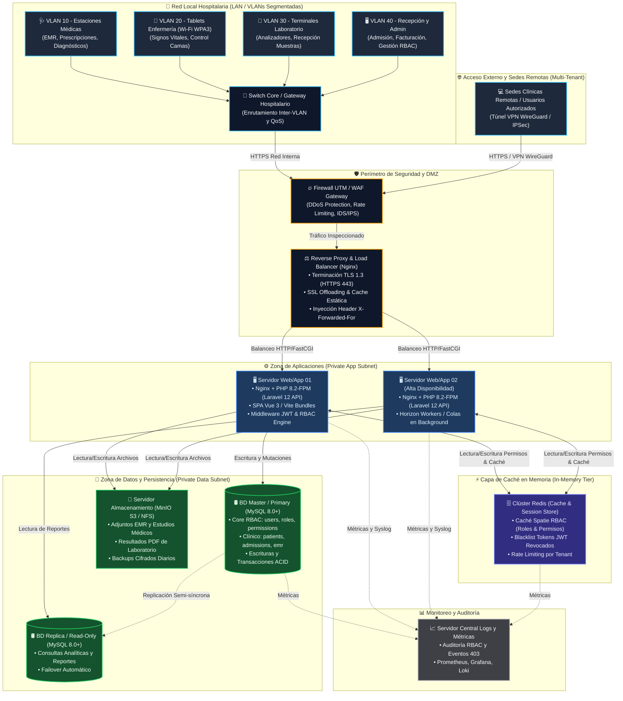

# Diagrama de Infraestructura de Red / Servidores y Diagrama de Procesos Global del Hospital
## Módulo 02: RBAC (Roles, Permisos y Protección de Rutas) — Sistema Hospitalario Integrado (HIS)

**Curso:** Análisis de Sistemas II (ASII) — 2026  
**Sistema:** Sistema Hospitalario Integrado (HIS) — Arquitectura Multi-Tenant  
**Estudiante:** Luis David Aroche Contreras (`Luis890D`)  
**Módulo:** RBAC (Roles, Permisos y Protección de Rutas)  

---

## 1. Diagrama de Infraestructura de Red y Servidores

### 1.1. Descripción de la Arquitectura de Infraestructura

Para garantizar la **alta disponibilidad**, **confidencialidad médica (HIPAA / GDPR / Estándares de Salud)**, **seguridad perimetral** y **aislamiento multi-tenant** del Sistema Hospitalario Integrado (HIS), se ha diseñado una infraestructura de red segmentada en zonas de seguridad (**DMZ**, **Red de Aplicaciones**, **Red de Datos** y **Redes Locales Hospitalarias / VLANs Clínicas**).

El módulo **RBAC** y el subsistema de autenticación operan transversalmente en esta infraestructura:
- **Terminación SSL/TLS 1.3** y filtrado WAF en el Reverse Proxy.
- **Servidores de Aplicación (Laravel 12 / PHP 8.2+ PHP-FPM)** ejecutando los middlewares de inspección de tokens JWT y permisos Spatie en memoria.
- **Clúster de Caché Redis** para almacenar en memoria ultrarrápida la matriz de permisos y listas de revocación de tokens JWT.
- **Clúster de Base de Datos Relacional (MySQL / PostgreSQL)** con replicación Primary-Replica y aislamiento lógico por `tenant_id`.
- **Segmentación de Dispositivos Clínicos** (Workstations médicas, tablets de enfermería en Wi-Fi WPA3 Enterprise, terminales de laboratorio y recepción).

---

### 1.2. Diagrama de Infraestructura de Red y Servidores (Topología)

---

### 1.3. Especificaciones Técnicas de Servidores y Red

| Componente de Infraestructura | Rol / Función Principal | Software / Stack | Especificación de Hardware Recomendada | Protocolos & Puertos |
|---|---|---|---|---|
| **Firewall / WAF Gateway** | Protección perimetral, detección de intrusiones (IDS/IPS), WAF, VPN gateway | pfSense / OPNsense / Cloudflare WAF | 4 vCPU, 8 GB RAM, 2x 10Gbps NIC | Puerto 443 (HTTPS), 51820 (WireGuard VPN) |
| **Reverse Proxy & Load Balancer** | Balanceo HTTP/HTTPS, SSL Offloading, caché estática, enrutamiento multi-tenant | Nginx 1.24+ / HAProxy | 4 vCPU, 8 GB RAM, 50 GB SSD NVMe | 80 (Redirect a 443), 443 (TLS 1.3) |
| **Servidores de Aplicación (x2)** | Backend Laravel 12 API, Frontend SPA Vue 3 compilado, ejecución del motor RBAC | Ubuntu Server 24.04 LTS, PHP 8.2-FPM, Node/Vite, Composer | 8 vCPU, 16 GB RAM, 100 GB SSD NVMe (c/u) | 9000 (PHP-FPM interno), 443 interno |
| **Servidor de Caché & Queues** | Caché de roles y permisos Spatie, invalidación de tokens JWT, colas de notificaciones | Redis 7.2+ Standalone o Sentinel | 4 vCPU, 8 GB RAM, 30 GB SSD | 6379 (Redis con AUTH y TLS interno) |
| **Clúster de Base de Datos (Master/Replica)** | Almacén relacional transaccional (usuarios, roles, pacientes, expedientes, laboratorio) | MySQL 8.0 Enterprise / PostgreSQL 16 | 8 vCPU, 32 GB RAM, 500 GB NVMe RAID 10 (c/u) | 3306 / 5432 (Solo accesible desde App Subnet) |
| **Almacenamiento de Objetos / Archivos** | Almacenamiento seguro de estudios médicos, PDFs de resultados, adjuntos EMR | MinIO S3 Compatible / NFS cifrado | 4 vCPU, 8 GB RAM, 2 TB HDD/SSD Storage Pool | 9000 / 9001 (S3 API interna) |
| **Servidor de Monitoreo & Logs** | Centralización de logs de auditoría RBAC, trazabilidad clínica y alertas de sistema | Prometheus, Grafana, Loki / ELK | 4 vCPU, 16 GB RAM, 200 GB SSD | 3000 (Grafana), 9090 (Prometheus) |

---

## 2. Diagrama de Procesos General del Hospital (Integración Global con RBAC)

### 2.1. Descripción del Flujo Integrado Hospitalario

El flujo asistencial y administrativo del hospital es un proceso interdisciplinario que involucra a múltiples actores:
1. **Admisión y Triaje:** Registro de paciente, validación de derechohabiencia, asignación de cama/sala o pase a consulta externa.
2. **Atención Médica y Expediente (EMR):** Toma de signos vitales, evaluación médica (Notas SOAP), emisión de diagnósticos y órdenes de medicamentos o laboratorio.
3. **Servicios de Apoyo y Laboratorio:** Toma y recepción de muestras con código identificador, análisis técnico, ingreso de resultados, validación por bioquímico y alertas críticas.
4. **Farmacia y Prescripciones:** Validación de alergias cruzadas y dispensación de medicamentos.
5. **Egreso, Facturación y Gobernanza:** Alta hospitalaria, liberación de cama, liquidación de cuenta y registro inmutable en bitácora de auditoría.

#### El Rol Central y Transversal del Módulo RBAC:
En **cada una de las compuertas de decisión y pasos del proceso**, el módulo **RBAC** actúa como un filtro de seguridad estricto e invisible:
- **Frontend Guard (`Vue Router` + `v-can`):** Habilita únicamente los módulos y botones que corresponden al actor en turno.
- **Tenant Context (`X-Tenant-ID`):** Garantiza que los datos consultados y generados pertenezcan exclusivamente a la sede/hospital del usuario autenticado.
- **Backend Guard (`Laravel Middleware` + `Spatie Permissions`):** Valida a nivel de controlador que el token JWT del usuario contenga el permiso granular exigido para ejecutar la acción clínica (ej. `vital_signs.create`, `emr.soap.write`, `lab.results.validate`).

---

### 2.2. Diagrama de Procesos Global del Hospital e Integración RBAC

```mermaid
flowchart TD
    %% ── INICIO Y ACCESO AL SISTEMA ─────────────────────────────
    START(["🟢 Inicio: Llegada del Paciente / Inicio de Turno"]) --> AUTH_STEP["🔑 Autenticación de Usuario (Módulo 01)\nEnvío de Credenciales & X-Tenant-ID"]
    
    AUTH_STEP --> RBAC_EVAL{"🛡️ [RBAC Core - Módulo 02]\n¿Usuario Autenticado & Rol Válido?"}
    RBAC_EVAL -- No (401 / 403) --> ACC_DENIED["🔴 Acceso Denegado\n(Redirección /403 o Bloqueo API)"]
    RBAC_EVAL -- Sí (Token JWT + Permisos Resueltos) --> LOAD_DASH["🖥️ Carga de Dashboard UI Dinámica (Módulo 26)\nRenderizado según permisos del rol (v-can)"]

    %% ── FASE 1: ADMISIÓN Y REGISTRO ────────────────────────────
    LOAD_DASH --> P1_REG["1. Registro / Búsqueda de Paciente (Módulo 03)\nActor: Recepcionista / Admisiones"]
    P1_REG --> RBAC_CHK_PAT{"🛡️ RBAC Check:\n'patients.create' / 'patients.read'"}
    RBAC_CHK_PAT -- Denegado --> ACC_DENIED
    RBAC_CHK_PAT -- Autorizado --> DEC_DEST{"¿Tipo de Atención?"}

    DEC_DEST -- Consulta Externa / Cita --> P2_CITAS["2. Agendamiento de Citas Médicas (Módulo 05)\nAsignación con Médico y Especialidad (Módulo 04)"]
    DEC_DEST -- Urgencias / Hospitalización --> P2_HOSP["3. Admisión Hospitalaria & Asignación de Cama (Módulo 07)\nCatálogo de Salas y Wards (Módulo 06)"]
    
    P2_HOSP --> RBAC_CHK_BED{"🛡️ RBAC Check:\n'beds.assign' / 'admissions.create'"}
    RBAC_CHK_BED -- Denegado --> ACC_DENIED
    RBAC_CHK_BED -- Autorizado --> P3_TRIAJE

    P2_CITAS --> P3_TRIAJE["4. Triaje y Signos Vitales (Módulo 13)\nActor: Personal de Enfermería"]

    %% ── FASE 2: ATENCIÓN CLÍNICA Y EXPEDIENTE (EMR) ───────────
    P3_TRIAJE --> RBAC_CHK_VITAL{"🛡️ RBAC Check:\n'vital_signs.create'"}
    RBAC_CHK_VITAL -- Denegado --> ACC_DENIED
    RBAC_CHK_VITAL -- Autorizado --> VITAL_ALERT{"¿Signos Fuera de Rango?"}
    
    VITAL_ALERT -- Sí --> NOTIF_CRIT["⚠️ Disparo de Alerta Crítica (Módulo 21)\nNotificación visual al médico"]
    VITAL_ALERT -- No --> P4_EMR
    NOTIF_CRIT --> P4_EMR

    P4_EMR["5. Consulta Médica & Expediente Electrónico EMR (Módulo 10)\nRegistro de Notas SOAP y Diagnósticos CIE (Módulo 11)\nActor: Médico Especialista / General"]
    P4_EMR --> RBAC_CHK_EMR{"🛡️ RBAC Check:\n'emr.soap.write' / 'diagnoses.create'"}
    RBAC_CHK_EMR -- Denegado --> ACC_DENIED
    RBAC_CHK_EMR -- Autorizado --> DEC_CLINIC{"¿Requiere Apoyo Diagnóstico / Terapéutico?"}

    %% ── FASE 3: FARMACIA Y PRESCRIPCIONES ──────────────────────
    DEC_CLINIC -- Prescripción Médica --> P5_RX["6. Prescripción Electrónica de Medicamentos (Módulo 15)\nCatálogo de Medicamentos (Módulo 14)"]
    P5_RX --> RBAC_CHK_RX{"🛡️ RBAC Check:\n'prescriptions.create'"}
    RBAC_CHK_RX -- Denegado --> ACC_DENIED
    RBAC_CHK_RX -- Autorizado --> CHK_ALLERGY{"🛡️ Validación de Alergias (Módulo 12)\n¿Paciente Alérgico al Fármaco?"}
    
    CHK_ALLERGY -- Sí (Conflicto Crítico) --> ALERT_RX["⛔ Alerta de Contraindicación Farmacológica\nEl médico ajusta el fármaco"]
    ALERT_RX --> P5_RX
    CHK_ALLERGY -- No (Seguro) --> DISP_FARM["Farmacia: Despacho y Administración"]

    %% ── FASE 4: SERVICIOS DE LABORATORIO CLÍNICO ────────────────
    DEC_CLINIC -- Órdenes de Laboratorio --> P6_LAB_ORD["7. Emisión de Orden de Laboratorio (Módulo 16)\nCatálogo de Pruebas (Módulo 17)"]
    P6_LAB_ORD --> RBAC_CHK_LAB_ORD{"🛡️ RBAC Check:\n'lab.orders.create'"}
    RBAC_CHK_LAB_ORD -- Denegado --> ACC_DENIED
    RBAC_CHK_LAB_ORD -- Autorizado --> P7_MUESTRA["8. Recepción de Muestra y Etiquetado Código (Módulo 18)\nActor: Flebotomista / Recepción Lab"]

    P7_MUESTRA --> P8_RES_ING["9. Ingreso de Resultados de Pruebas (Módulo 19)\nActor: Técnico de Laboratorio"]
    P8_RES_ING --> RBAC_CHK_TECH{"🛡️ RBAC Check:\n'lab.results.write'"}
    RBAC_CHK_TECH -- Denegado --> ACC_DENIED
    RBAC_CHK_TECH -- Autorizado --> P9_VAL_BIO["10. Validación Bioquímica de Resultados (Módulo 20)\nActor: Bioquímico / Jefe de Laboratorio"]

    P9_VAL_BIO --> RBAC_CHK_BIO{"🛡️ RBAC Check:\n'lab.results.validate'"}
    RBAC_CHK_BIO -- Denegado --> ACC_DENIED
    RBAC_CHK_BIO -- Autorizado --> LAB_CRIT{"¿Valores Críticos / Pánico?"}

    LAB_CRIT -- Sí --> NOTIF_LAB["🚨 Alerta Inmediata a Médico Tratante (Módulo 21)"]
    LAB_CRIT -- No --> EMR_INTEG["Actualización de Resultados en EMR del Paciente"]
    NOTIF_LAB --> EMR_INTEG

    %% ── FASE 5: TRASLADOS, EGRESO Y GOBERNANZA ──────────────────
    DISP_FARM --> EVOL_CLI["Evolución Clínica / Monitoreo en Cama"]
    EMR_INTEG --> EVOL_CLI

    EVOL_CLI --> DEC_ALTA{"¿Paciente Listo para Alta Médica?"}
    DEC_ALTA -- No (Traslado de Área) --> P10_TRAS["11. Traslado Interno de Cama/Ward (Módulo 08)"]
    P10_TRAS --> P3_TRIAJE

    DEC_ALTA -- Sí (Alta Hospitalaria) --> P11_ALTA["12. Orden de Alta y Liberación de Cama (Módulo 08)\nActualización de Ocupación Hospitalaria (Módulo 09)"]
    P11_ALTA --> RBAC_CHK_DISCH{"🛡️ RBAC Check:\n'admissions.discharge'"}
    RBAC_CHK_DISCH -- Denegado --> ACC_DENIED
    RBAC_CHK_DISCH -- Autorizado --> P12_REP["13. Emisión de Reportes Operativos & Analytics (Módulos 23 y 27)\nActor: Administración Hospitalaria"]

    P12_REP --> AUDIT_LOG["14. Gobernanza y Auditoría Inmutable (Módulo 22)\nRegistro de toda transacción en 'audit_logs'\n(Usuario, Rol, Acción, Tenant, IP, Timestamp)"]

    AUDIT_LOG --> END_PROC(["🏁 Fin del Proceso Asistencial"])

    %% ── ESTILOS DE DIAGRAMA ─────────────────────────────────────
    classDef startEnd fill:#0f172a,stroke:#22c55e,stroke-width:2px,color:#f0fdf4;
    classDef rbacGate fill:#450a0a,stroke:#ef4444,stroke-width:2px,color:#fee2e2;
    classDef clinicalStep fill:#1e3a5f,stroke:#3b82f6,stroke-width:2px,color:#f8fafc;
    classDef labStep fill:#14532d,stroke:#10b981,stroke-width:2px,color:#f0fdf4;
    classDef alertStep fill:#78350f,stroke:#f59e0b,stroke-width:2px,color:#fef3c7;
    classDef auditStep fill:#312e81,stroke:#818cf8,stroke-width:2px,color:#ede9fe;

    class START,END_PROC startEnd;
    class RBAC_EVAL,RBAC_CHK_PAT,RBAC_CHK_BED,RBAC_CHK_VITAL,RBAC_CHK_EMR,RBAC_CHK_RX,RBAC_CHK_LAB_ORD,RBAC_CHK_TECH,RBAC_CHK_BIO,RBAC_CHK_DISCH,ACC_DENIED rbacGate;
    class AUTH_STEP,LOAD_DASH,P1_REG,P2_CITAS,P2_HOSP,P3_TRIAJE,P4_EMR,P5_RX,P10_TRAS,P11_ALTA,P12_REP clinicalStep;
    class P6_LAB_ORD,P7_MUESTRA,P8_RES_ING,P9_VAL_BIO,EMR_INTEG,DISP_FARM,EVOL_CLI labStep;
    class NOTIF_CRIT,NOTIF_LAB,ALERT_RX alertStep;
    class AUDIT_LOG auditStep;
```

---

### 2.3. Matriz de Integración de Permisos RBAC en el Flujo Hospitalario

| Etapa del Proceso | Módulo Clínico Involucrado | Actor Principal | Permiso RBAC Exigido (`Permission Key`) | Mecanismo de Control (Backend & Frontend) |
|---|---|---|---|---|
| **Acceso al Sistema** | Módulo 01 (Auth) & Módulo 02 (RBAC) | Todos los Usuarios | `auth.login`, `tenant.access` | JWT Bearer Token + Validación `X-Tenant-ID` en headers |
| **Admisión y Registro** | Módulo 03 (Pacientes) | Recepcionista / Admisión | `patients.create`, `patients.read` | `Route::middleware('permission:patients.create')` y `v-can="'patients.create'"` |
| **Asignación de Camas** | Módulo 06 & 07 (Salas y Admisión) | Admisiones / Hospitalización | `beds.assign`, `admissions.create` | Validación de disponibilidad de cama y asignación por tenant |
| **Triaje y Signos Vitales** | Módulo 13 (Signos Vitales) | Personal de Enfermería | `vital_signs.create`, `vital_signs.read` | Middleware de Laravel + alertas automáticas por valores anormales |
| **Atención Médica EMR** | Módulo 10 & 11 (EMR y Notas SOAP) | Médico General / Especialista | `emr.soap.write`, `diagnoses.create` | Bloqueo estricto a personal no facultativo; firma de nota médica |
| **Prescripción de Fármacos** | Módulo 14 & 15 (Catálogo y Prescripciones) | Médico Tratante | `prescriptions.create` | Interceptación y validación cruzada con Módulo 12 (Alergias) |
| **Órdenes de Laboratorio** | Módulo 16 & 17 (Órdenes y Catálogo Lab) | Médico Solicitante | `lab.orders.create` | Creación de orden vinculada al episodio médico del paciente |
| **Toma y Registro de Muestra** | Módulo 18 (Recepción Muestras) | Flebotomista / Lab Assistant | `lab.samples.receive` | Escaneo y asignación de código de barras/identificador |
| **Ingreso de Resultados** | Módulo 19 (Resultados Lab) | Técnico de Laboratorio | `lab.results.write` | Edición de valores cuantitativos/cualitativos de la prueba |
| **Validación Bioquímica** | Módulo 20 (Validación Bioquímica) | Bioquímico / Jefe de Lab | `lab.results.validate` | Autorización jerárquica de publicación de resultados a EMR |
| **Alta y Liberación** | Módulo 08 (Traslados y Altas) | Médico / Supervisor de Piso | `admissions.discharge`, `beds.release` | Cierre de admisión hospitalaria y cambio de estado de cama |
| **Gobernanza y Auditoría** | Módulo 22 (Auditoría de Movimientos) | SuperAdmin / Auditor | `audit.logs.view`, `rbac.roles.manage` | Registro inmutable de eventos HTTP y mutaciones en base de datos |

---

## 3. Conclusiones y Valor Arquitectónico

1. **Alineación con Estándares Hospitalarios:** La arquitectura de infraestructura y el flujo de procesos global garantizan la confidencialidad de los datos clínicos de acuerdo con estándares internacionales, asegurando que cada profesional de la salud opere dentro del principio del menor privilegio (*Least Privilege Principle*).
2. **Resiliencia y Rendimiento:** La separación en capas físicas y lógicas (DMZ, App Servers balanceados, Clúster Redis y Clúster MySQL) permite absorber picos de carga en el hospital sin degradar los tiempos de validación autorizativa (< 15 ms).
3. **Gobernanza Integral:** El módulo **RBAC** no es una funcionalidad aislada, sino el eje de control autorizativo transversal que protege todas las operaciones clínicas y administrativas del **Sistema Hospitalario Integrado**.
