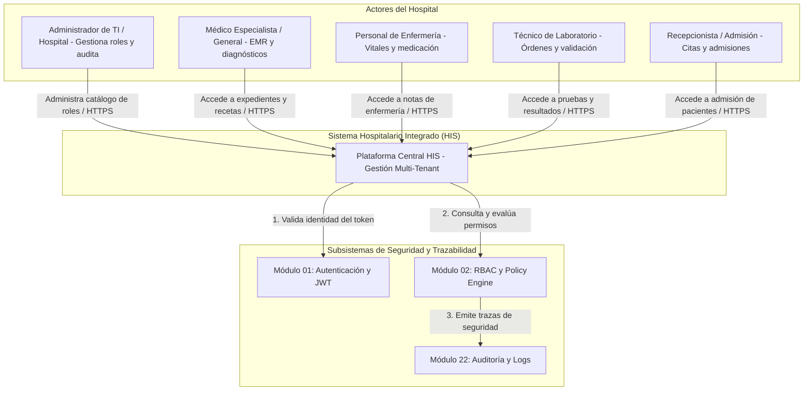
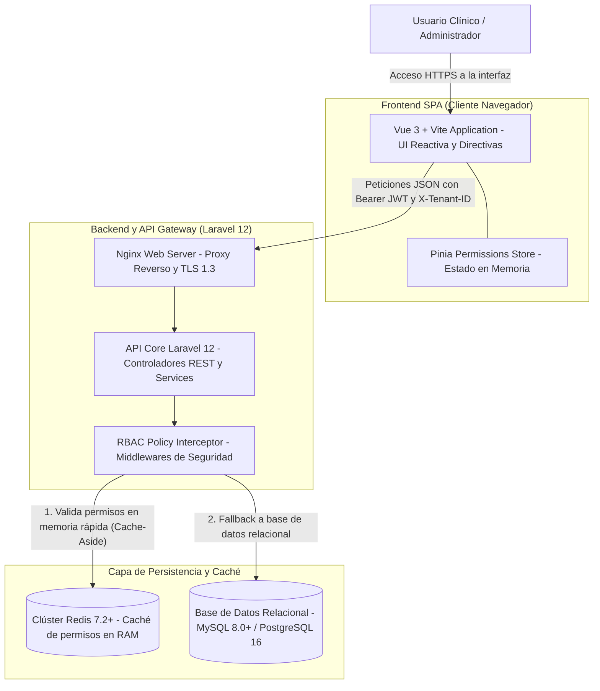
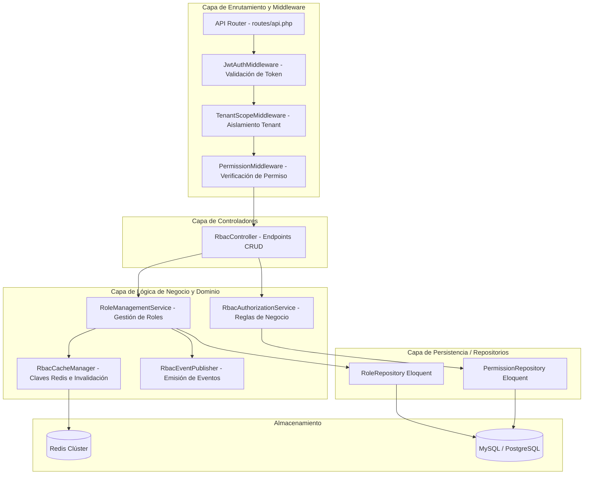

# Semana 3 — Diseño Arquitectónico, Vistas y Patrones
## Módulo 02: RBAC (Roles, Permisos y Protección de Rutas)

**Curso:** Análisis de Sistemas II (ASII) — 2026  
**Sistema:** Sistema Hospitalario Integrado (HIS)  
**Estudiante:** Luis David Aroche Contreras (`Luis890D`)  
**Rama de trabajo:** `feature/asii-02-rbac-roles-permisos-y-proteccion-de-rutas-luis890d`  
**Worktree actual:** `shi-documentacion-rbac-Luis-Aroche`  

---

## 1. Introducción y Visión Arquitectónica

El módulo **RBAC (Role-Based Access Control)** constituye el subsistema transversal de seguridad y gobernanza autorizativa del **Sistema Hospitalario Integrado (HIS)**. Su objetivo arquitectónico es desacoplar las reglas de acceso del código de negocio de los distintos módulos clínicos (Admisión, EMR, Farmacia, Laboratorio, Facturación) y proporcionar un mecanismo declarativo, determinista, auditable y de alto rendimiento para validar permisos tanto a nivel de API backend como en la interfaz de usuario frontend.

La arquitectura se fundamenta en el **Modelo C4** (Contexto, Contenedores y Componentes) y adopta patrones de diseño y arquitectónicos probados en la industria médica para garantizar alta cohesión, bajo acoplamiento y cumplimiento estricto del aislamiento multi-tenant.

---

## 2. Modelo Arquitectónico C4

### 2.1. Nivel 1: Diagrama de Contexto del Sistema (System Context)

Muestra la interacción global entre los usuarios del hospital, el módulo RBAC y los sistemas satélite dentro del ecosistema hospitalario.

---

### 2.2. Nivel 2: Diagrama de Contenedores (Container Diagram)

Describe la distribución física y lógica de las aplicaciones, servicios de almacenamiento en memoria y bases de datos que componen la solución.

---

### 2.3. Nivel 3: Diagrama de Componentes Backend (Component Diagram)

Detalla la estructura interna del módulo RBAC dentro del backend Laravel 12.

---

## 3. Vista de Dependencias e Interacción con el HIS

El módulo RBAC es una dependencia transversal de orden cero en el HIS. Ningún módulo clínico o administrativo procesa una mutación de estado sin la previa autorización de RBAC.

```mermaid
flowchart TB
    subgraph TRANSVERSAL ["Nivel Transversal: Seguridad y Core"]
        M01["Módulo 01: Autenticación (JWT)"]
        M02["Módulo 02: RBAC y Permisos (Luis Aroche)"]
        M22["Módulo 22: Auditoría y Trazabilidad"]
    end

    subgraph ASISTENCIAL ["Nivel Asistencial / Clínico"]
        M03["Módulo 03: Gestión de Pacientes"]
        M07["Módulo 07: Admisión Hospitalaria"]
        M10["Módulo 10: EMR y Expediente Clínico"]
        M15["Módulo 15: Prescripciones y Recetas"]
        M16["Módulo 16: Órdenes de Laboratorio"]
        M20["Módulo 20: Validación de Resultados Lab"]
    end

    subgraph ADMINISTRATIVO ["Nivel Administrativo y Soporte"]
        M05["Módulo 05: Gestión de Camas"]
        M08["Módulo 08: Facturación y Cobros"]
        M12["Módulo 12: Farmacia e Inventario"]
    end

    M01 -->|"Identity Provider (Token)"| M02
    M02 -->|"Autoriza acceso a"| M03
    M02 -->|"Autoriza acceso a"| M07
    M02 -->|"Autoriza acceso a"| M10
    M02 -->|"Autoriza acceso a"| M15
    M02 -->|"Autoriza acceso a"| M16
    M02 -->|"Autoriza acceso a"| M20
    M02 -->|"Autoriza acceso a"| M05
    M02 -->|"Autoriza acceso a"| M08
    M02 -->|"Autoriza acceso a"| M12
    M02 -->|"Emite eventos de auditoría hacia"| M22
```

---

## 4. Patrones de Diseño y Arquitectónicos Aplicados

| Patrón | Tipo | Propósito en el Módulo RBAC | Ubicación / Implementación |
|---|---|---|---|
| **Role-Based Access Control (RBAC)** | Arquitectónico / Seguridad | Modelo formal que asigna permisos a roles abstractos y vincula usuarios a dichos roles, simplificando la matriz $U \times P$ a $U \times R + R \times P$. | Capa de Dominio / Spatie Core |
| **Pipeline / Interceptor (Middleware)** | Comportamiento | Intercepta cada solicitud HTTP entrante de manera secuencial antes de llegar al controlador para validar autenticación, tenant y permisos. | `app/Http/Middleware/PermissionMiddleware.php` |
| **Cache-Aside (Lazy Loading)** | Arquitectónico / Rendimiento | Los permisos se consultan en Redis; si no existen (cache miss), se leen de la BD relacional y se pueblan en memoria con TTL configurable. | `app/Services/RbacCacheManager.php` |
| **Repository Pattern** | Estructural | Desacopla la lógica de negocio de la implementación de acceso a datos (ORM Eloquent), facilitando testing con dobles/mocks. | `app/Repositories/Contracts/RoleRepositoryInterface.php` |
| **Data Transfer Object (DTO)** | Estructural | Transporta datos fuertemente tipados e inmutables entre la capa de presentación (API) y la capa de servicios. | `app/DTOs/AssignRoleDTO.php`, `CreateRoleDTO.php` |
| **Observer / Domain Events** | Comportamiento | Emite eventos reactivos ante cambios en privilegios (`RoleUpdated`, `PermissionsChanged`) para invalidar caché y alimentar la bitácora de auditoría. | `app/Events/RolePermissionsUpdated.php` |
| **Directiva Declarativa (UI Decorator)** | Frontend | Suprime o deshabilita elementos del DOM en Vue 3 según los permisos del usuario activo en el cliente sin contaminar los componentes. | `resources/js/directives/can.js` (`v-can`) |

---

## 5. Estrategia de Aislamiento Multi-Tenant

Para prevenir cualquier filtración de privilegios entre distintos centros hospitalarios o clínicas que compartan la misma infraestructura:

1. **Inyección de Tenant Scope:** Cada modelo RBAC (`Role`, `Permission`) incorpora un global scope `TenantScope` que añade automáticamente la cláusula `WHERE tenant_id = ?` a todas las consultas SQL.
2. **Llave de Caché Compuesta:** Las llaves de almacenamiento en Redis incorporan el tenant explícitamente:
   $$\text{Key} = \texttt{tenant:\{tenant\_id\}:user:\{user\_id\}:permissions}$$
3. **Validación Cruzada en Middleware:** Si el `tenant_id` contenido en el JWT no coincide con el encabezado `X-Tenant-ID` de la petición, el sistema aborta de inmediato con código `403 Forbidden` (*Tenant Mismatch*).
