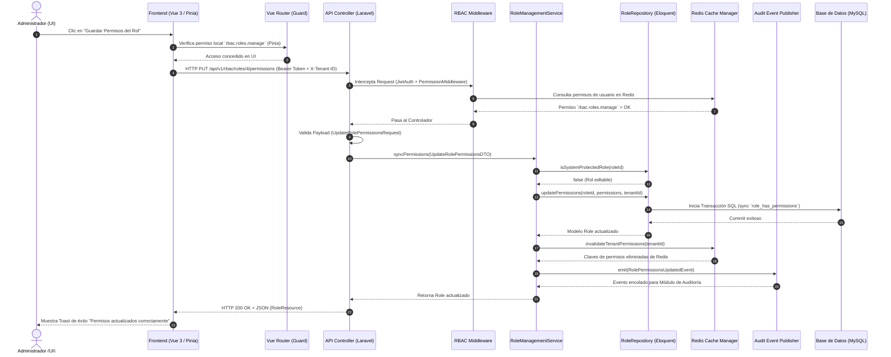

# Semana 4 — Arquitectura en Capas y Patrón Repositorio
## Módulo 02: RBAC (Roles, Permisos y Protección de Rutas)

**Curso:** Análisis de Sistemas II (ASII) — 2026  
**Sistema:** Sistema Hospitalario Integrado (HIS)  
**Estudiante:** Luis David Aroche Contreras (`Luis890D`)  
**Rama de trabajo:** `feature/asii-02-rbac-roles-permisos-y-proteccion-de-rutas-luis890d`  
**Worktree actual:** `shi-documentacion-rbac-Luis-Aroche`  

---

## 1. Visión General de la Arquitectura en Capas

El módulo **RBAC** está estructurado siguiendo los principios de la **Arquitectura en Capas (Layered Architecture)** y **Domain-Driven Design (DDD)** táctico, garantizando una estricta separación de responsabilidades (*Separation of Concerns*). Las capas superiores conocen a las inferiores exclusivamente a través de interfaces y abstracciones, lo que favorece la testeabilidad, mantenibilidad y desacoplamiento del framework.

```mermaid
graph TD
    subgraph CAPA_1 ["1. Capa de Presentación / UI (Frontend Vue 3)"]
        UI_VIEWS["Vistas y Componentes (`RolesManagementView.vue`)"]
        UI_STORE["Estado Global Pinia (`rbacStore.js`)"]
        UI_GUARDS["Navigation Guards (`router/index.js`)"]
        UI_DIRECTIVES["Directivas de Permisos (`v-can`, `can.js`)"]
    end

    subgraph CAPA_2 ["2. Capa de Interfaz API / Entrada HTTP (Backend Laravel 12)"]
        API_ROUTES["Enrutador REST (`routes/api.php`)"]
        API_MW["Middlewares de Seguridad (`PermissionMiddleware`, `TenantScope`)"]
        API_CTRL["Controladores REST (`RbacController.php`)"]
        API_REQUESTS["Form Requests / Validaciones (`StoreRoleRequest.php`)"]
        API_RESOURCES["API Resources / Serializadores (`RoleResource.php`)"]
    end

    subgraph CAPA_3 ["3. Capa de Lógica de Negocio / Dominio (Domain Services)"]
        SRV_AUTH["RbacAuthorizationService.php"]
        SRV_ROLE["RoleManagementService.php"]
        SRV_CACHE["RbacCacheManager.php"]
        DOM_EVENTS["Eventos de Dominio (`RoleCreated`, `PermissionsSynced`)"]
    end

    subgraph CAPA_4 ["4. Capa de Abstracción y Persistencia (Data Access / Repository Pattern)"]
        REPO_INT["Contratos de Repositorio (`RoleRepositoryInterface`, `PermissionRepositoryInterface`)"]
        REPO_ELOQ["Implementaciones Eloquent (`EloquentRoleRepository`, `EloquentPermissionRepository`)"]
        ORM_MODELS["Modelos de Dominio / ORM (`Role`, `Permission`, `User`)"]
        CACHE_STORE["Store de Memoria Rápida (Redis Cache Adapter)"]
    end

    subgraph CAPA_5 ["5. Infraestructura y Base de Datos (Storage Layer)"]
        DB_SQL["Motor SQL (MySQL 8.0+ / PostgreSQL 16)"]
        DB_REDIS["Servidor Redis (Clúster de Memoria)"]
    end

    CAPA_1 -->|"Peticiones HTTP y JSON"| CAPA_2
    CAPA_2 -->|"Invoca Servicios DTO"| CAPA_3
    CAPA_3 -->|"Consulta Interfaces"| CAPA_4
    CAPA_4 -->|"Lectura y Escritura"| CAPA_5
```



---

## 2. Responsabilidades Detalladas por Capa

| Capa | Responsabilidad Principal | Tecnologías y Artefactos Clave |
|---|---|---|
| **1. UI / Presentación (Frontend)** | Renderizar interfaces reactivas de gestión de roles, ocultar botones no permitidos mediante `v-can`, interceptar navegación no autorizada en el cliente y consultar permisos en Pinia. | Vue 3, Pinia Store, Vue Router, TailwindCSS / CSS3, Axios. |
| **2. API / Entrada HTTP (Backend)** | Recibir solicitudes HTTP, validar el token JWT y tenant, ejecutar el pipeline de middlewares autorizativos, sanear inputs mediante `FormRequest` y retornar respuestas JSON estructuradas. | Laravel 12 Router, Controllers, Form Requests, JsonResources, Middlewares. |
| **3. Lógica de Negocio (Domain & Services)** | Orquestar las reglas del negocio: verificar jerarquías de roles, impedir eliminación de roles protegidos del sistema (`SuperAdmin`), coordinar sincronización atómica de permisos y disparar eventos de auditoría. | `RbacAuthorizationService`, `RoleManagementService`, Domain Events, DTOs. |
| **4. Persistencia / Repositorios** | Abstraer el almacenamiento de datos relacionales y en memoria. Implementar el patrón Repositorio para encapsular consultas Eloquent y operaciones de lectura/escritura en Redis. | `RoleRepositoryInterface`, `EloquentRoleRepository`, Modelos Eloquent, Spatie Permission Core, Redis Drivers. |
| **5. Almacenamiento e Infraestructura** | Persistir de forma durable las tablas maestras, índices, llaves foráneas y registros de auditoría; y mantener la caché en memoria RAM de baja latencia. | MySQL 8.0+ / PostgreSQL 16, Redis 7.2+. |

---

## 3. Catálogo de Objetos Reutilizables

Para garantizar un código limpio, desacoplado y fuertemente tipado, el módulo define los siguientes objetos reutilizables entre capas:

### 3.1. Data Transfer Objects (DTOs)

Objetos inmutables que encapsulan los parámetros de entrada y salida entre el Controller y los Servicios de Dominio:

1. **`CreateRoleDTO`**: Transporta `name` (string), `guard_name` (string), `description` (string), `tenant_id` (int/uuid) y `permissions` (array de strings).
2. **`UpdateRolePermissionsDTO`**: Encapsula `role_id` (int), `tenant_id` (int) y la lista de `permissions` (array de IDs/slangs) a sincronizar atómicamente.
3. **`AssignUserRolesDTO`**: Contiene `user_id` (int), `tenant_id` (int), `roles` (array de nombres/IDs) y el identificador del usuario auditor que realiza la asignación.
4. **`UserEffectivePermissionsDTO`**: Estructura de salida consolidada que contiene `roles` (array), `direct_permissions` (array), `inherited_permissions` (array) y `all_permissions` (set unificado).

### 3.2. Value Objects y Enums (PHP 8.2+)

Tipos estrictos para evitar cadenas mágicas (*magic strings*) y errores tipográficos:

```php
namespace App\Enums;

enum SystemRole: string
{
    case SUPER_ADMIN  = 'SuperAdmin';
    case HOSPITAL_ADMIN = 'HospitalAdmin';
    case DOCTOR       = 'Médico';
    case NURSE        = 'Enfermera';
    case LAB_TECH     = 'TecnicoLab';
    case RECEPTIONIST = 'Recepcionista';
    case AUDITOR      = 'Auditor';
}

enum PermissionModule: string
{
    case RBAC         = 'rbac';
    case PATIENTS     = 'patients';
    case ADMISSIONS   = 'admissions';
    case EMR          = 'emr';
    case PRESCRIPTIONS = 'prescriptions';
    case LAB          = 'lab';
    case BEDS         = 'beds';
    case AUDIT        = 'audit';
}
```

### 3.3. Interfaces del Patrón Repositorio

Contratos explícitos para el acceso a datos:

```php
namespace App\Repositories\Contracts;

use App\DTOs\CreateRoleDTO;
use App\Models\Role;
use Illuminate\Database\Eloquent\Collection;

interface RoleRepositoryInterface
{
    public function findById(int $id, int $tenantId): ?Role;
    public function findByName(string $name, int $tenantId): ?Role;
    public function getAllByTenant(int $tenantId): Collection;
    public function create(CreateRoleDTO $dto): Role;
    public function updatePermissions(int $roleId, array $permissionNames, int $tenantId): Role;
    public function delete(int $roleId, int $tenantId): bool;
    public function isSystemProtectedRole(int $roleId): bool;
}
```

```php
namespace App\Repositories\Contracts;

use App\Models\Permission;
use Illuminate\Database\Eloquent\Collection;

interface PermissionRepositoryInterface
{
    public function getAllGroupedByModule(): array;
    public function findByNames(array $names): Collection;
    public function getPermissionsForUser(int $userId, int $tenantId): array;
}
```

---

## 4. Diagrama de Secuencia de Flujo entre Capas

Ilustra la interacción completa desde que un usuario intenta realizar una operación protegida (ej. *Modificar permisos de un rol*) a través de la UI hasta su persistencia y sincronización de caché.



---

## 5. Beneficios Arquitectónicos Obtenidos

1. **Testabilidad Aislada:** La lógica de negocio (`RoleManagementService`) puede probarse con pruebas unitarias puras usando mocks de `RoleRepositoryInterface` sin tocar la base de datos física.
2. **Independencia del Framework:** Si el motor de persistencia cambia de MySQL a PostgreSQL o MongoDB, únicamente se reemplaza la implementación del repositorio sin alterar la capa de servicios ni la API.
3. **Alto Rendimiento en Lectura:** El desacoplamiento de `RbacCacheManager` asegura que el 95% de las validaciones de acceso se resuelvan en memoria (Redis) en sub-milisegundos.
