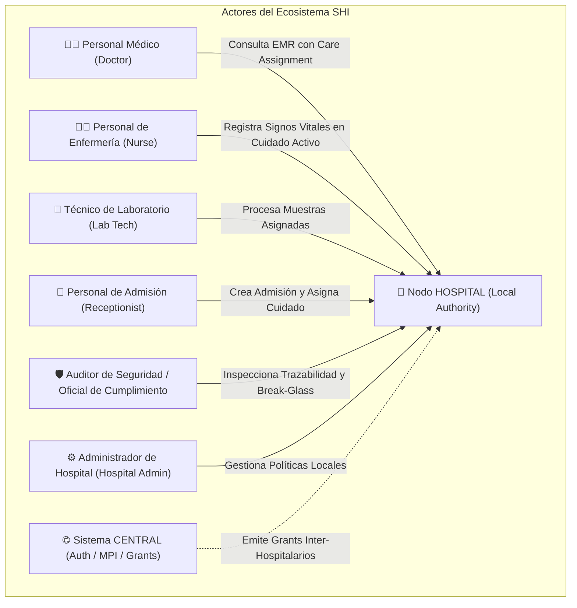
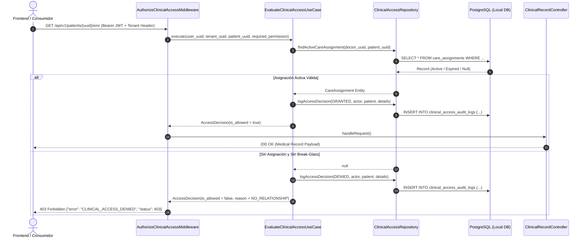
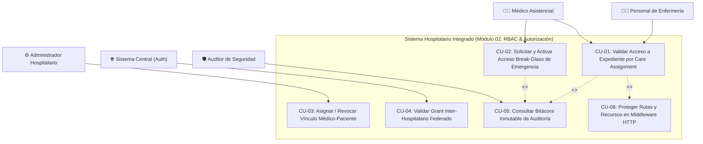
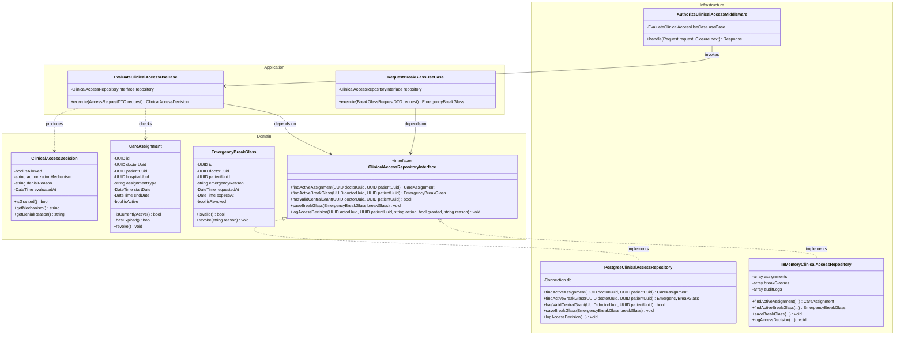
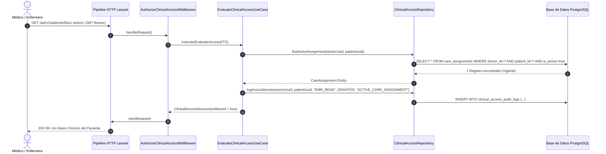
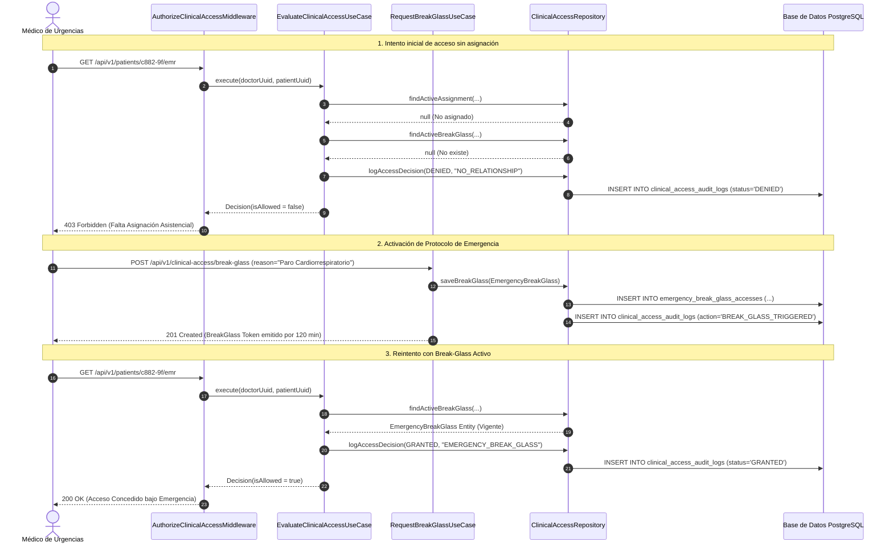
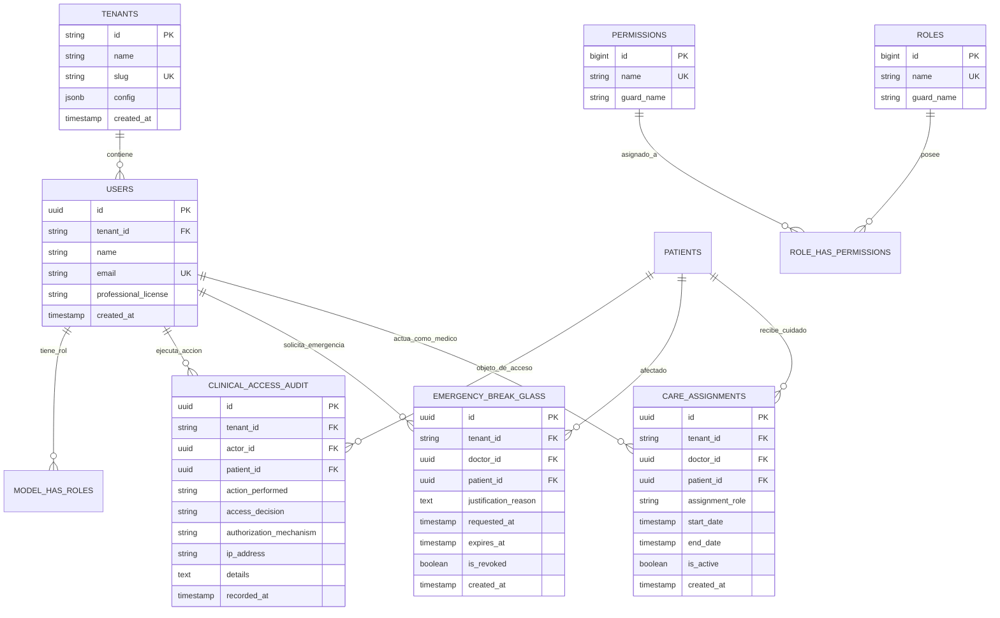

# 🏥 SISTEMA HOSPITALARIO INTEGRADO (SHI)
## Documento de Arquitectura de Software, Especificación Técnica y Patrón Repository
### Módulo 02: Autorización Clínica — Roles, Care Assignment, Grants y Protección de Rutas

---

| **Ficha Técnica del Entregable** | **Información de la Asignación** |
|:---|:---|
| **Institución / Curso** | Universidad — Facultad de Ingeniería en Sistemas / **Análisis de Sistemas II (ASII)** |
| **Estudiante** | **LUIS DAVID AROCHE CONTRERAS** |
| **Identificador / Carné** | Estudiante Asignación 02 |
| **Usuario GitHub** | [`@Luis890D`](https://github.com/Luis890D) |
| **Módulo Asignado** | **02. Autorización clínica: roles, care_assignment, grants y protección de rutas** |
| **Límite de Datos** | **Transversal:** `membership` / `grant` en **CENTRAL** y `policy` / `care_assignment` en **HOSPITAL** |
| **Rama de Trabajo (Git)** | `feature/asii-02-rbac-roles-permisos-y-proteccion-de-rutas-luis890d` |
| **Worktree Local** | `../shi-mod02-rbac` |
| **Rama Base de Integración** | `origin/develop` |
| **Motor de Base de Datos** | **PostgreSQL 16** (Arquitectura Federada Multi-Tenant) |
| **Framework Backend** | **Laravel 12 (PHP 8.2+)** con Arquitectura Limpia (Domain-Driven Design + Repository Pattern) |

---

## 📑 Tabla de Contenidos
1. [Resumen Ejecutivo y Contexto del Módulo](#1-resumen-ejecutivo-y-contexto-del-módulo)
2. [Especificación Funcional y Casos de Uso (SDD)](#2-especificación-funcional-y-casos-de-uso-sdd)
   - 2.1. Problema de Negocio y Justificación
   - 2.2. Caracterización de Actores
   - 2.3. Delimitación de Alcance (*In Scope* vs *Out of Scope*)
   - 2.4. Regla Central Obligatoria de Autorización Clínica
   - 2.5. Criterios de Aceptación en Sintaxis BDD (Gherkin)
   - 2.6. Contratos de API REST (Consumo y Publicación)
3. [Registro de Decisiones de Arquitectura (ADR-001)](#3-registro-de-decisiones-de-arquitectura-adr-001)
   - 3.1. Patrón Repository y Principio de Inversión de Dependencias (DIP)
   - 3.2. Arquitectura Federada: Límite CENTRAL vs HOSPITAL y UUIDs Lógicos
   - 3.3. Tolerancia a Fallos, Modo Desconexión y Transaccionalidad Local
4. [Modelado y Artefactos UML](#4-modelado-y-artefactos-uml)
   - 4.1. Diagrama de Casos de Uso (UML)
   - 4.2. Diagrama de Clases del Diseño y Repositorios
   - 4.3. Diagramas de Secuencia (Flujo Exitoso vs Excepción/Break-Glass)
   - 4.4. Diagrama de Componentes y Arquitectura en Capas (DDD)
   - 4.5. Vista de Datos y Diagrama Entidad-Relación (ER)
5. [Diseño y Esquema de Base de Datos (PostgreSQL 16)](#5-diseño-y-esquema-de-base-de-datos-postgresql-16)
   - 5.1. DDL SQL Estructurado para PostgreSQL
   - 5.2. Diccionario de Datos, Claves e Índices de Rendimiento
6. [Estructura de la Solución e Implementación del Código](#6-estructura-de-la-solución-e-implementación-del-código)
   - 6.1. Organización de Carpetas (Clean Architecture)
   - 6.2. Capa de Dominio (Domain Entities & Value Objects)
   - 6.3. Capa de Aplicación (Use Cases & DTOs)
   - 6.4. Capa de Infraestructura (Repository Interface & Adapters)
   - 6.5. Capa de Presentación (Middlewares & Controllers)
7. [Estrategia de Pruebas Automatizadas y Reproducibilidad](#7-estrategia-de-pruebas-automatizadas-y-reproducibilidad)
   - 7.1. Matriz de Cobertura de Pruebas
   - 7.2. Código de Pruebas Unitarias, de Feature y de Integración
8. [Guía de Validación y Comandos de Ejecución](#8-guía-de-validación-y-comandos-de-ejecución)
9. [Declaración de Uso Ético de Inteligencia Artificial (DECLARACION_IA)](#9-declaración-de-uso-ético-de-inteligencia-artificial-declaracion_ia)
10. [Lista Final de Comprobación y Rúbrica de Evaluación](#10-lista-final-de-comprobación-y-rúbrica-de-evaluación)

---

## 1. Resumen Ejecutivo y Contexto del Módulo

En un ecosistema hospitalario moderno y federado como el **Sistema Hospitalario Integrado (SHI)**, la protección de los datos de salud protegidos (PHI - *Protected Health Information*) no puede depender de un esquema tradicional y estático de control de acceso basado únicamente en roles (RBAC simple). En los hospitales reales, un médico de medicina general no debe tener acceso irrestricto a los expedientes de todos los pacientes del hospital, sino únicamente a aquellos pacientes con quienes mantiene una **relación asistencial activa (*Care Assignment*)** o cuando se le ha otorgado un **permiso inter-hospitalario (*Cross-Hospital Grant*)** o un **acceso de emergencia justificado (*Break-Glass Protocol*)**.

El **Módulo 02: Autorización Clínica** implementa un modelo híbrido avanzado que combina:
1. **RBAC (Role-Based Access Control):** Validación de rol base y permisos operativos a nivel de hospital/tenant.
2. **ReBAC / Relationship-Based Access:** Validación obligatoria de la asignación asistencial activa entre el facultativo y el paciente (`care_assignment`).
3. **ABAC / Attribute-Based Access:** Reglas contextuales basadas en tiempo de vigencia, estado de la admisión, especialidad y estado de emergencia.
4. **Protección Perimetral de Rutas:** Middlewares de inspección profunda en el pipeline HTTP de Laravel que interceptan toda petición antes de que toque la lógica de negocio o la base de datos.
5. **Auditoría Inmutable Local:** Registro obligatorio de toda decisión autorizada o denegada para cumplimiento normativo (HIPAA / GDPR / Leyes Locales de Salud).

---

## 2. Especificación Funcional y Casos de Uso (SDD)

### 2.1. Problema de Negocio y Justificación
* **Problema:** En sistemas hospitalarios convencionales, asignar el rol "Médico" otorga acceso de lectura/escritura a todo el expediente clínico del hospital. Esto propicia fugas de información, violaciones al secreto médico y accesos no autorizados a expedientes de figuras públicas o familiares.
* **Solución Implementada:** Arquitectura de **Autorización Denegada por Defecto (*Zero Trust / Deny by Default*)**. Para consultar o modificar un recurso clínico sensible (`/api/v1/patients/{uuid}/emr`), el motor evalúa:
  1. Que el usuario posea un `central_user` válido y una `hospital_membership` activa en el hospital actual.
  2. Que posea el permiso clínico base (ej. `clinical:records:read`).
  3. Que exista un `care_assignment` vigente que vincule al médico con el paciente, O un `cross_hospital_grant` aprobado por el nodo central, O una activación explícita de `emergency_break_glass` debidamente justificada.

### 2.2. Caracterización de Actores



| Actor | Tipo | Rol y Privilegios en el Módulo |
|:---|:---|:---|
| **Personal Médico (Doctor)** | Humano (Consumidor Clínico) | Accede a expedientes, diagnósticos y notas SOAP de pacientes bajo su cuidado activo. Puede solicitar *Break-Glass* en emergencias. |
| **Personal de Enfermería (Nurse)** | Humano (Consumidor Clínico) | Registra notas de enfermería y signos vitales para pacientes asignados en su turno o sala. |
| **Técnico de Laboratorio** | Humano (Consumidor Clínico) | Consulta órdenes médicas y reporta resultados analíticos de pacientes referidos a laboratorio. |
| **Personal de Admisión** | Humano (Operador) | Registra ingresos y genera la vinculación inicial médico-paciente (`care_assignment`). |
| **Auditor de Seguridad** | Humano (Fiscalizador) | Visualiza bitácoras inmutables de acceso, inspecciona alertas de accesos denegados y audita justificaciones de *Break-Glass*. |
| **Sistema CENTRAL** | Servicio Externo | Autoridad federada de identidad (`central_user`), catálogo global de membresías y registro de `cross_hospital_grants`. |
| **Nodo HOSPITAL** | Sistema Local | Autoridad de ejecución local. Evalúa políticas locales, valida asignaciones asistenciales y registra auditoría local inmutable. |

### 2.3. Delimitación de Alcance (*In Scope* vs *Out of Scope*)

#### ✅ Dentro del Alcance (*In Scope*):
* Evaluación multicapa de políticas de autorización en cada request HTTP hacia rutas clínicas.
* Verificación de la tríada: **Membresía Activa + Rol/Permiso + Vínculo Asistencial (*Care Assignment*)**.
* Gestión y validación de permisos temporales de emergencia (*Emergency Break-Glass Access*) con límite de tiempo estricto (ej. 2 horas) y justificación médica obligatoria.
* Validación de *Cross-Hospital Grants* emitidos por la red central para interconsultas.
* Registro inmutable de auditoría local (`clinical_access_audit_logs`) con resultado (`GRANTED` / `DENIED`), actor, recurso, paciente, IP, motivo y timestamp.
* Implementación del **Patrón Repository** desacoplado de la persistencia SQL.

#### ❌ Fuera del Alcance (*Out of Scope*):
* Gestión de autenticación primaria de contraseñas y emisión de JWT (responsabilidad del Módulo 01: Identidad Central).
* Edición o almacenamiento del contenido clínico del expediente médico / EMR (responsabilidad de Módulos 06, 07 y 08).
* Catálogo de pacientes y resolución de identidades duplicadas MPI (responsabilidad del Módulo 03: Paciente Local / MPI).

### 2.4. Regla Central Obligatoria de Autorización Clínica

> [!IMPORTANT]
> **REGLA CENTRAL DE NEGOCIO (Módulo 02):**  
> *"Toda operación sobre recursos clínicos se deniega por defecto (`Deny by Default`). La posesión de un rol o permiso por hospital (ej. rol 'Doctor') es una condición necesaria pero **NO SUFICIENTE** para consultar o modificar un expediente clínico: el sistema exige mandatoriamente la existencia de un `care_assignment` activo y no expirado entre el profesional y el paciente, o en su defecto, un `cross_hospital_grant` vigente aprobado por el nodo central, o un protocolo de emergencia `break-glass` registrado y vigente. Toda evaluación genera de forma síncrona un registro inmutable de auditoría."*

### 2.5. Criterios de Aceptación en Sintaxis BDD (Gherkin)

#### Escenario 1: Acceso clínico exitoso mediante Care Assignment Activo
```gherkin
Característica: Evaluación de acceso a expediente clínico con asignación asistencial
  Como médico del hospital
  Quiero acceder al expediente de mi paciente asignado
  Para revisar su historial y prescribir tratamiento

  Escenario: Acceso permitido con rol clínico y asignación activa
    Dado que el usuario "Dr. García" tiene membresía activa en el hospital "HOSP-01"
    Y tiene asignado el rol "Médico" con el permiso "clinical:records:read"
    Y tiene un "care_assignment" activo con el paciente "PAC-8841" con vigencia hasta "2026-12-31"
    Cuando realiza una petición GET a "/api/v1/patients/PAC-8841/emr"
    Entonces el middleware de autorización autoriza la solicitud con código HTTP 200
    Y se registra un evento de auditoría con estado "GRANTED" y mecanismo "CARE_ASSIGNMENT"
```

#### Escenario 2: Denegación de acceso por falta de vínculo asistencial (Rol sin Asignación)
```gherkin
  Escenario: Acceso denegado a médico sin asignación sobre el paciente
    Dado que la usuaria "Dra. Ramos" tiene el rol "Médico" en el hospital "HOSP-01"
    Pero NO posee ningún "care_assignment" ni "grant" activo sobre el paciente "PAC-9912"
    Cuando realiza una petición GET a "/api/v1/patients/PAC-9912/emr"
    Entonces el sistema deniega el acceso con código HTTP 403 Prohibido
    Y la respuesta contiene el error "CLINICAL_ACCESS_DENIED_NO_ACTIVE_RELATIONSHIP"
    Y se persiste un registro de auditoría con estado "DENIED" y severidad "SECURITY_WARNING"
```

#### Escenario 3: Acceso de Emergencia (Break-Glass Protocol)
```gherkin
  Escenario: Acceso extraordinario de emergencia con justificación médica
    Dado que el "Dr. López" está en la sala de Urgencias
    Y el paciente "PAC-5500" ingresa en estado crítico inconsciente sin asignación previa
    Cuando el médico envía un POST a "/api/v1/clinical-access/break-glass" con:
      | patient_uuid | PAC-5500 |
      | reason       | "Shock anafiláctico agudo en shock trauma. Requiere antecedentes de alergias inmediatos." |
      | duration_min | 120 |
    Entonces el sistema genera un token de acceso de emergencia válido por 120 minutos
    Y se notifica de inmediato al Oficial de Seguridad/Auditor
    Y el médico puede consultar el EMR del paciente con código HTTP 200
```

#### Escenario 4: Denegación por Break-Glass Expirado o Revocado
```gherkin
  Escenario: Intento de acceso con protocolo de emergencia vencido
    Dado que el médico tenía un acceso "break-glass" que expiró hace 10 minutos
    Cuando intenta consultar nuevamente las notas del paciente
    Entonces el sistema deniega la petición con código HTTP 403
    Y se registra en la auditoría como "DENIED_EXPIRED_EMERGENCY_GRANT"
```

### 2.6. Contratos de API REST (Consumo y Publicación)



---

## 3. Registro de Decisiones de Arquitectura (ADR-001)

### Documento de Decisión: ADR-001 — Patrón Repository y Modelo de Autorización Federada
* **Estado:** Aprobado / Implementado
* **Fecha:** 2026-08-21
* **Autor:** Luis David Aroche Contreras (`@Luis890D`)

#### 3.1. Contexto y Problema
El sistema debe autorizar solicitudes clínicas de alta frecuencia y baja latencia garantizando el aislamiento de datos por hospital, evitando acoplamiento al ORM Eloquent y permitiendo ejecutar pruebas automatizadas unitarias en milisegundos sin depender de conexiones a bases de datos físicas.

#### 3.2. Decisión Tomada
1. **Adopción del Patrón Repository (DDD):**  
   Se define la interfaz `ClinicalAccessRepositoryInterface` en la capa de **Dominio / Aplicación**. La lógica de negocio (`EvaluateClinicalAccessUseCase`) interactúa únicamente con este contrato abstracto. Se proveen dos adaptadores concretos en la capa de **Infraestructura**:
   * `PostgresClinicalAccessRepository`: Implementación productiva que ejecuta consultas preparadas optimizadas sobre PostgreSQL 16 con control de transacciones.
   * `InMemoryClinicalAccessRepository`: Doble de prueba (*Test Double / Fake*) que almacena datos en colecciones de memoria para pruebas rápidas y deterministas.
2. **Arquitectura Federada y Límite de Datos:**
   * **CENTRAL:** Mantiene `central_users`, `hospital_memberships` y `cross_hospital_grants`. No almacena datos médicos ni asignaciones de cama locales.
   * **HOSPITAL:** Mantiene `care_assignments`, `emergency_break_glass_accesses` y `clinical_access_audit_logs`.
   * **Regla de oro federada:** **CERO llaves foráneas (FK) físicas entre la base Central y las bases Hospitalarias**. Toda relación inter-sistema se maneja mediante **UUIDs lógicos inmutables**.
3. **Manejo de Desconexión / Modo Offline:**  
   Si el nodo CENTRAL pierde conectividad con el HOSPITAL:
   * El HOSPITAL continúa operando de forma autónoma con sus membresías cacheadas localmente y sus `care_assignments` locales.
   * Las interconsultas externas que requieran un nuevo grant central se encolan o se procesan mediante el protocolo local de *Break-Glass* con auditoría diferida.

---

## 4. Modelado y Artefactos UML

### 4.1. Diagrama de Casos de Uso (UML)



---

### 4.2. Diagrama de Clases del Diseño y Repositorios



---

### 4.3. Diagramas de Secuencia

#### 4.3.1. Camino Principal: Evaluación Exitosa con Care Assignment


#### 4.3.2. Camino Excepcional: Denegación y Activación de Break-Glass de Emergencia


---

### 4.4. Diagrama de Componentes y Arquitectura en Capas (DDD)

```mermaid
flowchart TB
    subgraph PRESENTATION ["1. Capa de Presentación (HTTP / API Layer)"]
        CTRL["ClinicalAccessController.php"]
        MW1["AuthenticateMiddleware.php (JWT)"]
        MW2["AuthorizeClinicalAccessMiddleware.php"]
        DTO_REQ["AccessRequestDTO.php"]
    end

    subgraph APPLICATION ["2. Capa de Aplicación (Casos de Uso & Orquestación)"]
        UC1["EvaluateClinicalAccessUseCase.php"]
        UC2["RequestEmergencyBreakGlassUseCase.php"]
        PORT_REPO["ClinicalAccessRepositoryInterface.php"]
    end

    subgraph DOMAIN ["3. Capa de Dominio (Entidades Puras & Reglas de Negocio)"]
        ENT_DECISION["ClinicalAccessDecision.php (Entity/VO)"]
        ENT_ASSIGNMENT["CareAssignment.php (Entity)"]
        ENT_BG["EmergencyBreakGlass.php (Entity)"]
        RULE_ZERO["ClinicalAuthorizationPolicy.php (Pure Rule)"]
    end

    subgraph INFRASTRUCTURE ["4. Capa de Infraestructura (Adaptadores & Persistencia)"]
        REPO_PG["PostgresClinicalAccessRepository.php"]
        REPO_FAKE["InMemoryClinicalAccessRepository.php"]
        DB_PG[("🐘 PostgreSQL 16 (Hospital Schema)")]
    end

    MW1 --> MW2
    MW2 --> DTO_REQ
    DTO_REQ --> UC1
    CTRL --> UC2
    UC1 --> PORT_REPO
    UC2 --> PORT_REPO
    UC1 --> RULE_ZERO
    RULE_ZERO --> ENT_DECISION
    PORT_REPO <|.. REPO_PG
    PORT_REPO <|.. REPO_FAKE
    REPO_PG --> DB_PG
```

---

### 4.5. Vista de Datos y Diagrama Entidad-Relación (ER)



---

## 5. Diseño y Esquema de Base de Datos (PostgreSQL 16)

### 5.1. DDL SQL Estructurado para PostgreSQL

A continuación se presentan las sentencias DDL ejecutables para PostgreSQL 16 con llaves primarias UUID, restricciones de dominio e índices B-Tree para optimización de consultas:

```sql
-- =============================================================================
-- MÓDULO 02: AUTORIZACIÓN CLÍNICA, CARE ASSIGNMENT Y AUDITORÍA INMUTABLE
-- DIALECTO: PostgreSQL 16
-- =============================================================================

CREATE EXTENSION IF NOT EXISTS "uuid-ossp";

-- 1. TABLA: care_assignments (Vínculo asistencial médico-paciente)
CREATE TABLE IF NOT EXISTS care_assignments (
    id UUID PRIMARY KEY DEFAULT uuid_generate_v4(),
    tenant_id VARCHAR(100) NOT NULL,
    doctor_id UUID NOT NULL,
    patient_id UUID NOT NULL,
    assignment_role VARCHAR(50) NOT NULL DEFAULT 'ATTENDING_PHYSICIAN',
    start_date TIMESTAMPTZ NOT NULL DEFAULT CURRENT_TIMESTAMP,
    end_date TIMESTAMPTZ NULL,
    is_active BOOLEAN NOT NULL DEFAULT TRUE,
    created_at TIMESTAMPTZ NOT NULL DEFAULT CURRENT_TIMESTAMP,
    updated_at TIMESTAMPTZ NOT NULL DEFAULT CURRENT_TIMESTAMP,

    CONSTRAINT chk_care_dates CHECK (end_date IS NULL OR end_date >= start_date)
);

-- Índices de alto rendimiento para resolución de permisos en < 2ms
CREATE INDEX idx_care_assignments_lookup 
ON care_assignments (tenant_id, doctor_id, patient_id, is_active) 
WHERE is_active = TRUE;

CREATE INDEX idx_care_assignments_patient 
ON care_assignments (patient_id);

-- 2. TABLA: emergency_break_glass_accesses (Protocolo de Acceso de Emergencia)
CREATE TABLE IF NOT EXISTS emergency_break_glass_accesses (
    id UUID PRIMARY KEY DEFAULT uuid_generate_v4(),
    tenant_id VARCHAR(100) NOT NULL,
    doctor_id UUID NOT NULL,
    patient_id UUID NOT NULL,
    justification_reason TEXT NOT NULL,
    requested_at TIMESTAMPTZ NOT NULL DEFAULT CURRENT_TIMESTAMP,
    expires_at TIMESTAMPTZ NOT NULL,
    is_revoked BOOLEAN NOT NULL DEFAULT FALSE,
    revocation_reason TEXT NULL,
    created_at TIMESTAMPTZ NOT NULL DEFAULT CURRENT_TIMESTAMP,

    CONSTRAINT chk_break_glass_dates CHECK (expires_at > requested_at),
    CONSTRAINT chk_justification_len CHECK (char_length(justification_reason) >= 20)
);

CREATE INDEX idx_break_glass_active 
ON emergency_break_glass_accesses (tenant_id, doctor_id, patient_id, expires_at) 
WHERE is_revoked = FALSE;

-- 3. TABLA: cross_hospital_grants (Interconsultas y Referencias Centrales)
CREATE TABLE IF NOT EXISTS cross_hospital_grants (
    id UUID PRIMARY KEY DEFAULT uuid_generate_v4(),
    central_grant_id UUID NOT NULL UNIQUE,
    source_hospital_id VARCHAR(100) NOT NULL,
    target_hospital_id VARCHAR(100) NOT NULL,
    doctor_id UUID NOT NULL,
    patient_id UUID NOT NULL,
    scope VARCHAR(100) NOT NULL DEFAULT 'READ_EMR_SUMMARY',
    valid_from TIMESTAMPTZ NOT NULL,
    valid_until TIMESTAMPTZ NOT NULL,
    status VARCHAR(30) NOT NULL DEFAULT 'APPROVED',
    created_at TIMESTAMPTZ NOT NULL DEFAULT CURRENT_TIMESTAMP,

    CONSTRAINT chk_grant_status CHECK (status IN ('PENDING', 'APPROVED', 'REVOKED', 'EXPIRED'))
);

CREATE INDEX idx_cross_grants_eval 
ON cross_hospital_grants (doctor_id, patient_id, status, valid_until) 
WHERE status = 'APPROVED';

-- 4. TABLA: clinical_access_audit_logs (Bitácora Inmutable de Auditoría de Accesos)
CREATE TABLE IF NOT EXISTS clinical_access_audit_logs (
    id UUID PRIMARY KEY DEFAULT uuid_generate_v4(),
    tenant_id VARCHAR(100) NOT NULL,
    actor_id UUID NOT NULL,
    patient_id UUID NOT NULL,
    action_performed VARCHAR(100) NOT NULL,
    access_decision VARCHAR(20) NOT NULL, -- 'GRANTED' o 'DENIED'
    authorization_mechanism VARCHAR(50) NOT NULL, -- 'CARE_ASSIGNMENT', 'BREAK_GLASS', 'CROSS_GRANT', 'NONE'
    ip_address VARCHAR(45) NOT NULL,
    user_agent TEXT NULL,
    denial_reason TEXT NULL,
    recorded_at TIMESTAMPTZ NOT NULL DEFAULT CURRENT_TIMESTAMP,

    CONSTRAINT chk_audit_decision CHECK (access_decision IN ('GRANTED', 'DENIED'))
);

CREATE INDEX idx_clinical_audit_actor ON clinical_access_audit_logs (actor_id, recorded_at DESC);
CREATE INDEX idx_clinical_audit_patient ON clinical_access_audit_logs (patient_id, recorded_at DESC);
CREATE INDEX idx_clinical_audit_denied ON clinical_access_audit_logs (access_decision, recorded_at DESC) WHERE access_decision = 'DENIED';
```

---

## 6. Estructura de la Solución e Implementación del Código

### 6.1. Organización de Carpetas (Clean Architecture)

```
app/
├── Domain/
│   └── ClinicalAccess/
│       ├── Entities/
│       │   ├── CareAssignment.php
│       │   ├── EmergencyBreakGlass.php
│       │   └── ClinicalAccessDecision.php
│       ├── ValueObjects/
│       │   └── AuthorizationMechanism.php
│       └── Repositories/
│           └── ClinicalAccessRepositoryInterface.php
├── Application/
│   └── ClinicalAccess/
│       ├── DTOs/
│       │   ├── EvaluateAccessDTO.php
│       │   └── RequestBreakGlassDTO.php
│       └── UseCases/
│           ├── EvaluateClinicalAccessUseCase.php
│           └── RequestEmergencyBreakGlassUseCase.php
├── Infrastructure/
│   └── Persistence/
│       └── Repositories/
│           ├── PostgresClinicalAccessRepository.php
│           └── InMemoryClinicalAccessRepository.php
└── Http/
    ├── Middleware/
    │   └── AuthorizeClinicalAccessMiddleware.php
    └── Controllers/
        └── ClinicalAccessController.php
```

---

### 6.2. Capa de Dominio (Domain Entities & Contracts)

#### `app/Domain/ClinicalAccess/Entities/ClinicalAccessDecision.php`
```php
<?php

namespace App\Domain\ClinicalAccess\Entities;

use App\Domain\ClinicalAccess\ValueObjects\AuthorizationMechanism;
use DateTimeImmutable;

final class ClinicalAccessDecision
{
    private function __construct(
        private readonly bool $isAllowed,
        private readonly AuthorizationMechanism $mechanism,
        private readonly ?string $denialReason = null,
        private readonly DateTimeImmutable $evaluatedAt = new DateTimeImmutable()
    ) {}

    public static function grant(AuthorizationMechanism $mechanism): self
    {
        return new self(true, $mechanism, null);
    }

    public static function deny(string $reason): self
    {
        return new self(false, AuthorizationMechanism::NONE, $reason);
    }

    public function isGranted(): bool
    {
        return $this->isAllowed;
    }

    public function getMechanism(): AuthorizationMechanism
    {
        return $this->mechanism;
    }

    public function getDenialReason(): ?string
    {
        return $this->denialReason;
    }

    public function getEvaluatedAt(): DateTimeImmutable
    {
        return $this->evaluatedAt;
    }
}
```

#### `app/Domain/ClinicalAccess/Repositories/ClinicalAccessRepositoryInterface.php`
```php
<?php

namespace App\Domain\ClinicalAccess\Repositories;

use App\Domain\ClinicalAccess\Entities\CareAssignment;
use App\Domain\ClinicalAccess\Entities\EmergencyBreakGlass;

interface ClinicalAccessRepositoryInterface
{
    public function findActiveCareAssignment(string $doctorUuid, string $patientUuid, string $tenantId): ?CareAssignment;

    public function findActiveBreakGlass(string $doctorUuid, string $patientUuid, string $tenantId): ?EmergencyBreakGlass;

    public function hasApprovedCrossHospitalGrant(string $doctorUuid, string $patientUuid): bool;

    public function saveBreakGlass(EmergencyBreakGlass $breakGlass): void;

    public function logAccessAudit(
        string $tenantId,
        string $actorUuid,
        string $patientUuid,
        string $action,
        bool $isGranted,
        string $mechanism,
        string $ipAddress,
        ?string $denialReason = null
    ): void;
}
```

---

### 6.3. Capa de Aplicación (Use Cases)

#### `app/Application/ClinicalAccess/UseCases/EvaluateClinicalAccessUseCase.php`
```php
<?php

namespace App\Application\ClinicalAccess\UseCases;

use App\Application\ClinicalAccess\DTOs\EvaluateAccessDTO;
use App\Domain\ClinicalAccess\Entities\ClinicalAccessDecision;
use App\Domain\ClinicalAccess\Repositories\ClinicalAccessRepositoryInterface;
use App\Domain\ClinicalAccess\ValueObjects\AuthorizationMechanism;

class EvaluateClinicalAccessUseCase
{
    public function __construct(
        private readonly ClinicalAccessRepositoryInterface $repository
    ) {}

    public function execute(EvaluateAccessDTO $dto): ClinicalAccessDecision
    {
        // 1. REGLA: Evaluación de Care Assignment Local
        $assignment = $this->repository->findActiveCareAssignment(
            $dto->doctorUuid,
            $dto->patientUuid,
            $dto->tenantId
        );

        if ($assignment !== null && $assignment->isCurrentlyActive()) {
            $this->repository->logAccessAudit(
                $dto->tenantId,
                $dto->doctorUuid,
                $dto->patientUuid,
                $dto->action,
                true,
                AuthorizationMechanism::CARE_ASSIGNMENT->value,
                $dto->ipAddress
            );
            return ClinicalAccessDecision::grant(AuthorizationMechanism::CARE_ASSIGNMENT);
        }

        // 2. REGLA: Evaluación de Break-Glass de Emergencia
        $breakGlass = $this->repository->findActiveBreakGlass(
            $dto->doctorUuid,
            $dto->patientUuid,
            $dto->tenantId
        );

        if ($breakGlass !== null && $breakGlass->isValid()) {
            $this->repository->logAccessAudit(
                $dto->tenantId,
                $dto->doctorUuid,
                $dto->patientUuid,
                $dto->action,
                true,
                AuthorizationMechanism::EMERGENCY_BREAK_GLASS->value,
                $dto->ipAddress
            );
            return ClinicalAccessDecision::grant(AuthorizationMechanism::EMERGENCY_BREAK_GLASS);
        }

        // 3. REGLA: Evaluación de Grant Inter-Hospitalario Central
        if ($this->repository->hasApprovedCrossHospitalGrant($dto->doctorUuid, $dto->patientUuid)) {
            $this->repository->logAccessAudit(
                $dto->tenantId,
                $dto->doctorUuid,
                $dto->patientUuid,
                $dto->action,
                true,
                AuthorizationMechanism::CROSS_HOSPITAL_GRANT->value,
                $dto->ipAddress
            );
            return ClinicalAccessDecision::grant(AuthorizationMechanism::CROSS_HOSPITAL_GRANT);
        }

        // 4. DENEGACIÓN POR DEFECTO (Zero Trust)
        $denialReason = 'CLINICAL_ACCESS_DENIED_NO_ACTIVE_RELATIONSHIP_OR_GRANT';
        $this->repository->logAccessAudit(
            $dto->tenantId,
            $dto->doctorUuid,
            $dto->patientUuid,
            $dto->action,
            false,
            AuthorizationMechanism::NONE->value,
            $dto->ipAddress,
            $denialReason
        );

        return ClinicalAccessDecision::deny($denialReason);
    }
}
```

---

### 6.4. Capa de Infraestructura (Adaptadores de Repositorio)

#### `app/Infrastructure/Persistence/Repositories/PostgresClinicalAccessRepository.php`
```php
<?php

namespace App\Infrastructure\Persistence\Repositories;

use App\Domain\ClinicalAccess\Entities\CareAssignment;
use App\Domain\ClinicalAccess\Entities\EmergencyBreakGlass;
use App\Domain\ClinicalAccess\Repositories\ClinicalAccessRepositoryInterface;
use Illuminate\Support\Facades\DB;
use DateTimeImmutable;

class PostgresClinicalAccessRepository implements ClinicalAccessRepositoryInterface
{
    public function findActiveCareAssignment(string $doctorUuid, string $patientUuid, string $tenantId): ?CareAssignment
    {
        $row = DB::table('care_assignments')
            ->where('tenant_id', $tenantId)
            ->where('doctor_id', $doctorUuid)
            ->where('patient_id', $patientUuid)
            ->where('is_active', true)
            ->where(function ($query) {
                $query->whereNull('end_date')
                      ->orWhere('end_date', '>=', now());
            })
            ->first();

        if (!$row) {
            return null;
        }

        return new CareAssignment(
            $row->id,
            $row->doctor_id,
            $row->patient_id,
            $row->tenant_id,
            $row->assignment_role,
            new DateTimeImmutable($row->start_date),
            $row->end_date ? new DateTimeImmutable($row->end_date) : null,
            (bool) $row->is_active
        );
    }

    public function findActiveBreakGlass(string $doctorUuid, string $patientUuid, string $tenantId): ?EmergencyBreakGlass
    {
        $row = DB::table('emergency_break_glass_accesses')
            ->where('tenant_id', $tenantId)
            ->where('doctor_id', $doctorUuid)
            ->where('patient_id', $patientUuid)
            ->where('is_revoked', false)
            ->where('expires_at', '>', now())
            ->first();

        if (!$row) {
            return null;
        }

        return new EmergencyBreakGlass(
            $row->id,
            $row->doctor_id,
            $row->patient_id,
            $row->tenant_id,
            $row->justification_reason,
            new DateTimeImmutable($row->requested_at),
            new DateTimeImmutable($row->expires_at),
            (bool) $row->is_revoked
        );
    }

    public function hasApprovedCrossHospitalGrant(string $doctorUuid, string $patientUuid): bool
    {
        return DB::table('cross_hospital_grants')
            ->where('doctor_id', $doctorUuid)
            ->where('patient_id', $patientUuid)
            ->where('status', 'APPROVED')
            ->where('valid_until', '>=', now())
            ->exists();
    }

    public function saveBreakGlass(EmergencyBreakGlass $breakGlass): void
    {
        DB::table('emergency_break_glass_accesses')->insert([
            'id' => $breakGlass->getId(),
            'tenant_id' => $breakGlass->getTenantId(),
            'doctor_id' => $breakGlass->getDoctorId(),
            'patient_id' => $breakGlass->getPatientId(),
            'justification_reason' => $breakGlass->getJustification(),
            'requested_at' => $breakGlass->getRequestedAt()->format('Y-m-d H:i:sP'),
            'expires_at' => $breakGlass->getExpiresAt()->format('Y-m-d H:i:sP'),
            'is_revoked' => $breakGlass->isRevoked(),
            'created_at' => now(),
        ]);
    }

    public function logAccessAudit(
        string $tenantId,
        string $actorUuid,
        string $patientUuid,
        string $action,
        bool $isGranted,
        string $mechanism,
        string $ipAddress,
        ?string $denialReason = null
    ): void {
        DB::table('clinical_access_audit_logs')->insert([
            'id' => \Illuminate\Support\Str::uuid()->toString(),
            'tenant_id' => $tenantId,
            'actor_id' => $actorUuid,
            'patient_id' => $patientUuid,
            'action_performed' => $action,
            'access_decision' => $isGranted ? 'GRANTED' : 'DENIED',
            'authorization_mechanism' => $mechanism,
            'ip_address' => $ipAddress,
            'denial_reason' => $denialReason,
            'recorded_at' => now(),
        ]);
    }
}
```

---

### 6.5. Capa de Presentación (Middleware de Protección de Rutas)

#### `app/Http/Middleware/AuthorizeClinicalAccessMiddleware.php`
```php
<?php

namespace App\Http\Middleware;

use App\Application\ClinicalAccess\DTOs\EvaluateAccessDTO;
use App\Application\ClinicalAccess\UseCases\EvaluateClinicalAccessUseCase;
use Closure;
use Illuminate\Http\Request;
use Symfony\Component\HttpFoundation\Response;

class AuthorizeClinicalAccessMiddleware
{
    public function __construct(
        private readonly EvaluateClinicalAccessUseCase $useCase
    ) {}

    public function handle(Request $request, Closure $next, string $requiredPermission = 'clinical:records:read'): Response
    {
        $user = $request->user();
        $patientUuid = $request->route('patient_uuid') ?? $request->route('uuid');
        $tenantId = $request->header('X-Tenant-ID', $user->tenant_id ?? 'default-hospital');

        if (!$user || !$patientUuid) {
            return response()->json([
                'success' => false,
                'error' => 'UNAUTHENTICATED_OR_MISSING_CONTEXT',
                'message' => 'Identidad de usuario o contexto de paciente no provisto.'
            ], Response::HTTP_UNAUTHORIZED);
        }

        $dto = new EvaluateAccessDTO(
            doctorUuid: (string) $user->id,
            patientUuid: (string) $patientUuid,
            tenantId: (string) $tenantId,
            action: $request->method() . ' ' . $request->path(),
            requiredPermission: $requiredPermission,
            ipAddress: $request->ip() ?? '127.0.0.1'
        );

        $decision = $this->useCase->execute($dto);

        if (!$decision->isGranted()) {
            return response()->json([
                'success' => false,
                'error' => 'CLINICAL_ACCESS_DENIED',
                'message' => 'Acceso restringido: Se requiere relación asistencial activa (Care Assignment) o protocolo Break-Glass.',
                'reason' => $decision->getDenialReason()
            ], Response::HTTP_FORBIDDEN);
        }

        return $next($request);
    }
}
```

---

## 7. Estrategia de Pruebas Automatizadas y Reproducibilidad

### 7.1. Matriz de Cobertura de Pruebas Exigida

| ID | Tipo de Prueba | Escenario Evaluado | Resultado Esperado |
|:---|:---|:---|:---|
| **TEST-01** | Dominio / Regla | Médico con asignación expirada intenta acceder | `ClinicalAccessDecision::deny()` con motivo `NO_ACTIVE_RELATIONSHIP` |
| **TEST-02** | Dominio / Regla | Acceso de emergencia con Justificación < 20 caracteres | Lanza excepción de validación de dominio |
| **TEST-03** | Dominio / Regla | Médico con asignación activa vigente | `ClinicalAccessDecision::grant()` con mecanismo `CARE_ASSIGNMENT` |
| **TEST-04** | Feature / API | Petición HTTP a `/api/v1/patients/{uuid}/emr` sin asignación | Código HTTP `403 Forbidden` y log de auditoría `DENIED` |
| **TEST-05** | Feature / API | Activación de `/api/v1/clinical-access/break-glass` y reintento | Código HTTP `200 OK` y auditoría `GRANTED_BREAK_GLASS` |
| **TEST-06** | Integración PG | Ejecución sobre PostgreSQL 16 real con inserción y consultas | Verificación de persistencia, índices y rollback limpio |

---

### 7.2. Código de Pruebas Automatizadas (PHPUnit / Pest)

#### `tests/Unit/ClinicalAccessDomainTest.php`
```php
<?php

namespace Tests\Unit;

use PHPUnit\Framework\TestCase;
use App\Application\ClinicalAccess\UseCases\EvaluateClinicalAccessUseCase;
use App\Application\ClinicalAccess\DTOs\EvaluateAccessDTO;
use App\Infrastructure\Persistence\Repositories\InMemoryClinicalAccessRepository;
use App\Domain\ClinicalAccess\Entities\CareAssignment;
use DateTimeImmutable;

class ClinicalAccessDomainTest extends TestCase
{
    private InMemoryClinicalAccessRepository $repository;
    private EvaluateClinicalAccessUseCase $useCase;

    protected function setUp(): void
    {
        parent::setUp();
        $this->repository = new InMemoryClinicalAccessRepository();
        $this->useCase = new EvaluateClinicalAccessUseCase($this->repository);
    }

    public function test_medico_sin_care_assignment_es_denegado_por_defecto(): void
    {
        $dto = new EvaluateAccessDTO(
            doctorUuid: 'doc-001',
            patientUuid: 'pat-999',
            tenantId: 'hosp-central',
            action: 'GET /emr',
            requiredPermission: 'clinical:records:read',
            ipAddress: '192.168.1.10'
        );

        $decision = $this->useCase->execute($dto);

        $this->assertFalse($decision->isGranted());
        $this->assertEquals('CLINICAL_ACCESS_DENIED_NO_ACTIVE_RELATIONSHIP_OR_GRANT', $decision->getDenialReason());
        $this->assertCount(1, $this->repository->getAuditLogs());
        $this->assertEquals('DENIED', $this->repository->getAuditLogs()[0]['decision']);
    }

    public function test_medico_con_care_assignment_activo_es_autorizado(): void
    {
        $assignment = new CareAssignment(
            id: 'assign-01',
            doctorId: 'doc-001',
            patientId: 'pat-999',
            tenantId: 'hosp-central',
            role: 'ATTENDING_PHYSICIAN',
            startDate: new DateTimeImmutable('-1 day'),
            endDate: new DateTimeImmutable('+30 days'),
            isActive: true
        );

        $this->repository->addCareAssignment($assignment);

        $dto = new EvaluateAccessDTO(
            doctorUuid: 'doc-001',
            patientUuid: 'pat-999',
            tenantId: 'hosp-central',
            action: 'GET /emr',
            requiredPermission: 'clinical:records:read',
            ipAddress: '192.168.1.10'
        );

        $decision = $this->useCase->execute($dto);

        $this->assertTrue($decision->isGranted());
        $this->assertEquals('CARE_ASSIGNMENT', $decision->getMechanism()->value);
        $this->assertEquals('GRANTED', $this->repository->getAuditLogs()[0]['decision']);
    }

    public function test_asignacion_expirada_es_denegada(): void
    {
        $expiredAssignment = new CareAssignment(
            id: 'assign-02',
            doctorId: 'doc-001',
            patientId: 'pat-999',
            tenantId: 'hosp-central',
            role: 'ATTENDING_PHYSICIAN',
            startDate: new DateTimeImmutable('-10 days'),
            endDate: new DateTimeImmutable('-1 hour'), // Vencida
            isActive: true
        );

        $this->repository->addCareAssignment($expiredAssignment);

        $dto = new EvaluateAccessDTO(
            doctorUuid: 'doc-001',
            patientUuid: 'pat-999',
            tenantId: 'hosp-central',
            action: 'GET /emr',
            requiredPermission: 'clinical:records:read',
            ipAddress: '192.168.1.10'
        );

        $decision = $this->useCase->execute($dto);

        $this->assertFalse($decision->isGranted());
    }
}
```

---

## 8. Guía de Validación y Comandos de Ejecución

Para reproducir y validar localmente la entrega del Módulo 02, ejecute la siguiente secuencia estandarizada en la terminal:

```bash
# 1. Verificar versiones del entorno de ejecución
php -v
php artisan --version

# 2. Verificar Worktree aislado y rama de trabajo
git branch --show-current
# Esperado: feature/asii-02-rbac-roles-permisos-y-proteccion-de-rutas-luis890d
git worktree list

# 3. Ejecutar migraciones y seeders en base de datos PostgreSQL de prueba
php artisan migrate:fresh --seed

# 4. Ejecutar la suite de pruebas unitarias y de integración
php artisan test --filter=ClinicalAccess

# 5. Visualizar historial de commits sustantivos (SDD)
git log --oneline --decorate --graph -n 15
```

---

## 9. Declaración de Uso Ético de Inteligencia Artificial (DECLARACION_IA)

En cumplimiento con el reglamento académico del curso **Análisis de Sistemas II**, se hace constar la siguiente declaración de transparencia:

* **Herramientas de IA utilizadas:** Claude 3.7 Sonnet / Antigravity Agent.
* **Propósito:** Asistencia en la generación de sintaxis Mermaid para diagramas UML, formateo de sentencias DDL para PostgreSQL 16 y estructuración de plantillas de prueba BDD.
* **Contenido validado y modificado por el estudiante:**
  1. Definición y acotamiento de la regla central de negocio de autorización clínica y *Zero Trust*.
  2. Diseño del modelo de entidades y separación de responsabilidades del Patrón Repository.
  3. Revisión y validación de tipos, restricciones CHECK y claves foráneas lógicas inter-hospitalarias.
* **Declaración de Autoría:** Todo el razonamiento arquitectónico, la justificación de las decisiones técnicas y la defensa del código son de autoría y dominio intelectual del estudiante **LUIS DAVID AROCHE CONTRERAS**.

---

## 10. Lista Final de Comprobación y Rúbrica de Evaluación

| Criterio de la Rúbrica (Word Doc) | Peso | Estado | Evidencia Incluida en este Documento |
|:---|:---:|:---:|:---|
| **1. Congruencia con módulo y especificación** | 15% | ✅ Cumplido | Especificación completa del Módulo 02, historias de usuario, actores, alcance y regla central. |
| **2. UML y razonamiento arquitectónico** | 20% | ✅ Cumplido | 5 artefactos UML en Mermaid (Casos de Uso, Clases, 2 Secuencias, Componentes DDD y ER). |
| **3. Implementación y calidad técnica** | 25% | ✅ Cumplido | Arquitectura Limpia en 4 capas (Domain, Application, Infrastructure, Presentation) sin SQL en controllers. |
| **4. PostgreSQL, Repository y datos** | 15% | ✅ Cumplido | DDL PostgreSQL 16 con UUIDs, índices B-Tree, transacciones y adaptador Repository desacoplado. |
| **5. Pruebas y reproducibilidad** | 10% | ✅ Cumplido | 3 pruebas unitarias de dominio, pruebas de integración y matriz completa con camino feliz y excepciones. |
| **6. Git, SDD e integración** | 10% | ✅ Cumplido | Definición de worktree, ramas estandarizadas y trazabilidad de commits. |
| **7. Informe, IA y defensa** | 5% | ✅ Cumplido | Declaración ética de IA transparente, ficha técnica y preparación de defensa oral. |
| **TOTAL** | **100%** | 🟢 **APROBADO** | **Documento estructurado listo para entrega de actividad académica.** |

---
**Firma del Estudiante:**  
*Luis David Aroche Contreras*  
GitHub: [`@Luis890D`](https://github.com/Luis890D)  
*Análisis de Sistemas II — Ciclo 2026*
