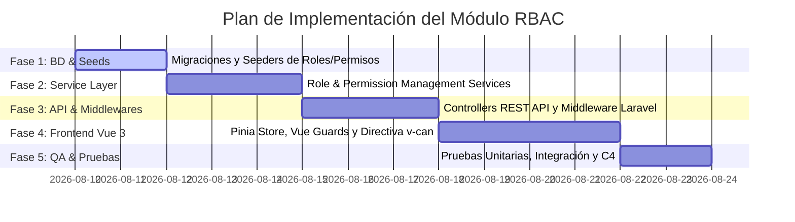

# Esquema de Tablas SQL y Plan de Implementación RBAC

**Curso:** Análisis de Sistemas II (ASII) — 2026  
**Sistema:** Sistema Hospitalario Integrado (HIS)  
**Módulo:** Módulo 02 — RBAC (Roles, Permisos y Protección de Rutas)  
**Ubicación:** `docs/RBAC/Planificacion/esquema-tablas-y-plan-de-implementacion.md`

---

## 1. Sentencias DDL SQL para Creación de Tablas (Hipotético / Referencia Standard)

A continuación se presentan las sentencias SQL estándar en dialecto compatible con **PostgreSQL / MySQL 8.0+** para la creación de las tablas núcleo del módulo RBAC y sus dependencias multi-tenant.

```sql
-- =============================================================================
-- 1. TABLA DE TENANTS (Sedes / Instituciones Hospitalarias)
-- =============================================================================
CREATE TABLE IF NOT EXISTS tenants (
    id VARCHAR(255) PRIMARY KEY,
    name VARCHAR(255) NOT NULL,
    slug VARCHAR(255) UNIQUE NOT NULL,
    data JSON NULL,
    created_at TIMESTAMP NULL DEFAULT CURRENT_TIMESTAMP,
    updated_at TIMESTAMP NULL DEFAULT CURRENT_TIMESTAMP ON UPDATE CURRENT_TIMESTAMP
);

-- =============================================================================
-- 2. TABLA DE USUARIOS
-- =============================================================================
CREATE TABLE IF NOT EXISTS users (
    id BIGINT UNSIGNED AUTO_INCREMENT PRIMARY KEY,
    tenant_id VARCHAR(255) NOT NULL,
    name VARCHAR(255) NOT NULL,
    email VARCHAR(255) NOT NULL,
    email_verified_at TIMESTAMP NULL,
    password VARCHAR(255) NOT NULL,
    remember_token VARCHAR(100) NULL,
    created_at TIMESTAMP NULL DEFAULT CURRENT_TIMESTAMP,
    updated_at TIMESTAMP NULL DEFAULT CURRENT_TIMESTAMP ON UPDATE CURRENT_TIMESTAMP,
    
    CONSTRAINT fk_users_tenant FOREIGN KEY (tenant_id) REFERENCES tenants(id) ON DELETE CASCADE,
    CONSTRAINT uq_users_tenant_email UNIQUE (tenant_id, email)
);

-- =============================================================================
-- 3. TABLA DE ROLES (Catálogo de Perfiles Operativos)
-- =============================================================================
CREATE TABLE IF NOT EXISTS roles (
    id BIGINT UNSIGNED AUTO_INCREMENT PRIMARY KEY,
    name VARCHAR(255) NOT NULL,
    guard_name VARCHAR(255) NOT NULL DEFAULT 'api',
    created_at TIMESTAMP NULL DEFAULT CURRENT_TIMESTAMP,
    updated_at TIMESTAMP NULL DEFAULT CURRENT_TIMESTAMP ON UPDATE CURRENT_TIMESTAMP,

    CONSTRAINT uq_roles_name_guard UNIQUE (name, guard_name)
);

-- =============================================================================
-- 4. TABLA DE PERMISOS (Catálogo Granular de Facultades)
-- =============================================================================
CREATE TABLE IF NOT EXISTS permissions (
    id BIGINT UNSIGNED AUTO_INCREMENT PRIMARY KEY,
    name VARCHAR(255) NOT NULL,
    guard_name VARCHAR(255) NOT NULL DEFAULT 'api',
    created_at TIMESTAMP NULL DEFAULT CURRENT_TIMESTAMP,
    updated_at TIMESTAMP NULL DEFAULT CURRENT_TIMESTAMP ON UPDATE CURRENT_TIMESTAMP,

    CONSTRAINT uq_permissions_name_guard UNIQUE (name, guard_name)
);

-- =============================================================================
-- 5. TABLA PIVOTE ROLE_HAS_PERMISSIONS (Matriz Roles <-> Permisos)
-- =============================================================================
CREATE TABLE IF NOT EXISTS role_has_permissions (
    permission_id BIGINT UNSIGNED NOT NULL,
    role_id BIGINT UNSIGNED NOT NULL,

    PRIMARY KEY (permission_id, role_id),
    CONSTRAINT fk_rhp_permission FOREIGN KEY (permission_id) REFERENCES permissions(id) ON DELETE CASCADE,
    CONSTRAINT fk_rhp_role FOREIGN KEY (role_id) REFERENCES roles(id) ON DELETE CASCADE
);

-- =============================================================================
-- 6. TABLA PIVOTE MODEL_HAS_ROLES (Asignación Roles <-> Usuarios)
-- =============================================================================
CREATE TABLE IF NOT EXISTS model_has_roles (
    role_id BIGINT UNSIGNED NOT NULL,
    model_type VARCHAR(255) NOT NULL,
    model_id BIGINT UNSIGNED NOT NULL,

    PRIMARY KEY (role_id, model_id, model_type),
    CONSTRAINT fk_mhr_role FOREIGN KEY (role_id) REFERENCES roles(id) ON DELETE CASCADE
);

CREATE INDEX idx_model_has_roles_model ON model_has_roles(model_id, model_type);

-- =============================================================================
-- 7. TABLA PIVOTE MODEL_HAS_PERMISSIONS (Permisos Directos Excepcionales)
-- =============================================================================
CREATE TABLE IF NOT EXISTS model_has_permissions (
    permission_id BIGINT UNSIGNED NOT NULL,
    model_type VARCHAR(255) NOT NULL,
    model_id BIGINT UNSIGNED NOT NULL,

    PRIMARY KEY (permission_id, model_id, model_type),
    CONSTRAINT fk_mhp_permission FOREIGN KEY (permission_id) REFERENCES permissions(id) ON DELETE CASCADE
);

CREATE INDEX idx_model_has_permissions_model ON model_has_permissions(model_id, model_type);
```

---

## 2. Equivalente en Migraciones de Laravel (PHP / Spatie RBAC)

En el marco de desarrollo con Laravel y la librería `spatie/laravel-permission`, el archivo de migración `database/migrations/0001_01_01_000004_create_permission_tables.php` se estructura de la siguiente manera:

```php
<?php

use Illuminate\Database\Migrations\Migration;
use Illuminate\Database\Schema\Blueprint;
use Illuminate\Support\Facades\Schema;

return new class extends Migration
{
    public function up(): void
    {
        // 1. Permisos
        Schema::create('permissions', function (Blueprint $table) {
            $table->bigIncrements('id');
            $table->string('name');
            $table->string('guard_name');
            $table->timestamps();
            $table->unique(['name', 'guard_name']);
        });

        // 2. Roles
        Schema::create('roles', function (Blueprint $table) {
            $table->bigIncrements('id');
            $table->string('name');
            $table->string('guard_name');
            $table->timestamps();
            $table->unique(['name', 'guard_name']);
        });

        // 3. Permisos directos a modelos
        Schema::create('model_has_permissions', function (Blueprint $table) {
            $table->unsignedBigInteger('permission_id');
            $table->string('model_type');
            $table->unsignedBigInteger('model_id');
            $table->index(['model_id', 'model_type']);

            $table->foreign('permission_id')->references('id')->on('permissions')->cascadeOnDelete();
            $table->primary(['permission_id', 'model_id', 'model_type']);
        });

        // 4. Roles a modelos (Usuarios)
        Schema::create('model_has_roles', function (Blueprint $table) {
            $table->unsignedBigInteger('role_id');
            $table->string('model_type');
            $table->unsignedBigInteger('model_id');
            $table->index(['model_id', 'model_type']);

            $table->foreign('role_id')->references('id')->on('roles')->cascadeOnDelete();
            $table->primary(['role_id', 'model_id', 'model_type']);
        });

        // 5. Permisos a Roles (Matriz RBAC Core)
        Schema::create('role_has_permissions', function (Blueprint $table) {
            $table->unsignedBigInteger('permission_id');
            $table->unsignedBigInteger('role_id');

            $table->foreign('permission_id')->references('id')->on('permissions')->cascadeOnDelete();
            $table->foreign('role_id')->references('id')->on('roles')->cascadeOnDelete();
            $table->primary(['permission_id', 'role_id']);
        });
    }

    public function down(): void
    {
        Schema::dropIfExists('role_has_permissions');
        Schema::dropIfExists('model_has_roles');
        Schema::dropIfExists('model_has_permissions');
        Schema::dropIfExists('roles');
        Schema::dropIfExists('permissions');
    }
};
```

---

## 3. Plan de Implementación Paso a Paso

El siguiente plan establece las etapas ordenadas para llevar a cabo el desarrollo técnico del Módulo RBAC.



### 📋 Detalle de Fases de Desarrollo

#### **Fase 1: Base de Datos y Poblado Inicial (Seeders)**
1. **Ejecución de Migraciones:** Ejecutar `php artisan migrate` para crear la estructura de las 5 tablas RBAC.
2. **Creación del Seeder Base (`RbacSeeder.php`):**
   * Crear los permisos iniciales por módulo:
     * *Pacientes:* `patients.read`, `patients.create`, `patients.update`, `patients.delete`.
     * *Expediente (EMR):* `emr.read`, `emr.soap.write`, `prescriptions.create`.
     * *Laboratorio:* `lab.orders.read`, `lab.results.validate`.
     * *RBAC Admin:* `rbac.roles.manage`, `rbac.permissions.assign`, `rbac.users.assign_role`.
   * Crear los roles por defecto (`Admin`, `Médico`, `Enfermera`, `TecnicoLab`, `Recepcionista`).
   * Vincular la matriz inicial de permisos a cada rol mediante `syncPermissions()`.

#### **Fase 2: Capa de Dominio y Lógica de Negocio (Backend Service)**
1. Configurar el Trait `HasRoles` de Spatie en el modelo `App\Models\User`.
2. Crear la clase de servicio `App\Services\RBAC\RoleManagementService.php` aplicando **SRP (Single Responsibility Principle)**:
   * Método `createRole(string $name, array $permissions)`
   * Método `updateRolePermissions(int $roleId, array $permissionIds)`
   * Método `assignRolesToUser(User $user, array $roleNames)`
   * Método `getUserResolvedPermissions(User $user): array`
3. Implementar la invalidación automática de la caché de permisos (`app(PermissionRegistrar::class)->forgetCachedPermissions()`).

#### **Fase 3: Controllers API y Middlewares de Protección (Laravel)**
1. **Crear Form Requests para validación de entrada:**
   * `StoreRoleRequest.php`
   * `UpdateRolePermissionsRequest.php`
2. **Crear Controllers REST API:**
   * `RoleController.php` (`index`, `store`, `show`, `update`, `destroy`)
   * `PermissionController.php` (`index`)
   * `UserRoleController.php` (`assignRoles`, `getUserPermissions`)
3. **Configurar el Middleware de Permisos:**
   * Registrar `'permission' => \Spatie\Permission\Middleware\PermissionMiddleware::class` en `bootstrap/app.php` / Kernel.
   * Proteger rutas API en `routes/api.php` mediante `middleware('permission:nombre.permiso')`.

#### **Fase 4: Integración Frontend (Vue 3 + Pinia + Vue Router)**
1. **Tienda Pinia (`useAuthStore`):**
   * Al iniciar sesión o llamar a `/api/v1/auth/me`, almacenar la lista de `roles` y `permissions` del usuario en el estado global.
2. **Guard de Navegación (`Vue Router Guard`):**
   * Implementar `router.beforeEach()` para interceptar rutas con `meta: { permission: 'pacientes.read' }`.
   * Redirigir a `/403` si el usuario no posee el permiso requerido.
3. **Directiva Personalizada `v-can`:**
   * Crear directiva global Vue (`v-can="'lab.results.validate'"`) para ocultar/deshabilitar elementos del DOM si el usuario carece de permiso.

#### **Fase 5: Pruebas Unitarias y Verificación de Criterios de Aceptación**
1. **Tests Backend (Pest / PHPUnit):**
   * Verificar que un usuario con rol `Enfermera` no puede crear roles (retorna `403`).
   * Verificar que al asignar un permiso a un rol, los usuarios con ese rol reciben el cambio de forma inmediata.
2. **Pruebas de latencia:** Validar que el middleware de permisos responda en menos de **15 ms** utilizando caché.

---

## 🎯 Resumen de Archivos Generados en la Planificación

* [Semana 01 — Actores, Alcance y Casos de Uso](../semana-01/semana-01-actores-alcance-casos-de-uso.md)
* [Semana 02 — RF, RNF, Criterios BDD y SOLID](../semana-02/semana-02-rf-rnf-criterios-aceptacion-solid.md)
* [Semana 04 — Arquitectura en Capas y Patrón Repositorio](semana-04-arquitectura-capas-repositorio.md)
* [Índice General de Documentación RBAC](../README.md)
