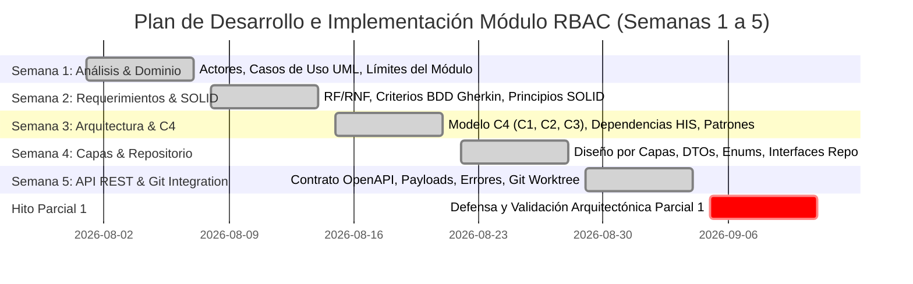

# Plan Maestro de Implementación — Módulo RBAC (Semanas 1 a 5)
## Roles, Permisos, Protección de Rutas y Soporte Multi-Tenant

**Curso:** Análisis de Sistemas II (ASII) — Ciclo 2026  
**Sistema:** Sistema Hospitalario Integrado (HIS)  
**Módulo:** 02 — Control de Acceso Basado en Roles (RBAC)  
**Estudiante:** Luis David Aroche Contreras (`Luis890D`)  
**Rama de Trabajo:** `feature/asii-02-rbac-roles-permisos-y-proteccion-de-rutas-luis890d`  
**Worktree Base:** `shi-documentacion-rbac-Luis-Aroche`  
**Hito Evaluativo:** Bloque Parcial 1 (Semanas 1 a 5)

---

## 1. Visión General y Alcance del Módulo

El módulo **RBAC (Role-Based Access Control)** es el subsistema de seguridad y gobernanza transversal del **Sistema Hospitalario Integrado (HIS)**. Provee la infraestructura autorizativa necesaria para desacoplar las reglas de acceso de los módulos clínicos (Admisión, EMR, Farmacia, Laboratorio, Prescripciones), asegurando que cada profesional de la salud o administrador interactúe únicamente con las funciones y datos médicos que su rol le faculta, bajo un esquema estricto de **aislamiento multi-tenant**.

---

## 2. Decisiones Arquitectónicas y Stack Tecnológico

| Capa / Subsistema | Tecnología / Librería | Justificación y Rol en el Módulo |
|---|---|---|
| **Backend Core** | PHP 8.2+ / **Laravel 12** | Framework robusto con inyección de dependencias, middlewares y enrutamiento RESTful. |
| **Motor de Permisos** | **`spatie/laravel-permission`** | Implementación estándar de RBAC adaptada con guard JWT y scoping multi-tenant. |
| **Multi-Tenancy** | **`stancl/tenancy`** | Aislamiento a nivel de base de datos o columna (`tenant_id`), fijado mediante el header `X-Tenant-ID`. |
| **Autenticación** | **`tymon/jwt-auth`** / JWT Guard | Verificación sin estado (stateless) de identidad médica mediante Bearer Tokens. |
| **Almacenamiento en Memoria** | **Redis 7.2+** | Caché distribuida para resolución de permisos en $< 2\text{ ms}$ (patrón Cache-Aside). |
| **Persistencia Relacional** | **MySQL 8.0+ / PostgreSQL 16** | Persistencia ACID de tablas `roles`, `permissions`, `model_has_roles`, `role_has_permissions`. |
| **Frontend SPA** | **Vue 3 (Composition API)** + **Vite** | Interfaz reactiva rápida y modular. |
| **Gestor de Estado Frontend** | **Pinia Store** (`rbacStore.js`) | Almacén reactivo de la matriz de permisos y roles del usuario activo en el cliente. |
| **Protección de Navegación UI** | **Vue Router 4** + Directiva `v-can` | Navigation Guards (`beforeEach`) y renderizado condicional de componentes y botones. |

---

## 3. Plan de Desarrollo Semana por Semana (Semanas 1 a 5)



---

### 🔹 Semana 1: Análisis de Actores, Alcance y Casos de Uso UML
* **Objetivo:** Delimitar formalmente las fronteras del subsistema RBAC y caracterizar todos los perfiles hospitalarios que consumen o administran privilegios.
* **Actividades Realizadas:**
  1. Identificación de actores directos (**SuperAdmin / IT Admin**, **Personal Médico**, **Enfermería**, **Técnico de Laboratorio**, **Recepcionista**, **Auditor**) y actores de software (**JWT Auth Subsystem**, **Middleware Guards**).
  2. Elaboración del Diagrama UML de Casos de Uso que comprende:
     - `CU-RBAC-01`: Administrar catálogo de roles por tenant.
     - `CU-RBAC-02`: Asignar / sincronizar matriz de permisos a roles.
     - `CU-RBAC-03`: Asignar roles y perfiles a usuarios médicos/administrativos.
     - `CU-RBAC-04`: Proteger rutas y endpoints en API Backend (Middleware Interceptor).
     - `CU-RBAC-05`: Proteger navegación y renderizado condicional en UI Frontend (`v-can`).
     - `CU-RBAC-06`: Consultar matriz de permisos del usuario autenticado (`/auth/me/permissions`).
* **Documento Entregable:** [`docs/RBAC/semana-01/semana-01-actores-alcance-casos-de-uso.md`](../semana-01/semana-01-actores-alcance-casos-de-uso.md)

---

### 🔹 Semana 2: Requerimientos (RF/RNF), Criterios de Aceptación (BDD) y SOLID
* **Objetivo:** Definir las especificaciones funcionales y no funcionales detalladas, criterios de aceptación ejecutables y diseño orientado a objetos con buenas prácticas.
* **Actividades Realizadas:**
  1. Redacción de la matriz de **Requerimientos Funcionales** (`RF-RBAC-01` a `RF-RBAC-07`) con prioridades y trazabilidad a casos de uso.
  2. Redacción de la matriz de **Requerimientos No Funcionales** (`RNF-RBAC-01` a `RNF-RBAC-05`) estableciendo latencias de validación $< 15\text{ ms}$, aislamiento estricto multi-tenant y estrategia *Fail-Closed*.
  3. Formulación de **Criterios de Aceptación** bajo sintaxis **Gherkin BDD (Given-When-Then)** para validación de endpoints y denegaciones `403 Forbidden`.
  4. Demostración práctica de los 5 **Principios SOLID** aplicados al módulo:
     - **SRP:** Desacoplamiento entre `RbacAuthorizationService` y `RoleRepository`.
     - **OCP:** Extensión modular de nuevos permisos sin modificar controllers estables.
     - **LSP:** Intercambiabilidad de repositorios y modelos de permisos.
     - **ISP:** Interfaces segregadas (`RoleRepositoryInterface`, `PermissionRepositoryInterface`).
     - **DIP:** Inyección de dependencias de interfaces en controladores y servicios.
* **Documento Entregable:** [`docs/RBAC/semana-02/semana-02-rf-rnf-criterios-aceptacion-solid.md`](../semana-02/semana-02-rf-rnf-criterios-aceptacion-solid.md)

---

### 🔹 Semana 3: Diseño Arquitectónico, Vistas C4 y Patrones
* **Objetivo:** Modelar la estructura arquitectónica global del módulo y sus interconexiones con el ecosistema del HIS.
* **Actividades Realizadas:**
  1. Diseño del **Modelo C4**:
     - **Nivel 1 (Contexto):** Relación del módulo con usuarios clínicos y sistemas de Autenticación y Auditoría.
     - **Nivel 2 (Contenedores):** Distribución entre SPA (Vue 3), API Gateway / Nginx, Backend Laravel 12, Clúster Redis y Base de Datos SQL.
     - **Nivel 3 (Componentes):** Interacción entre API Router, Middlewares (`JwtAuthMiddleware`, `PermissionMiddleware`, `TenantScope`), Controllers, Services y Repositories.
  2. Mapa de dependencias del HIS: Integración de orden transversal con M01 (Auth), M03 (Pacientes), M07 (Admisión), M10 (EMR), M15 (Recetas), M16 (Lab) y M22 (Auditoría).
  3. Selección y justificación de patrones: **RBAC Core**, **Pipeline/Interceptor**, **Cache-Aside en Redis**, **Repository Pattern**, **DTOs** y **UI Decorator (`v-can`)**.
  4. Mecanismos de aislamiento multi-tenant: Global Scopes de Eloquent y llaves compuestas `tenant:{id}:user:{id}:permissions` en Redis.
* **Documento Entregable:** [`docs/RBAC/semana-03/semana-03-arquitectura-vistas-patrones.md`](../semana-03/semana-03-arquitectura-vistas-patrones.md)

---

### 🔹 Semana 4: Arquitectura en Capas y Patrón Repositorio
* **Objetivo:** Establecer la separación estricta de responsabilidades entre capas y catalogar los objetos reutilizables del dominio.
* **Actividades Realizadas:**
  1. Definición y acotamiento de las **5 Capas del Sistema**:
     - **Capa 1 (Presentación / UI):** Vistas Vue 3, Store Pinia, Router Navigation Guards y Directivas.
     - **Capa 2 (API / Entrada HTTP):** Rutas, Controllers REST, FormRequests de validación y JsonResources.
     - **Capa 3 (Dominio / Servicios):** `RbacAuthorizationService`, `RoleManagementService`, `RbacCacheManager` y Domain Events.
     - **Capa 4 (Persistencia / Repositorio):** `RoleRepositoryInterface`, `PermissionRepositoryInterface` y adaptadores Eloquent.
     - **Capa 5 (Almacenamiento / Infraestructura):** MySQL / PostgreSQL y Redis.
  2. Catálogo de objetos reutilizables:
     - **DTOs:** `CreateRoleDTO`, `UpdateRolePermissionsDTO`, `AssignUserRolesDTO`, `UserEffectivePermissionsDTO`.
     - **Enums PHP 8.2:** `SystemRole` (`SuperAdmin`, `Médico`, `Enfermera`, etc.) y `PermissionModule`.
     - **Interfaces de Repositorio:** Contratos fuertemente tipados.
  3. Diagrama de Secuencia de flujo completo (UI $\to$ Middleware $\to$ Service $\to$ Repository $\to$ Cache $\to$ DB $\to$ Audit Event).
* **Documento Entregable:** [`docs/RBAC/semana-04/semana-04-arquitectura-capas-repositorio.md`](../semana-04/semana-04-arquitectura-capas-repositorio.md)

---

### 🔹 Semana 5: API REST, Contrato de Interfaz y Plan de Integración Técnica
* **Objetivo:** Definir el contrato formal de comunicación cliente-servidor y planificar la estrategia de ramificación e integración continua.
* **Actividades Realizadas:**
  1. Especificación del contrato RESTful con cabeceras requeridas (`Authorization: Bearer <JWT>`, `X-Tenant-ID`, `Accept: application/json`).
  2. Definición exhaustiva de endpoints:
     - `GET /api/v1/rbac/roles` & `POST /api/v1/rbac/roles`
     - `GET /api/v1/rbac/roles/{id}` & `PUT /api/v1/rbac/roles/{id}` & `DELETE /api/v1/rbac/roles/{id}`
     - `GET /api/v1/rbac/permissions` (Catálogo agrupado por módulos)
     - `PUT /api/v1/rbac/roles/{id}/permissions` (Sincronización atómica)
     - `POST /api/v1/rbac/users/{id}/roles` (Asignación a usuarios)
     - `GET /api/v1/auth/me/permissions` (Hidratación del store Pinia)
  3. Estandarización de payloads de solicitud y respuesta (códigos `200 OK`, `201 Created`).
  4. Catálogo estructurado de errores bajo **RFC 7807** (`UNAUTHENTICATED`, `PERMISSION_DENIED`, `TENANT_MISMATCH`, `SYSTEM_ROLE_PROTECTED`, `VALIDATION_ERROR`).
  5. Plan de integración técnica con Git:
     - Configuración de Git Worktree (`shi-documentacion-rbac-Luis-Aroche`).
     - Estrategia de ramas GitFlow (`develop` $\leftrightarrow$ `feature/asii-02-rbac-roles-permisos-y-proteccion-de-rutas-luis890d`).
     - Checklist de Definition of Done (DoD) y plantilla de Pull Request.
* **Documento Entregable:** [`docs/RBAC/semana-05/semana-05-api-rest-contrato-integracion.md`](semana-05-api-rest-contrato-integracion.md)

---

## 4. Estructura de Artefactos de Código a Construir

```text
app/
├── DTOs/
│   ├── AssignRoleDTO.php
│   ├── CreateRoleDTO.php
│   └── UpdateRolePermissionsDTO.php
├── Enums/
│   ├── PermissionModule.php
│   └── SystemRole.php
├── Events/
│   └── RolePermissionsUpdated.php
├── Http/
│   ├── Controllers/Api/V1/
│   │   └── RbacController.php
│   ├── Middleware/
│   │   ├── PermissionMiddleware.php
│   │   └── TenantScopeMiddleware.php
│   ├── Requests/
│   │   ├── AssignRolesRequest.php
│   │   ├── StoreRoleRequest.php
│   │   └── UpdateRolePermissionsRequest.php
│   └── Resources/
│       ├── PermissionResource.php
│       └── RoleResource.php
├── Repositories/
│   ├── Contracts/
│   │   ├── PermissionRepositoryInterface.php
│   │   └── RoleRepositoryInterface.php
│   └── Eloquent/
│       ├── EloquentPermissionRepository.php
│       └── EloquentRoleRepository.php
└── Services/
    ├── RbacAuthorizationService.php
    ├── RbacCacheManager.php
    └── RoleManagementService.php

database/
├── migrations/
│   └── 2026_08_01_000001_create_rbac_tables.php
└── seeders/
    └── RbacSeeder.php

resources/js/
├── directives/
│   └── can.js
├── router/
│   └── guards/
│       └── rbacGuard.js
├── stores/
│   └── rbacStore.js
└── views/rbac/
    ├── RolesManagementView.vue
    └── UserRolesAssignmentView.vue
```

---

## 5. Estrategia Integral de Pruebas y Validación

### 5.1. Pruebas Unitarias y de Integración Backend (PHPUnit / Pest)
```bash
# Ejecutar suite de pruebas de autorización y multi-tenancy
php artisan test --filter=RbacTest
```
* **Casos Críticos de Prueba:**
  1. `test_user_with_permission_can_access_protected_endpoint`: Retorna HTTP 200 al poseer el permiso.
  2. `test_user_without_permission_receives_403_forbidden`: Retorna HTTP 403 y payload `PERMISSION_DENIED`.
  3. `test_tenant_isolation_prevents_cross_hospital_access`: Un usuario del Tenant A no puede consultar ni operar roles del Tenant B.
  4. `test_cannot_delete_super_admin_protected_role`: Retorna HTTP 403 y payload `SYSTEM_ROLE_PROTECTED`.
  5. `test_permission_cache_is_invalidated_after_role_update`: Verifica que la clave en Redis se elimina tras modificar permisos.

### 5.2. Verificación Manual y Flujos Frontend E2E
* **Escenario A (Acceso por Rol):** Iniciar sesión como recepcionista $\to$ Intentar navegar a `/admin/roles` $\to$ Redirección inmediata a vista `/403` por el Navigation Guard.
* **Escenario B (Renderizado Condicional):** Cargar vista de expediente clínico como enfermera $\to$ Verificar que el botón "Prescribir Medicamento" no existe en el DOM gracias a la directiva `v-can="'prescriptions.create'"`.
* **Escenario C (Matriz Dinámica):** Como SuperAdmin, otorgar permiso `lab.results.validate` al rol `Bioquímico` $\to$ Guardar $\to$ Verificar actualización instantánea en base de datos e invalidación de caché en Redis.

---

## 6. Documentos de Referencia del Módulo RBAC

- [Asignación Individual Semanas 1 y 2](../asignacion-individual-semana-1-2.md)
- [Asignación Individual Semanas 3, 4 y 5](../asignacion-individual-semana-3-5.md)
- [Diagrama de Infraestructura de Red y Servidores](../semana-02/01-diagrama-infraestructura-red-y-servidores.md)
- [Diagrama de Procesos Generales del Hospital](../semana-02/02-diagrama-procesos-general-hospital-rbac.md)
- [Esquema de Tablas SQL y Migraciones](../semana-04/esquema-tablas-y-plan-de-implementacion.md)
- [Índice General de Documentación (README.md)](../README.md)
