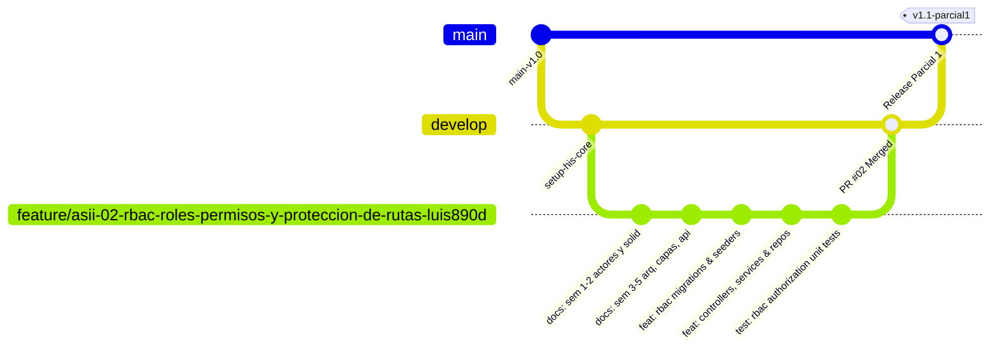

# Semana 5 — Cliente-Servidor, API REST, Contrato de Interfaz y Plan de Integración
## Módulo 02: RBAC (Roles, Permisos y Protección de Rutas)

**Curso:** Análisis de Sistemas II (ASII) — 2026  
**Sistema:** Sistema Hospitalario Integrado (HIS)  
**Estudiante:** Luis David Aroche Contreras (`Luis890D`)  
**Rama de trabajo:** `feature/asii-02-rbac-roles-permisos-y-proteccion-de-rutas-luis890d`  
**Worktree actual:** `shi-documentacion-rbac-Luis-Aroche`  

---

## 1. Arquitectura de Comunicación Cliente-Servidor

La interacción entre el cliente (SPA en Vue 3) y el servidor backend (Laravel 12 API) se rige bajo los principios de la arquitectura **REST (Representational State Transfer)** sobre el protocolo seguro **HTTPS/TLS 1.3**.

### 1.1. Cabeceras HTTP Obligatorias en Todas las Peticiones

| Cabecera HTTP | Tipo / Formato | Propósito | Ejemplo |
|---|---|---|---|
| `Authorization` | String (`Bearer <JWT>`) | Identidad autenticada del usuario y firma criptográfica emitida por el módulo Auth. | `Bearer eyJhbGciOiJIUzI1Ni...` |
| `X-Tenant-ID` | Integer / UUID | Identificador de la sede hospitalaria o clínica activa a la que pertenece la sesión. | `1` o `hospital-central-zone1` |
| `Accept` | String | Negociación de contenido; asegura que las respuestas y errores vengan en JSON. | `application/json` |
| `Content-Type` | String | Especificación del payload en mutaciones (`POST`, `PUT`, `PATCH`). | `application/json` |

---

## 2. Contrato de Interfaz de API REST (Endpoints RBAC)

### 2.1. Matriz de Endpoints y Permisos Requeridos

| Método | Endpoint | Descripción | Permiso Requerido | Código Éxito |
|:---:|---|---|---|:---:|
| `GET` | `/api/v1/rbac/roles` | Lista todos los roles registrados para el tenant activo. | `rbac.roles.view` | `200 OK` |
| `POST` | `/api/v1/rbac/roles` | Crea un nuevo rol dentro del tenant. | `rbac.roles.manage` | `201 Created` |
| `GET` | `/api/v1/rbac/roles/{id}` | Obtiene el detalle de un rol y sus permisos asignados. | `rbac.roles.view` | `200 OK` |
| `PUT` | `/api/v1/rbac/roles/{id}` | Actualiza datos básicos (nombre, descripción) de un rol. | `rbac.roles.manage` | `200 OK` |
| `DELETE` | `/api/v1/rbac/roles/{id}` | Desactiva o elimina un rol no protegido del tenant. | `rbac.roles.manage` | `200 OK` |
| `GET` | `/api/v1/rbac/permissions` | Catálogo completo de permisos agrupados por módulo. | `rbac.permissions.view` | `200 OK` |
| `PUT` | `/api/v1/rbac/roles/{id}/permissions` | Sincroniza la matriz de permisos de un rol específico. | `rbac.permissions.assign` | `200 OK` |
| `POST` | `/api/v1/rbac/users/{id}/roles` | Asigna uno o más roles a un usuario en el tenant. | `rbac.users.assign` | `200 OK` |
| `GET` | `/api/v1/auth/me/permissions` | Obtiene los roles y permisos consolidados del usuario activo. | `*` *(Cualquier usuario autenticado)* | `200 OK` |

---

### 2.2. Especificación Detallada de Payloads (Request / Response)

#### 🔹 Endpoint: `POST /api/v1/rbac/roles` (Crear Rol)
**Permiso:** `rbac.roles.manage`

* **Request Body (JSON):**
```json
{
  "name": "BioquimicoJefe",
  "display_name": "Bioquímico Jefe de Laboratorio",
  "description": "Responsable de validación técnica y autorización de reactivos",
  "guard_name": "api",
  "permissions": [
    "lab.orders.read",
    "lab.samples.receive",
    "lab.results.write",
    "lab.results.validate"
  ]
}
```

* **Response Body `201 Created` (JSON):**
```json
{
  "success": true,
  "message": "Rol creado exitosamente en el tenant.",
  "data": {
    "id": 8,
    "name": "BioquimicoJefe",
    "display_name": "Bioquímico Jefe de Laboratorio",
    "description": "Responsable de validación técnica y autorización de reactivos",
    "guard_name": "api",
    "tenant_id": 1,
    "is_system_protected": false,
    "permissions_count": 4,
    "created_at": "2026-08-20T10:30:00Z"
  }
}
```

---

#### 🔹 Endpoint: `PUT /api/v1/rbac/roles/{id}/permissions` (Sincronizar Permisos)
**Permiso:** `rbac.permissions.assign`

* **Request Body (JSON):**
```json
{
  "permissions": [
    "patients.read",
    "patients.update",
    "emr.soap.write",
    "prescriptions.create"
  ]
}
```

* **Response Body `200 OK` (JSON):**
```json
{
  "success": true,
  "message": "Matriz de permisos sincronizada correctamente.",
  "data": {
    "role_id": 4,
    "role_name": "Médico General",
    "tenant_id": 1,
    "assigned_permissions": [
      "patients.read",
      "patients.update",
      "emr.soap.write",
      "prescriptions.create"
    ],
    "cache_invalidated": true,
    "updated_at": "2026-08-20T10:35:12Z"
  }
}
```

---

#### 🔹 Endpoint: `GET /api/v1/auth/me/permissions` (Consulta de Permisos del Usuario Activo)
**Permiso:** Requiere token JWT válido.

* **Response Body `200 OK` (JSON):**
```json
{
  "success": true,
  "data": {
    "user_id": 142,
    "username": "dr.martinez",
    "tenant_id": 1,
    "tenant_name": "Hospital Nacional San Juan",
    "roles": [
      {
        "id": 3,
        "name": "Médico",
        "display_name": "Médico Especialista"
      }
    ],
    "permissions": [
      "patients.read",
      "patients.update",
      "emr.soap.read",
      "emr.soap.write",
      "prescriptions.create",
      "lab.orders.create"
    ],
    "is_super_admin": false
  }
}
```

---

### 2.3. Estructura Estandarizada de Respuestas de Error

Todas las respuestas de error siguen el estándar RFC 7807 (*Problem Details for HTTP APIs*):

```json
{
  "success": false,
  "error_code": "STRING_ERROR_CODE",
  "message": "Mensaje legible para el usuario o desarrollador.",
  "details": {},
  "timestamp": "2026-08-20T10:40:00Z",
  "path": "/api/v1/rbac/roles/999"
}
```

#### Catálogo de Códigos de Error RBAC:

| Código HTTP | `error_code` | Causa y Escenario |
|:---:|---|---|
| `401 Unauthorized` | `UNAUTHENTICATED` | Token JWT ausente, expirado o con firma inválida. |
| `403 Forbidden` | `PERMISSION_DENIED` | El usuario autenticado carece del permiso granular necesario para ejecutar el endpoint. |
| `403 Forbidden` | `TENANT_MISMATCH` | El token JWT pertenece a un hospital distinto al solicitado en el header `X-Tenant-ID`. |
| `403 Forbidden` | `SYSTEM_ROLE_PROTECTED` | Intento de modificar o eliminar un rol protegido del sistema (`SuperAdmin`). |
| `404 Not Found` | `ROLE_NOT_FOUND` | El rol solicitado no existe o no pertenece al tenant activo. |
| `422 Unprocessable` | `VALIDATION_ERROR` | Los parámetros enviados en el body fallaron las reglas de validación (ej. nombre duplicado). |
| `500 Server Error` | `INTERNAL_RBAC_ERROR` | Falla crítica en la base de datos o en la conexión con el clúster Redis. |

---

## 3. Plan de Integración Técnica (Git, Worktrees, Issues y Pull Requests)

Para garantizar un proceso de integración continuo, ordenado y sin conflictos con los demás módulos del HIS, se adopta el siguiente flujo de trabajo estandarizado:



### 3.1. Especificación del Issue en GitHub

* **Título:** `[FEATURE] Módulo 02: RBAC — Roles, Permisos y Protección de Rutas`
* **Etiquetas:** `enhancement`, `security`, `module:rbac`, `parcial-1`
* **Asignado a:** `Luis890D` (Luis David Aroche Contreras)
* **Milestone:** `Parcial 1 — Arquitectura e Integración Core`
* **Descripción:** Implementación del motor de autorización RBAC, roles predeterminados, matriz de permisos, middleware backend y directivas frontend con soporte multi-tenant.

---

### 3.2. Estrategia de Ramas y Git Worktree

1. **Rama de Trabajo:**  
   `feature/asii-02-rbac-roles-permisos-y-proteccion-de-rutas-luis890d`
2. **Worktree Dedicado:**  
   `d:\U 2024 DAVID\U David 2026\Octavo Semestre\ANÁLISIS DE SISTEMAS II\shi-documentacion-rbac`  
   *Alias de carpeta:* `shi-documentacion-rbac-Luis-Aroche`
3. **Comandos de Gestión del Worktree:**
   ```bash
   # Creación del worktree aislado desde el repositorio raíz
   git worktree add ../shi-documentacion-rbac-Luis-Aroche -b feature/asii-02-rbac-roles-permisos-y-proteccion-de-rutas-luis890d develop

   # Sincronización con origin
   git fetch origin
   git rebase origin/develop
   ```

---

### 3.3. Estructura y Checklist del Pull Request (PR)

* **Rama Origen:** `feature/asii-02-rbac-roles-permisos-y-proteccion-de-rutas-luis890d`
* **Rama Destino:** `develop`
* **Título del PR:** `feat(rbac): Módulo 02 - Roles, Permisos, Protección de Rutas y Soporte Multi-Tenant`

#### Checklist de Verificación (Definition of Done - DoD):
- [x] **Documentación Completa:** Semanas 1 a 5 redactadas con diagramas UML/C4, matriz RF/RNF, criterios Gherkin, arquitectura en capas y contrato REST.
- [ ] **Migraciones y Seeders:** Tablas `roles`, `permissions`, `model_has_roles`, `role_has_permissions` ejecutadas limpiamente con `php artisan migrate:fresh --seed`.
- [ ] **Middlewares Backend:** Verificación de `PermissionMiddleware` con cobertura de casos 401 y 403.
- [ ] **Frontend Guards:** Pinia Store y Vue Router Guards validados en vistas protegidas.
- [ ] **Aislamiento Multi-Tenant:** Validado mediante tests de cruce de `tenant_id`.
- [ ] **Pruebas Automatizadas:** Pruebas unitarias e integración en verde (`php artisan test --filter=RbacTest`).
- [ ] **Convención de Commits:** Commits semánticos (`feat:`, `docs:`, `fix:`, `test:`).
