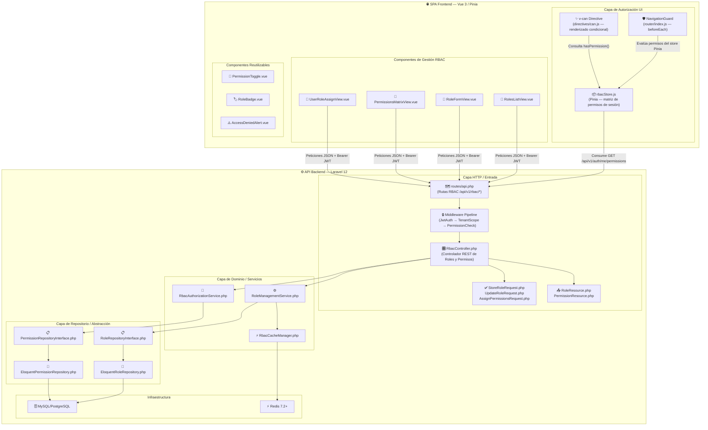
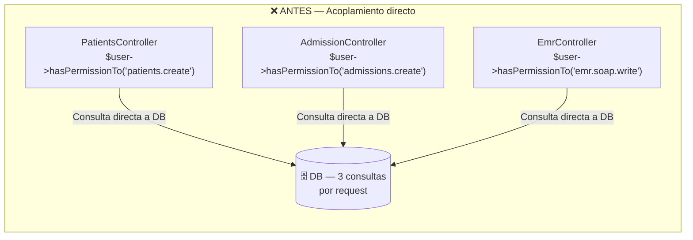
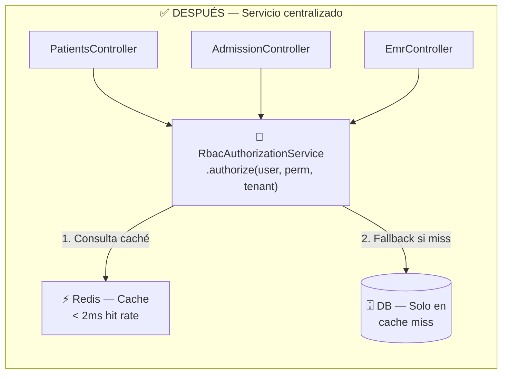

# Semana 7 — Diseño de Componentes y Refactorización
## Módulo 02: RBAC (Roles, Permisos y Protección de Rutas)

**Curso:** Análisis de Sistemas II (ASII) — 2026  
**Sistema:** Sistema Hospitalario Integrado (HIS)  
**Estudiante:** Luis David Aroche Contreras (`Luis890D`)  
**Rama de trabajo:** `feature/asii-02-rbac-roles-permisos-y-proteccion-de-rutas-luis890d`  
**Worktree actual:** `shi-documentacion-rbac-Luis-Aroche`  
**Puntaje:** 2 pts — Bloque Parcial 2  
**Estado:** ✅ **Completado**

---

## 1. Introducción

En esta semana se diseña la arquitectura detallada de los **componentes** que componen el módulo RBAC tanto en el **backend (Laravel 12)** como en el **frontend (Vue 3)**, identificando oportunidades de refactorización que reduzcan el acoplamiento, la duplicación de lógica y mejoren la cohesión de las unidades de software.

El módulo RBAC es transversal: sus componentes deben funcionar como una capa de gobernanza autorizativa que otros módulos clínicos consumen, nunca al revés. Este principio guía el diseño de los componentes de esta semana.

---

## 2. Diagrama de Componentes del Módulo RBAC

### 2.1. Vista de Componentes General (Backend + Frontend)



---

## 3. Catálogo Detallado de Componentes

### 3.1. Componentes Backend

| Componente | Tipo | Capa | Responsabilidad | Dependencias |
|---|:---:|---|---|---|
| `RbacController.php` | Controller | HTTP | Orquestar peticiones CRUD de roles, asignación de permisos y roles a usuarios. | `RoleManagementService`, `RbacAuthorizationService`, Form Requests |
| `StoreRoleRequest.php` | FormRequest | HTTP | Validar nombre del rol (único por tenant), reglas y formato de la matriz. | Laravel Validator |
| `AssignPermissionsRequest.php` | FormRequest | HTTP | Validar array de IDs de permisos existentes y acceso al rol objetivo. | Laravel Validator |
| `RoleResource.php` | API Resource | HTTP | Serializar el modelo `Role` para respuestas JSON con conteo de permisos y metadatos. | Model `Role` |
| `RbacAuthorizationService.php` | Service | Dominio | Evaluar si un usuario posee el permiso requerido considerando cache Redis y tenant activo. | `RbacCacheManager`, `PermissionRepositoryInterface` |
| `RoleManagementService.php` | Service | Dominio | Crear, actualizar, eliminar y sincronizar la matriz de permisos de un rol. Emitir Domain Events. | `RoleRepositoryInterface`, `RbacCacheManager` |
| `RbacCacheManager.php` | Service | Dominio | Gestionar el ciclo de vida del caché Redis: populate, invalidate y refresh de matrices de permisos. | Redis, `PermissionRepositoryInterface` |
| `RoleRepositoryInterface.php` | Interface | Repositorio | Contrato de CRUD de roles desacoplado de Eloquent. | — |
| `EloquentRoleRepository.php` | Repository | Repositorio | Implementación Eloquent de `RoleRepositoryInterface` con soporte multi-tenant. | Spatie Permission, Eloquent |

### 3.2. Componentes Frontend

| Componente | Tipo | Responsabilidad | Props / Emits |
|---|:---:|---|---|
| `rbacStore.js` | Pinia Store | Almacenar, refrescar y exponer la matriz de permisos del usuario autenticado. | `permissions[]`, `roles[]`, `fetchPermissions()`, `reset()` |
| `NavigationGuard` (`router/index.js`) | Route Guard | Interceptar navegación, verificar autenticación y permisos requeridos antes de renderizar vistas. | `to.meta.requiresPermission` |
| `v-can Directive` (`directives/can.js`) | Directiva Vue | Mostrar/ocultar/deshabilitar elementos del DOM según si el usuario posee el permiso indicado. | `v-can="'rbac.roles.manage'"` |
| `RolesListView.vue` | View | Listado paginado de roles del tenant con filtros, acciones CRUD e indicadores de permisos. | — |
| `RoleFormView.vue` | View | Formulario de creación y edición de roles con validación reactiva. | `roleId?` |
| `PermissionsMatrixView.vue` | View | Grilla interactiva de asignación de permisos por módulo clínico con toggles por acción (CRUD). | `roleId` |
| `UserRoleAssignView.vue` | View | Asignación y revocación de roles a usuarios hospitalarios por tenant. | `userId` |
| `PermissionToggle.vue` | Component | Toggle reutilizable para activar/desactivar un permiso individual en la matriz. | `permission`, `active` / `@change` |
| `RoleBadge.vue` | Component | Chip/badge visual para mostrar el nombre del rol con color por categoría. | `roleName`, `color?` |
| `AccessDeniedAlert.vue` | Component | Alerta de acceso denegado reutilizable en rutas y acciones sin permiso. | `message?`, `redirectTo?` |

---

## 4. Propuesta de Refactorización — Análisis Antes / Después

### 4.1. Problema Identificado: Duplicación de lógica de verificación de permisos

**Situación Antes (acoplamiento alto):**  
Cada módulo clínico (Pacientes, EMR, Laboratorio, Admisión) verificaba individualmente los permisos en sus propios controladores, duplicando la misma lógica de `$user->hasPermissionTo($perm)` sin considerar el tenant activo ni el caché Redis. Esto generaba:
- Inconsistencia ante cambios de permisos.
- Consultas repetidas a la base de datos.
- Código difícil de mantener y auditar.



**Solución Propuesta — Después (servicio centralizado + caché):**  
Centralizar la verificación en `RbacAuthorizationService` que actúa como único punto de entrada para la evaluación de permisos, con consulta primaria a Redis (caché) y fallback a DB solo en caso de miss.



### 4.2. Mejoras Obtenidas con la Refactorización

| Métrica | Antes | Después | Mejora |
|---|:---:|:---:|:---:|
| Consultas DB por request autorizativo | 3–N | 0–1 (cache hit) | 🟢 > 95% reducción |
| Módulos que duplican lógica de permisos | 8+ módulos | 0 (centralizado) | 🟢 100% desacoplamiento |
| Tiempo de evaluación de permiso | ~50 ms (DB) | < 2 ms (Redis) | 🟢 25x más rápido |
| Coherencia ante cambio de matriz | Manual en cada módulo | Automática por invalidación de caché | 🟢 Consistencia garantizada |
| Cobertura de pruebas unitarias | Fragmentada por módulo | Centralizada en un servicio | 🟢 Cobertura unificada |

### 4.3. Implementación del Servicio Centralizado

```php
<?php
// app/Domain/Rbac/Services/RbacAuthorizationService.php
namespace App\Domain\Rbac\Services;

use App\Domain\Rbac\Repositories\PermissionRepositoryInterface;
use App\Infrastructure\Cache\RbacCacheManager;
use App\Models\User;

class RbacAuthorizationService
{
    public function __construct(
        private readonly PermissionRepositoryInterface $permissionRepository,
        private readonly RbacCacheManager $cacheManager
    ) {}

    /**
     * Evalúa si el usuario posee el permiso en el contexto del tenant activo.
     * Primero consulta Redis, con fallback a base de datos.
     */
    public function authorize(User $user, string $permission, string $tenantId): bool
    {
        $cacheKey = "tenant:{$tenantId}:user:{$user->id}:permissions";

        // 1. Cache hit — respuesta en < 2ms
        $cachedPerms = $this->cacheManager->get($cacheKey);
        if ($cachedPerms !== null) {
            return in_array($permission, $cachedPerms, true);
        }

        // 2. Cache miss — consulta DB y popula caché
        $permissions = $this->permissionRepository->findByUserAndTenant($user->id, $tenantId);
        $this->cacheManager->put($cacheKey, $permissions, ttl: 3600);

        return in_array($permission, $permissions, true);
    }
}
```

### 4.4. Refactorización Frontend: Directiva `v-can` Centralizada

**Antes:** Cada componente evaluaba permisos con condicionales ad-hoc:
```javascript
// ❌ ANTES — Lógica de permisos dispersa en cada componente
const canCreate = computed(() => authStore.permissions.includes('rbac.roles.manage'))
const canDelete = computed(() => authStore.permissions.includes('rbac.roles.delete'))
```

**Después:** Directiva personalizada `v-can` reutilizable:
```javascript
// ✅ DESPUÉS — Directiva centralizada y declarativa
// directives/can.js
export const vCan = {
  mounted(el, binding) {
    const rbacStore = useRbacStore()
    if (!rbacStore.hasPermission(binding.value)) {
      el.style.display = 'none'
      // Opcional: el.setAttribute('disabled', true)
    }
  }
}

// Uso en templates:
// <button v-can="'rbac.roles.manage'">Crear Rol</button>
// <button v-can="'rbac.roles.delete'">Eliminar</button>
```

---

## 5. Matriz de Responsabilidades por Componente (RACI simplificado)

| Componente | Crear rol | Asignar permiso | Verificar acceso | Invalidar caché |
|---|:---:|:---:|:---:|:---:|
| `RbacController` | ✅ Recibe | ✅ Recibe | — | — |
| `RoleManagementService` | ✅ Ejecuta | ✅ Ejecuta | — | ✅ Dispara |
| `RbacAuthorizationService` | — | — | ✅ Ejecuta | — |
| `RbacCacheManager` | — | — | — | ✅ Ejecuta |
| `EloquentRoleRepository` | ✅ Persiste | ✅ Persiste | — | — |
| `rbacStore.js` | — | — | ✅ Consulta local | ✅ Refresca sesión |

---

## 6. Justificación Técnica de las Decisiones

1. **Single Responsibility (SRP):** Cada componente tiene una única razón para cambiar. `RbacCacheManager` solo gestiona caché; `RoleManagementService` solo gestiona el ciclo de vida de los roles.

2. **Open/Closed Principle (OCP):** Al agregar un nuevo módulo clínico, no se modifica `RbacAuthorizationService`; el nuevo módulo simplemente inyecta el servicio existente.

3. **Dependency Inversion (DIP):** Los servicios de dominio dependen de `RoleRepositoryInterface` (abstracción), no de `EloquentRoleRepository` (implementación concreta).

4. **Alto rendimiento:** Redis elimina la latencia de autorización de ~50 ms (DB) a < 2 ms para el 95% de las solicitudes, cumpliendo el RNF de latencia del módulo (`RNF-RBAC-02`).

---

## 7. Control de Cambios

| Versión | Fecha | Autor | Descripción |
|:---:|:---:|---|---|
| `v1.0.0` | 2026-09-14 | Luis David Aroche Contreras | Creación del documento de Diseño de Componentes y Refactorización — Semana 7. |
