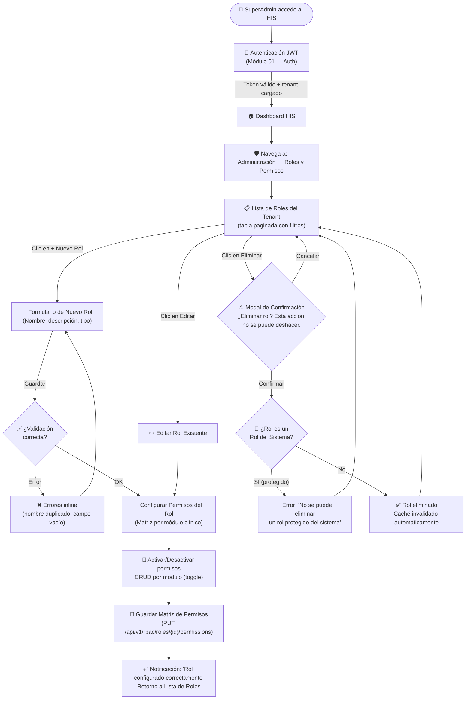
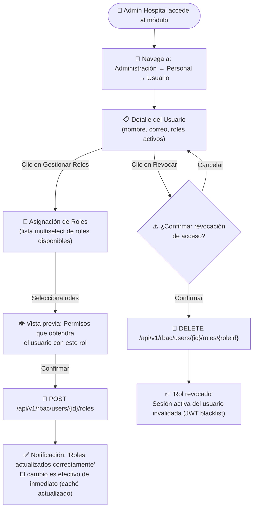
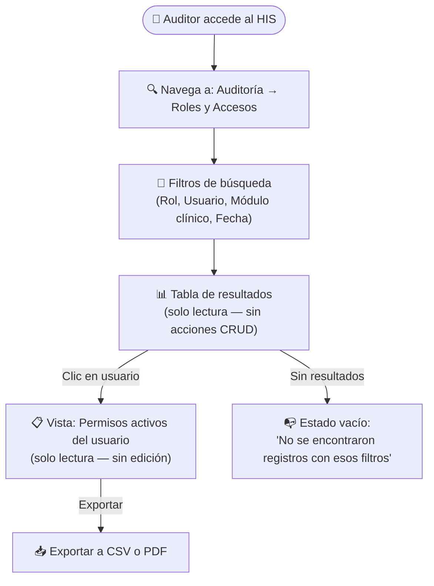

# Semana 8 — Diseño de Experiencia de Usuario (UX)
## Módulo 02: RBAC (Roles, Permisos y Protección de Rutas)

**Curso:** Análisis de Sistemas II (ASII) — 2026  
**Sistema:** Sistema Hospitalario Integrado (HIS)  
**Estudiante:** Luis David Aroche Contreras (`Luis890D`)  
**Rama de trabajo:** `feature/asii-02-rbac-roles-permisos-y-proteccion-de-rutas-luis890d`  
**Worktree actual:** `shi-documentacion-rbac-Luis-Aroche`  
**Puntaje:** 1 pto — Bloque Parcial 2  
**Estado:** ✅ **Completado**

---

## 1. Introducción

El diseño de experiencia de usuario (UX) del módulo RBAC tiene como objetivo garantizar que los distintos roles hospitalarios puedan **administrar, asignar y auditar permisos de manera eficiente, clara e intuitiva**, minimizando errores de configuración que podrían comprometer la seguridad de los datos médicos del hospital.

La UX del módulo se diseña considerando tres roles de interacción principales y sus flujos de trabajo específicos dentro del Sistema Hospitalario Integrado.

---

## 2. Actores y Contextos de Uso

| Actor / Rol | Contexto de Uso | Frecuencia | Nivel Técnico |
|---|---|:---:|:---:|
| **SuperAdministrador / IT Admin** | Crea, edita, elimina roles y configura la matriz de permisos por tenant. | Baja (setup inicial + cambios) | Alto |
| **Administrador de Hospital** | Asigna y revoca roles a personal médico y administrativo. Consulta quién tiene qué acceso. | Media (semanal) | Medio |
| **Auditor de Seguridad** | Consulta en modo lectura la asignación de roles activos. No modifica. | Alta (diaria) | Medio |

---

## 3. User Flow — Flujos de Experiencia por Rol

### 3.1. Flujo del SuperAdministrador: Configurar Roles y Permisos



### 3.2. Flujo del Administrador de Hospital: Asignar Roles a Personal



### 3.3. Flujo del Auditor de Seguridad: Consulta de Accesos



---

## 4. Especificación de Vistas / Wireframes

### 4.1. Vista: Lista de Roles (`RolesListView.vue`)

```text
╔══════════════════════════════════════════════════════════════════════╗
║  🛡️ Gestión de Roles — Tenant: Hospital San José                    ║
╠══════════════════════════════════════════════════════════════════════╣
║  [🔍 Buscar rol...]          [+ Nuevo Rol]                          ║
╠══════════════════════════════════════════════════════════════════════╣
║  Nombre del Rol      │ Permisos │ Usuarios │ Tipo     │ Acciones    ║
║ ─────────────────────┼──────────┼──────────┼──────────┼──────────── ║
║  🔴 Super Admin      │   48     │    2     │ Sistema  │ 👁️ Ver      ║
║  🔵 Médico General   │   18     │   24     │ Custom   │ ✏️ 🗑️       ║
║  🟢 Enfermería       │   12     │   38     │ Custom   │ ✏️ 🗑️       ║
║  🟡 Recepcionista    │    8     │   15     │ Custom   │ ✏️ 🗑️       ║
║  ⚫ Auditor          │    3     │    1     │ Custom   │ ✏️ 🗑️       ║
╠══════════════════════════════════════════════════════════════════════╣
║  Mostrando 5 de 5 roles     [← Anterior]  Página 1 / 1  [Siguiente→]║
╚══════════════════════════════════════════════════════════════════════╝
```

**Notas de interacción:**
- Los roles de **Tipo: Sistema** (SuperAdmin) solo permiten Ver, no editar ni eliminar.
- El botón `+ Nuevo Rol` muestra un modal deslizable desde la derecha (drawer).
- Los badges de color diferencian categorías de roles.

---

### 4.2. Vista: Matriz de Permisos (`PermissionsMatrixView.vue`)

```text
╔══════════════════════════════════════════════════════════════════════╗
║  🔐 Permisos del Rol: Médico General                                ║
║  [← Regresar a Roles]                              [💾 Guardar]    ║
╠══════════════════════════════════════════════════════════════════════╣
║  Módulo Clínico     │ Ver  │ Crear │ Editar │ Eliminar │ Validar  ║
║ ────────────────────┼──────┼───────┼────────┼──────────┼───────── ║
║  📋 Pacientes       │  ✅  │  ❌   │   ✅   │    ❌    │   —      ║
║  📝 EMR / SOAP      │  ✅  │  ✅   │   ✅   │    ❌    │   —      ║
║  💊 Prescripciones  │  ✅  │  ✅   │   ✅   │    ❌    │   —      ║
║  🔬 Lab — Órdenes   │  ✅  │  ✅   │   ❌   │    ❌    │   —      ║
║  🔬 Lab — Results   │  ✅  │  ❌   │   ❌   │    ❌    │   ❌     ║
║  🏨 Admisión        │  ✅  │  ❌   │   ❌   │    ❌    │   —      ║
║  🛡️ RBAC            │  ❌  │  ❌   │   ❌   │    ❌    │   —      ║
║  📊 Auditoría       │  ❌  │  ❌   │   ❌   │    ❌    │   —      ║
╠══════════════════════════════════════════════════════════════════════╣
║  ✅ 18 permisos activos │ ❌ 30 permisos inactivos                  ║
╚══════════════════════════════════════════════════════════════════════╝
```

**Notas de interacción:**
- Cada celda es un `<toggle>` con estado visual claro (✅ / ❌).
- Los módulos bloqueados por política del sistema se muestran en gris sin toggles.
- El botón Guardar dispara la llamada `PUT /api/v1/rbac/roles/{id}/permissions` y muestra una notificación toast.

---

### 4.3. Estados del Sistema / Micro-Interacciones

| Estado | Descripción | UI esperada |
|---|---|---|
| **Cargando** | Se obtiene la lista de roles o permisos desde la API. | Skeleton loaders en la tabla (no spinner bloqueante). |
| **Error de red** | La API no responde dentro de 5 segundos. | Banner de error con botón "Reintentar". |
| **Sin resultados** | La búsqueda no devuelve roles. | Ilustración con texto "No encontramos roles con ese nombre. ¿Quieres crear uno?". |
| **Acceso denegado** | El usuario no tiene `rbac.roles.manage`. | Vista `AccessDeniedAlert.vue` con mensaje claro y botón "Volver al Dashboard". |
| **Rol protegido del sistema** | Se intenta eliminar un rol del sistema. | Modal de bloqueo con explicación: "Este rol es parte del sistema y no puede eliminarse". |
| **Cambio guardado** | Los permisos se sincronizan correctamente. | Toast verde en esquina inferior derecha: "Permisos actualizados. El cambio es efectivo de inmediato." |

---

## 5. Reglas de Interacción y Ayudas

### 5.1. Reglas de Negocio Reflejadas en la UX
1. **Roles del Sistema no son eliminables:** Los botones de eliminar se muestran deshabilitados con tooltip explicativo, no ocultos (evitar confusión).
2. **Cambios de permisos son inmediatos:** El usuario debe ser notificado de que los cambios afectan a todos los usuarios con ese rol de forma instantánea (toast de confirmación).
3. **Vista previa de permisos antes de asignar:** Al seleccionar un rol para asignar a un usuario, se despliega un resumen de qué acceso recibirá antes de confirmar.
4. **Confirmación modal en acciones destructivas:** Eliminar roles y revocar accesos requieren un paso de confirmación explícito.

### 5.2. Textos de Ayuda (Microcopy)
| Contexto | Texto de ayuda |
|---|---|
| Campo "Nombre del rol" | *"El nombre del rol debe ser único dentro de este hospital. Ej: 'Médico de urgencias'"* |
| Toggle de permiso | *"Activa este permiso para permitir al rol realizar esta acción en el módulo indicado."* |
| Botón eliminado deshabilitado (rol sistema) | *"Este rol es del sistema y no puede eliminarse para garantizar el funcionamiento del HIS."* |
| Sección de permisos RBAC | *"Solo SuperAdministradores pueden tener permisos sobre este módulo."* |

---

## 6. Control de Cambios

| Versión | Fecha | Autor | Descripción |
|:---:|:---:|---|---|
| `v1.0.0` | 2026-09-14 | Luis David Aroche Contreras | Creación del documento de Diseño de Experiencia de Usuario — Semana 8. |
