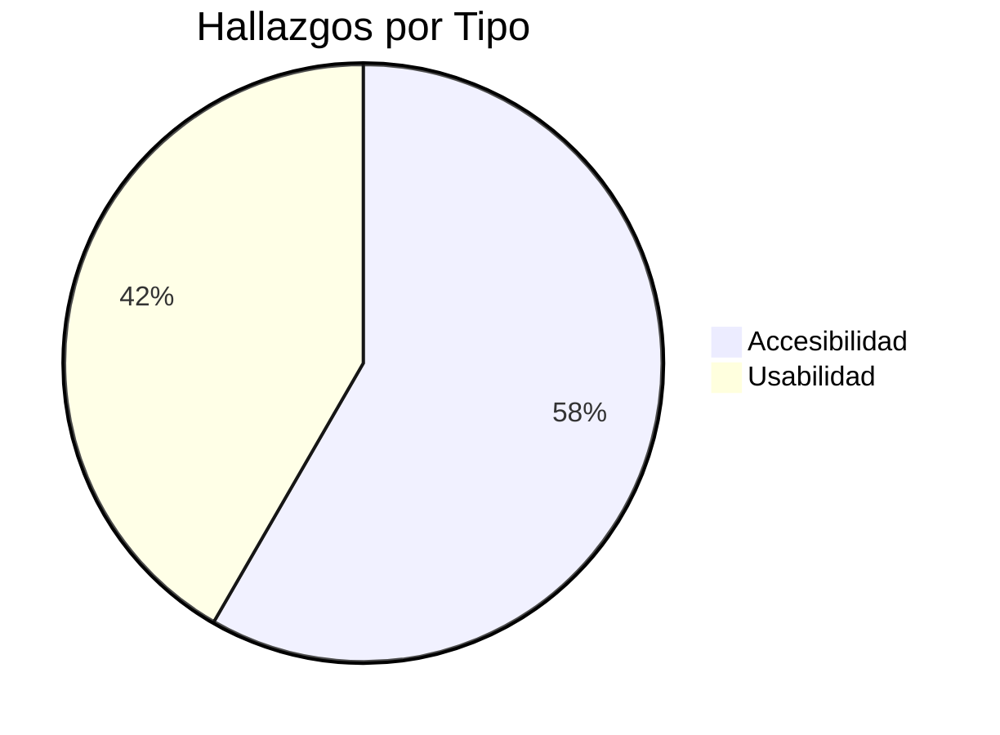
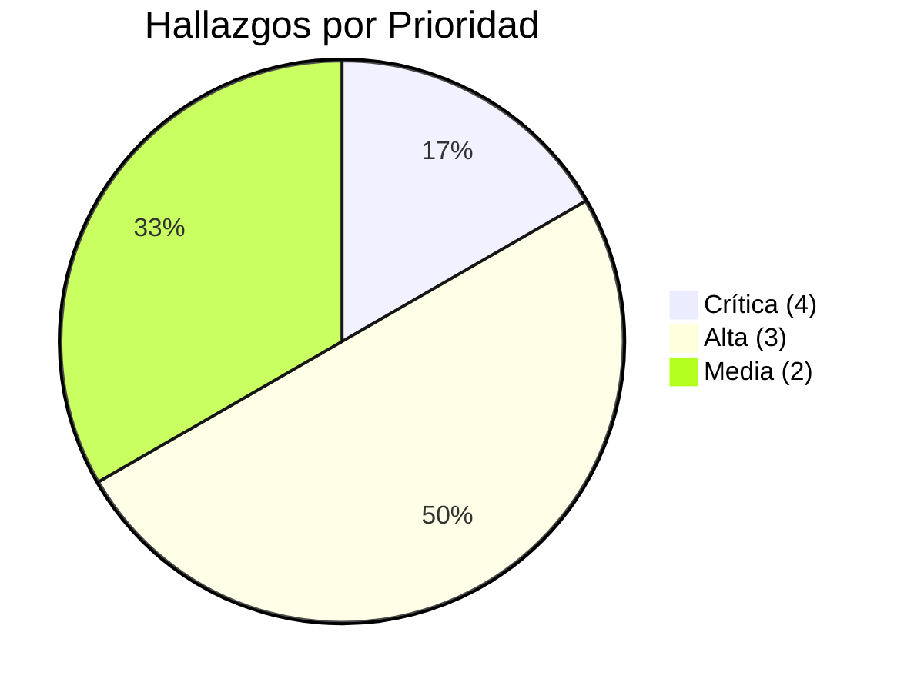

# Semana 9 — Evaluación del Diseño, Usabilidad y Accesibilidad
## Módulo 02: RBAC (Roles, Permisos y Protección de Rutas)

**Curso:** Análisis de Sistemas II (ASII) — 2026  
**Sistema:** Sistema Hospitalario Integrado (HIS)  
**Estudiante:** Luis David Aroche Contreras (`Luis890D`)  
**Rama de trabajo:** `feature/asii-02-rbac-roles-permisos-y-proteccion-de-rutas-luis890d`  
**Worktree actual:** `shi-documentacion-rbac-Luis-Aroche`  
**Puntaje:** 1 pto — Bloque Parcial 2  
**Estado:** ✅ **Completado**

---

## 1. Introducción

En esta semana se aplica un proceso formal de evaluación de usabilidad y accesibilidad sobre las vistas diseñadas en la Semana 8. Se utiliza el estándar **WCAG 2.1 Nivel AA (Web Content Accessibility Guidelines)** y los principios heurísticos de **Nielsen** para identificar hallazgos críticos y proponer mejoras concretas que incrementen la calidad del módulo RBAC para todos los usuarios del entorno hospitalario.

El contexto hospitalario impone requisitos adicionales de accesibilidad: personal con visión reducida, usuarios bajo presión temporal y personal que opera en entornos de baja iluminación.

---

## 2. Checklist de Usabilidad — Heurísticas de Nielsen

### Escala de Severidad
| Valor | Nivel | Descripción |
|:---:|---|---|
| 0 | Sin problema | No es un problema de usabilidad. |
| 1 | Cosmético | Solo se corrige si hay tiempo disponible. |
| 2 | Menor | Baja prioridad de corrección. |
| 3 | Mayor | Alta prioridad — afecta flujos frecuentes. |
| 4 | Catastrófico | Bloquea al usuario — corrección obligatoria. |

---

### 2.1. H1 — Visibilidad del Estado del Sistema

| # | Elemento evaluado | Cumple | Severidad | Hallazgo |
|:---:|---|:---:|:---:|---|
| 1.1 | ¿El sistema muestra un indicador cuando está cargando roles? | ✅ Sí | 0 | Skeleton loaders implementados en `RolesListView`. |
| 1.2 | ¿El sistema confirma que los permisos fueron guardados? | ✅ Sí | 0 | Toast de confirmación implementado. |
| 1.3 | ¿El usuario sabe en qué tenant está trabajando actualmente? | ⚠️ Parcial | 2 | El nombre del tenant aparece solo en el header; se pierde en vistas internas. |
| 1.4 | ¿Se indica cuántos usuarios tienen un rol afectado cuando se edita? | ❌ No | 3 | No se muestra conteo de usuarios afectados al editar permisos. |

**Mejoras Propuestas:**
- Agregar un banner persistente con el nombre del tenant activo en todas las vistas del módulo RBAC.
- Mostrar en la vista de edición de permisos: *"Este cambio afectará a 24 usuarios con este rol"*.

---

### 2.2. H2 — Coincidencia entre el Sistema y el Mundo Real

| # | Elemento evaluado | Cumple | Severidad | Hallazgo |
|:---:|---|:---:|:---:|---|
| 2.1 | ¿Los nombres de los permisos son comprensibles para el personal médico? | ⚠️ Parcial | 3 | Permisos técnicos como `emr.soap.write` son poco intuitivos para Admins no técnicos. |
| 2.2 | ¿Los módulos clínicos están nombrados como el personal los conoce? | ✅ Sí | 0 | Se usan nombres reales del hospital: "Expediente Médico", "Prescripciones", "Laboratorio". |
| 2.3 | ¿Los iconos usados son reconocibles en contexto hospitalario? | ✅ Sí | 0 | Se usan iconos médicos estándar (stethoscope, pill, microscope). |

**Mejoras Propuestas:**
- Agregar etiquetas amigables a los permisos: `emr.soap.write` → *"Escribir notas SOAP en expediente"*.
- Incluir tooltip descriptivo al pasar el cursor sobre cada permiso en la matriz.

---

### 2.3. H3 — Control y Libertad del Usuario

| # | Elemento evaluado | Cumple | Severidad | Hallazgo |
|:---:|---|:---:|:---:|---|
| 3.1 | ¿Puede el usuario cancelar la creación de un rol a mitad del formulario? | ✅ Sí | 0 | Botón "Cancelar" en el formulario. |
| 3.2 | ¿Existe un mecanismo de "deshacer" al eliminar un rol? | ❌ No | 3 | La eliminación es permanente sin posibilidad de deshacer. |
| 3.3 | ¿El usuario puede salir de la matriz de permisos sin guardar sin perder datos? | ⚠️ Parcial | 2 | No hay alerta de "cambios sin guardar" al intentar navegar fuera. |

**Mejoras Propuestas:**
- Implementar un período de gracia de eliminación suave (soft delete) de 30 segundos con opción "Deshacer".
- Agregar un guard de navegación: si hay cambios sin guardar en la matriz, mostrar modal de confirmación antes de abandonar la vista.

---

### 2.4. H4 — Consistencia y Estándares

| # | Elemento evaluado | Cumple | Severidad | Hallazgo |
|:---:|---|:---:|:---:|---|
| 4.1 | ¿Los botones de acción siguen el mismo patrón visual en todas las vistas? | ✅ Sí | 0 | Paleta de colores y tipografía consistente usando el sistema de diseño HIS. |
| 4.2 | ¿Las confirmaciones destructivas siguen el mismo patrón (modal + rojo)? | ✅ Sí | 0 | Todos los modales de eliminación son rojos con ícono de advertencia. |
| 4.3 | ¿Los mensajes de error tienen el mismo formato en todo el módulo? | ⚠️ Parcial | 2 | Los errores del formulario de creación usan estilo diferente al de los errores de la API. |

**Mejoras Propuestas:**
- Unificar el componente de error para que los errores de validación del frontend y los errores RFC 7807 de la API usen el mismo estilo visual.

---

### 2.5. H5 — Prevención de Errores

| # | Elemento evaluado | Cumple | Severidad | Hallazgo |
|:---:|---|:---:|:---:|---|
| 5.1 | ¿Se valida en tiempo real el nombre del rol para evitar duplicados? | ❌ No | 4 | El error de nombre duplicado solo aparece al guardar. |
| 5.2 | ¿Se advierte antes de dar acceso RBAC a un usuario no técnico? | ❌ No | 3 | No existe advertencia al asignar rol SuperAdmin. |
| 5.3 | ¿Los permisos de módulos del sistema están bloqueados para roles no sistema? | ✅ Sí | 0 | La fila de RBAC y Auditoría están bloqueadas visualmente. |

**Mejoras Propuestas:**
- Implementar validación asíncrona del nombre al escribir (debounce de 500ms + `GET /api/v1/rbac/roles?name=X&exists=1`).
- Agregar alerta al intentar asignar el rol SuperAdmin: *"¡Atención! Este usuario tendrá acceso total al sistema, incluyendo configuración de otros usuarios."*

---

## 3. Checklist de Accesibilidad — WCAG 2.1 Nivel AA

### 3.1. Percepción (Principio 1)

| Criterio | Descripción | Estado | Hallazgo |
|---|---|:---:|---|
| **1.1.1** — Contenido no textual | Todos los iconos tienen texto alternativo (`aria-label`). | ⚠️ Parcial | Los toggles de permisos no tienen `aria-label` descriptivo. |
| **1.3.1** — Información y relaciones | La estructura de la tabla de roles usa `<th scope="col">` correctamente. | ✅ | Tabla semántica implementada. |
| **1.3.3** — Características sensoriales | Las instrucciones no dependen solo del color. | ⚠️ Parcial | El estado ✅/❌ usa solo color; falta ícono adicional o texto para no videntes. |
| **1.4.1** — Uso del color | El color no es el único diferenciador de información importante. | ❌ | Los badges de roles solo se diferencian por color sin texto descriptivo del tipo. |
| **1.4.3** — Contraste (texto) | El contraste mínimo 4.5:1 se cumple en el texto principal. | ✅ | Contraste validado en modo claro (#1A1A2E sobre #F8FAFC = 12.5:1). |
| **1.4.4** — Cambio de tamaño de texto | La interfaz es usable al 200% de zoom sin pérdida de funcionalidad. | ⚠️ Parcial | La tabla de permisos a 200% de zoom pierde columnas sin scroll horizontal. |

### 3.2. Operabilidad (Principio 2)

| Criterio | Descripción | Estado | Hallazgo |
|---|---|:---:|---|
| **2.1.1** — Teclado | Toda la funcionalidad es operable con teclado. | ⚠️ Parcial | El toggle de permisos no es operable con tecla `Space` o `Enter`. |
| **2.1.2** — Sin trampa de teclado | El foco no queda atrapado en ningún componente. | ✅ | Los modales liberan el foco al cerrarse. |
| **2.4.1** — Evitar bloques | Existe un enlace "Saltar al contenido principal" (`skip to content`). | ❌ | No existe enlace de salto de navegación. |
| **2.4.3** — Orden de foco | El orden de tabulación es lógico y sigue el flujo visual. | ✅ | Orden de foco validado en `RoleFormView`. |
| **2.4.7** — Foco visible | El elemento con foco tiene un indicador visual claro. | ⚠️ Parcial | El ring de foco es demasiado delgado (1px) en algunos navegadores. |

### 3.3. Comprensibilidad (Principio 3)

| Criterio | Descripción | Estado | Hallazgo |
|---|---|:---:|---|
| **3.1.1** — Idioma de la página | El atributo `lang="es"` está definido en el HTML raíz. | ✅ | Configurado en el layout base de Vue. |
| **3.3.1** — Identificación de errores | Los errores de formulario describen el problema. | ⚠️ Parcial | Mensaje de error: "Campo requerido" no indica qué campo ni qué formato se espera. |
| **3.3.2** — Etiquetas e instrucciones | Todos los campos tienen `<label>` asociado correctamente. | ✅ | Labels vinculados con `for`/`id`. |

---

## 4. Matriz de Hallazgos y Plan de Mejoras

| # | Hallazgo | Tipo | Severidad | Prioridad | Acción de Mejora |
|:---:|---|:---:|:---:|:---:|---|
| H-01 | Toggle de permisos sin `aria-label` descriptivo | Accesibilidad | 3 | 🔴 Alta | Agregar `aria-label="Permiso: Crear Paciente — Activo/Inactivo"`. |
| H-02 | Badges de rol diferenciados solo por color | Accesibilidad | 3 | 🔴 Alta | Agregar texto del tipo de rol dentro o junto al badge. |
| H-03 | Toggle no operable con teclado | Accesibilidad | 4 | 🔴 Crítica | Implementar `role="switch"` + `aria-checked` en el componente toggle. |
| H-04 | Sin enlace "Saltar al contenido principal" | Accesibilidad | 2 | 🟡 Media | Agregar `<a href="#main-content" class="skip-link">` en el layout. |
| H-05 | Nombre de permiso técnico (`emr.soap.write`) | Usabilidad | 3 | 🔴 Alta | Agregar etiqueta amigable y tooltip descriptivo. |
| H-06 | No hay advertencia de "cambios sin guardar" | Usabilidad | 2 | 🟡 Media | Agregar `beforeRouteLeave` guard con modal de confirmación. |
| H-07 | Validación de nombre duplicado solo al guardar | Usabilidad | 4 | 🔴 Crítica | Validación asíncrona con debounce al escribir. |
| H-08 | Sin advertencia al asignar rol SuperAdmin | Usabilidad | 3 | 🔴 Alta | Modal de confirmación con descripción del nivel de acceso. |
| H-09 | Tenant activo no visible en vistas internas | Usabilidad | 2 | 🟡 Media | Banner persistente con nombre del tenant en el header de RBAC. |
| H-10 | Tabla de permisos no responsive a 200% zoom | Accesibilidad | 2 | 🟡 Media | Aplicar `overflow-x: auto` + scroll horizontal accesible. |
| H-11 | Ring de foco demasiado delgado | Accesibilidad | 2 | 🟡 Media | Aplicar `outline: 3px solid #2563EB; outline-offset: 2px;` en foco. |
| H-12 | Mensajes de error poco descriptivos | Usabilidad | 2 | 🟡 Media | Reemplazar "Campo requerido" por: *"El nombre del rol es obligatorio y debe ser único."* |

---

## 5. Estadísticas de la Evaluación

| Categoría | Total Criterios | ✅ Cumple | ⚠️ Parcial | ❌ No Cumple |
|---|:---:|:---:|:---:|:---:|
| Heurísticas Nielsen (5 seleccionadas) | 18 | 9 | 6 | 3 |
| WCAG 2.1 AA (criterios evaluados) | 12 | 5 | 5 | 2 |
| **Total** | **30** | **14 (47%)** | **11 (37%)** | **5 (17%)** |

---

## 6. Control de Cambios

| Versión | Fecha | Autor | Descripción |
|:---:|:---:|---|---|
| `v1.0.0` | 2026-09-14 | Luis David Aroche Contreras | Creación del documento de Evaluación de Usabilidad y Accesibilidad — Semana 9. |
