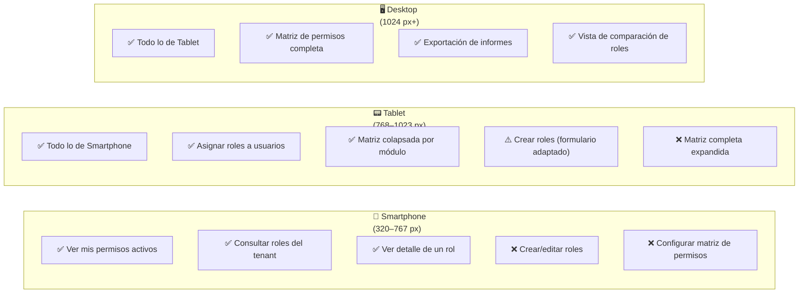

# Semana 10 — Diseño para Movilidad y Responsive
## Módulo 02: RBAC (Roles, Permisos y Protección de Rutas)

**Curso:** Análisis de Sistemas II (ASII) — 2026  
**Sistema:** Sistema Hospitalario Integrado (HIS)  
**Estudiante:** Luis David Aroche Contreras (`Luis890D`)  
**Rama de trabajo:** `feature/asii-02-rbac-roles-permisos-y-proteccion-de-rutas-luis890d`  
**Worktree actual:** `shi-documentacion-rbac-Luis-Aroche`  
**Puntaje:** 1 pto — Bloque Parcial 2  
**Estado:** ✅ **Completado**

---

## 1. Introducción y Contexto Hospitalario

El entorno hospitalario requiere que el módulo RBAC funcione correctamente en **múltiples tipos de dispositivos** que el personal clínico y administrativo utiliza en sus labores diarias:

- **Estaciones de trabajo desktop:** Usadas por Administradores de TI para configuración completa de roles y permisos.
- **Tablets clínicas (10–12"):** Usadas por Supervisores y Jefes de Enfermería para asignación rápida de roles al personal entrante.
- **Smartphones (5–6.7"):** Usados principalmente por el Auditor de Seguridad para consultas urgentes de acceso fuera de su estación.

El principio guía es **Mobile First** progresivo: el módulo debe ser **completamente funcional** en tablets y con las **funciones críticas de consulta** accesibles en smartphones.

---

## 2. Estrategia de Breakpoints Responsive

| Breakpoint | Dispositivo | Ancho | Funcionalidades Disponibles |
|---|---|:---:|---|
| **xs** — Smartphone S | 320 – 479 px | Solo lectura: consultar roles activos del usuario, ver mis permisos. |
| **sm** — Smartphone L | 480 – 767 px | + Consulta de roles del tenant y detalle de permisos. |
| **md** — Tablet (portrait) | 768 – 1023 px | + Asignación de roles a usuarios. Matriz de permisos colapsada por módulo. |
| **lg** — Tablet (landscape) / Desktop S | 1024 – 1279 px | + Matriz de permisos completa. Creación y edición de roles. |
| **xl** — Desktop Full | 1280 px+ | Experiencia completa de administración RBAC. Columnas extendidas. |

---

## 3. Mapeo de Funcionalidades por Dispositivo



---

## 4. Especificación de Layouts por Breakpoint

### 4.1. Smartphone (sm) — Vista: Mis Permisos

```text
╔═══════════════════════════════╗
║  ← HIS    🛡️ Mis Accesos    ║
║─────────────────────────────  ║
║  👤 Médico General            ║
║  🏥 Hospital San José         ║
║─────────────────────────────  ║
║  📋 Módulos con Acceso:       ║
║                               ║
║  ▸ Pacientes           →      ║
║  ▸ Expediente Médico   →      ║
║  ▸ Prescripciones      →      ║
║  ▸ Lab — Órdenes       →      ║
║─────────────────────────────  ║
║  [🔄 Actualizar permisos]     ║
╚═══════════════════════════════╝
```

**Comportamiento:**
- Lista vertical simple de módulos accesibles. Cada fila expande el detalle de permisos (CRUD).
- Un único botón de acción: "Actualizar permisos" que llama `GET /api/v1/auth/me/permissions`.
- Sin funcionalidades de edición en esta vista.

---

### 4.2. Smartphone (sm) — Vista: Lista de Roles

```text
╔═══════════════════════════════╗
║  ← Volver    📋 Roles        ║
║  [🔍 Buscar rol...]           ║
║─────────────────────────────  ║
║  🔵 Médico General            ║
║     18 permisos • 24 usuarios ║
║                        [→]   ║
║─────────────────────────────  ║
║  🟢 Enfermería                ║
║     12 permisos • 38 usuarios ║
║                        [→]   ║
║─────────────────────────────  ║
║  🟡 Recepcionista             ║
║     8 permisos • 15 usuarios  ║
║                        [→]   ║
║─────────────────────────────  ║
║                   [1] [2] →  ║
╚═══════════════════════════════╝
```

**Comportamiento:**
- Cards en lugar de tabla. Cada card muestra nombre, conteo de permisos y usuarios.
- Solo permite ver el detalle (tap en `→`). No hay botones de editar/eliminar en esta vista.
- Paginación simplificada.

---

### 4.3. Tablet Portrait (md) — Vista: Asignación de Roles a Usuario

```text
╔══════════════════════════════════════════╗
║  ← Volver    👥 Asignar Roles           ║
║  👤 Dr. Juan Pérez — Turno Emergencias  ║
║────────────────────────────────────────  ║
║  Roles Disponibles:                      ║
║  ☑️ Médico General                       ║
║  ☐  Médico Especialista                  ║
║  ☐  Auditor de Seguridad                 ║
║  ☐  Recepcionista                        ║
║────────────────────────────────────────  ║
║  Vista previa de permisos del rol:       ║
║  Médico General tiene acceso a:          ║
║  • Pacientes (Ver, Editar)               ║
║  • EMR (Ver, Crear, Editar)              ║
║  • Prescripciones (Ver, Crear)           ║
║────────────────────────────────────────  ║
║            [Cancelar]  [✅ Asignar]     ║
╚══════════════════════════════════════════╝
```

**Comportamiento:**
- Lista de checkboxes con selección múltiple de roles.
- Panel inferior con vista previa de permisos del rol seleccionado (se actualiza al seleccionar).
- Botones de acción fijos en la parte inferior de la pantalla.

---

### 4.4. Tablet Portrait (md) — Matriz de Permisos Colapsada

```text
╔══════════════════════════════════════════╗
║  🔐 Permisos: Médico General  [💾 Guardar]║
║────────────────────────────────────────  ║
║  ▼ Pacientes (2/5 activos)              ║
║    ✅ Ver    ❌ Crear  ✅ Editar         ║
║    ❌ Eliminar  —                        ║
║────────────────────────────────────────  ║
║  ▶ Expediente Médico (3/5 activos)      ║
║────────────────────────────────────────  ║
║  ▶ Prescripciones (3/5 activos)         ║
║────────────────────────────────────────  ║
║  ▶ Laboratorio (2/5 activos)            ║
║────────────────────────────────────────  ║
║  🔒 RBAC (0/5 — bloqueado)              ║
╚══════════════════════════════════════════╝
```

**Comportamiento:**
- Cada módulo clínico es un **acordeón colapsable**. Por defecto, solo el primero está expandido.
- El conteo `(2/5 activos)` muestra el estado del módulo sin expandir.
- Los módulos protegidos del sistema se muestran con candado y no son expandibles.

---

### 4.5. Desktop (xl) — Matriz de Permisos Completa

```text
╔══════════════════════════════════════════════════════════════════════╗
║  🔐 Permisos del Rol: Médico General                [💾 Guardar]   ║
╠══════════════════════════════════════════════════════════════════════╣
║  Módulo              │ Ver  │ Crear │ Editar │ Elim. │ Validar     ║
║ ─────────────────────┼──────┼───────┼────────┼───────┼──────────── ║
║  📋 Pacientes        │  ✅  │  ❌   │   ✅   │   ❌  │   —         ║
║  📝 Exp. Médico      │  ✅  │  ✅   │   ✅   │   ❌  │   —         ║
║  💊 Prescripciones   │  ✅  │  ✅   │   ✅   │   ❌  │   —         ║
║  🔬 Lab — Órdenes    │  ✅  │  ✅   │   ❌   │   ❌  │   —         ║
║  🔬 Lab — Results    │  ✅  │  ❌   │   ❌   │   ❌  │   ❌        ║
║  🏨 Admisión         │  ✅  │  ❌   │   ❌   │   ❌  │   —         ║
║  🛡️ RBAC             │  🔒  │  🔒   │   🔒   │   🔒  │   —         ║
╠══════════════════════════════════════════════════════════════════════╣
║  Total: 18/48 permisos activos                 [Selec. todos] [Limpiar]║
╚══════════════════════════════════════════════════════════════════════╝
```

---

## 5. Escenarios Móviles Críticos

| # | Escenario | Dispositivo | Flujo Esperado |
|:---:|---|:---:|---|
| E-01 | Supervisor revisa roles de personal entrante en turno nocturno | Tablet 10" | Lista de usuarios → Detalle → Asignar Rol → Confirmar. Flujo máximo 4 taps. |
| E-02 | Auditor consulta qué permisos tiene un médico desde su celular | Smartphone | Busca usuario → Ver detalle → Ver permisos activos. Solo lectura, máximo 3 taps. |
| E-03 | Admin actualiza permisos de un rol desde tablet en una reunión | Tablet 12" | Roles → Seleccionar rol → Matriz colapsada → Expandir módulo → Toggle → Guardar. |
| E-04 | Personal médico verifica sus propios accesos antes de iniciar guardia | Smartphone | Login → Mis Accesos. Máximo 2 taps. |
| E-05 | Admin revoca acceso de emergencia desde móvil | Smartphone | Usuarios → Búsqueda → Usuario → Revocar. Confirmación con modal. |

---

## 6. Reglas de Diseño Responsive para RBAC

### 6.1. Tablas Responsivas
- En móviles, la tabla de roles se convierte en **cards verticales**.
- En tablets, la tabla mantiene las columnas críticas (Nombre, Permisos, Usuarios, Acciones).
- La columna "Tipo" se oculta en tablet portrait (`hidden md:table-cell`).

### 6.2. Navegación Adaptativa
```text
Desktop:   [Dashboard] [Roles] [Permisos] [Usuarios] [Auditoría]   ← sidebar fija
Tablet:    [☰ Menú] + bottom navigation para secciones principales
Smartphone: [☰ Menú hamburguesa] + bottom bar con íconos (max 4 items)
```

### 6.3. Acciones Táctiles
- Todos los botones táctiles tienen mínimo `44 × 44 px` de área de toque (WCAG 2.5.5).
- Los toggles de permisos en tablet tienen mínimo `48 × 48 px`.
- Las filas de tabla son seleccionables con `min-height: 56px` en tablet.

### 6.4. Formularios en Móvil
- Un campo por línea en smartphones.
- El teclado virtual no oculta el botón de guardar (campo scrollable).
- El selector de roles usa `<select>` nativo en móvil por mejor compatibilidad táctil.

---

## 7. Control de Cambios

| Versión | Fecha | Autor | Descripción |
|:---:|:---:|---|---|
| `v1.0.0` | 2026-09-14 | Luis David Aroche Contreras | Creación del documento de Diseño para Movilidad — Semana 10. |
