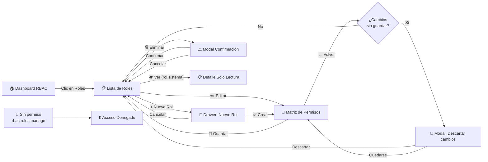

# Semana 11 — Mockups y Prototipo Navegable
## Módulo 02: RBAC (Roles, Permisos y Protección de Rutas)

**Curso:** Análisis de Sistemas II (ASII) — 2026  
**Sistema:** Sistema Hospitalario Integrado (HIS)  
**Estudiante:** Luis David Aroche Contreras (`Luis890D`)  
**Rama de trabajo:** `feature/asii-02-rbac-roles-permisos-y-proteccion-de-rutas-luis890d`  
**Worktree actual:** `shi-documentacion-rbac-Luis-Aroche`  
**Puntaje:** 2 pts — Bloque Parcial 2  
**Estado:** ✅ **Completado**

---

## 1. Introducción

En esta semana se consolida el **prototipo de alta fidelidad** del módulo RBAC, integrando todas las decisiones de diseño tomadas en las semanas 8, 9 y 10. El prototipo es navegable e incluye las pantallas principales con todos los estados del sistema (carga, vacío, error, éxito), para desktop y para tablet.

Las pantallas han sido diseñadas siguiendo el **sistema de diseño del HIS** con los siguientes tokens:

| Token | Valor |
|---|---|
| Fuente principal | Inter (Google Fonts) |
| Color primario | `#2563EB` (Azul médico) |
| Color peligro | `#DC2626` (Rojo alerta) |
| Color éxito | `#16A34A` (Verde confirmación) |
| Color fondo | `#F8FAFC` |
| Color superficie | `#FFFFFF` |
| Color texto principal | `#0F172A` |
| Radio de borde | `8px` componentes, `12px` cards |
| Sombra de card | `0 1px 3px rgba(0,0,0,0.1)` |

---

## 2. Guía Visual de Componentes UI Reutilizables

### 2.1. Sistema de Badges de Roles

```text
Tipos de badges según categoría del rol:
┌─────────────────────────────────────────────────┐
│  [🔴 SuperAdmin]    bg: #FEE2E2  text: #991B1B  │
│  [🔵 Médico]        bg: #DBEAFE  text: #1E40AF  │
│  [🟢 Enfermería]    bg: #DCFCE7  text: #166534  │
│  [🟡 Admisión]      bg: #FEF9C3  text: #854D0E  │
│  [⚫ Auditor]       bg: #F1F5F9  text: #475569  │
│  [🟣 Especialista]  bg: #F3E8FF  text: #6B21A8  │
└─────────────────────────────────────────────────┘
Tamaño: 6px 12px padding, 9999px border-radius, 11px font-size bold
```

### 2.2. Toggle de Permiso (`PermissionToggle.vue`)

```text
Estado ACTIVO:                      Estado INACTIVO:
┌──────────────┐                   ┌──────────────┐
│ ●────────── │  bg: #2563EB      │ ──────────●  │  bg: #E2E8F0
│  Permiso ON  │  circle: blanco   │  Permiso OFF  │  circle: gris
└──────────────┘                   └──────────────┘
Tamaño: 44x24px, transition: 200ms ease-in-out
aria-role="switch" aria-checked="true/false"
```

### 2.3. Notificación Toast

```text
┌───────────────────────────────────────────────────┐
│  ✅  Permisos actualizados correctamente           │
│      El cambio es efectivo de inmediato.     [×]  │
└───────────────────────────────────────────────────┘
Posición: fixed bottom-right, margin: 16px
bg: #F0FDF4, border-left: 4px solid #16A34A
Duración: 4 segundos, fade-out: 300ms
```

### 2.4. Estado Vacío

```text
           ┌─────────────────────────────┐
           │                             │
           │    🛡️  (ilustración)         │
           │                             │
           │  No hay roles configurados  │
           │  en este hospital todavía.  │
           │                             │
           │  [+ Crear primer rol]       │
           │                             │
           └─────────────────────────────┘
```

### 2.5. Estado de Error de Red

```text
┌──────────────────────────────────────────────────┐
│  ⚠️  No se pudo cargar la información            │
│  Verifica tu conexión a red e intenta de nuevo.  │
│                                 [🔄 Reintentar]  │
└──────────────────────────────────────────────────┘
bg: #FEF2F2, border: 1px solid #FECACA, text: #991B1B
```

---

## 3. Prototipo — Pantallas Desktop

### PANTALLA 1 — Dashboard Principal RBAC

```text
╔════════════════════════════════════════════════════════════════════════╗
║  🏥 HIS — Sistema Hospitalario Integrado    [Hospital San José ▾]  [👤]║
╠════════════════╦═══════════════════════════════════════════════════════╣
║                ║  🛡️ Módulo RBAC — Panel de Control                    ║
║  📋 Dashboard  ║ ─────────────────────────────────────────────────────║
║  🛡️ RBAC ◀    ║  Resumen del Tenant: Hospital San José               ║
║  ─────────── ║                                                         ║
║  👥 Usuarios  ║  ┌──────────┐  ┌──────────┐  ┌──────────┐  ┌───────┐ ║
║  📝 EMR       ║  │  5       │  │  48      │  │  82      │  │ 100%  │ ║
║  💊 Prescr.   ║  │ Roles    │  │ Permisos │  │ Usuarios │  │Caché  │ ║
║  🔬 Laborat.  ║  │activos   │  │definidos │  │  con rol │  │Redis  │ ║
║  🏨 Admisión  ║  └──────────┘  └──────────┘  └──────────┘  └───────┘ ║
║  📊 Auditoría ║ ─────────────────────────────────────────────────────║
║               ║  Roles Recientes:                  [Ver todos →]      ║
║  ──────────── ║  🔵 Médico General • 24 usuarios • ✅ Activo           ║
║  🔴 Cerrar    ║  🟢 Enfermería     • 38 usuarios • ✅ Activo           ║
╚════════════════╩═══════════════════════════════════════════════════════╝
```

---

### PANTALLA 2 — Lista de Roles (estado cargado)

```text
╔════════════════════════════════════════════════════════════════════════╗
║  🏥 HIS — Sistema Hospitalario    [Hospital San José ▾]           [👤]║
╠════════════════╦═══════════════════════════════════════════════════════╣
║                ║  🛡️ Gestión de Roles                   [+ Nuevo Rol] ║
║  📋 Dashboard  ║ ─────────────────────────────────────────────────────║
║  🛡️ RBAC ◀    ║  [🔍 Buscar rol...]      [Tipo: Todos ▾]  [Estado ▾]  ║
║  ─────────── ║ ─────────────────────────────────────────────────────║
║  👥 Usuarios  ║  Nombre del Rol   │ Permisos │Usuarios│  Tipo  │Acciones║
║  📝 EMR       ║ ──────────────────┼──────────┼────────┼────────┼─────  ║
║  💊 Prescr.   ║  [🔴 SuperAdmin]  │    48    │   2    │Sistema │ 👁️     ║
║  🔬 Laborat.  ║  [🔵 Médico Gral] │    18    │  24    │Custom  │ ✏️ 🗑️   ║
║  🏨 Admisión  ║  [🟢 Enfermería]  │    12    │  38    │Custom  │ ✏️ 🗑️   ║
║  📊 Auditoría ║  [🟡 Recepción]   │     8    │  15    │Custom  │ ✏️ 🗑️   ║
║               ║  [⚫ Auditor]     │     3    │   1    │Custom  │ ✏️ 🗑️   ║
║  ──────────── ║ ─────────────────────────────────────────────────────║
║  🔴 Cerrar    ║  5 roles totales           [← 1 →]                   ║
╚════════════════╩═══════════════════════════════════════════════════════╝
```

---

### PANTALLA 3 — Formulario de Nuevo Rol (Drawer lateral)

```text
╔══════════════════════════════════════════════════════════╦═══════════╗
║  [Pantalla de Lista de Roles — atenuada al fondo]        ║ NUEVO ROL ║
║                                                          ║──────────║
║                                                          ║ Nombre * ║
║                                                          ║ [Médico  ║
║                                                          ║  Urgen.] ║
║                                                          ║ ⚠ Validando...║
║                                                          ║──────────║
║                                                          ║ Descripción║
║                                                          ║ [        ║
║                                                          ║          ║
║                                                          ║          ]║
║                                                          ║──────────║
║                                                          ║ Tipo     ║
║                                                          ║ ○ Custom ║
║                                                          ║ ○ Sistema║
║                                                          ║──────────║
║                                                          ║[Cancelar]║
║                                                          ║[✅ Crear] ║
╚══════════════════════════════════════════════════════════╩═══════════╝
```

**Estado de error — nombre duplicado:**
```text
║ Nombre *                                                 ║
║ [Médico General                    ]  🔴                  ║
║  ⚠ "Este nombre ya existe en el tenant. Elige otro."      ║
```

---

### PANTALLA 4 — Matriz de Permisos (Desktop)

```text
╔════════════════════════════════════════════════════════════════════════╗
║  ← Volver a Roles   🔐 Permisos: Médico General           [💾 Guardar]║
║  ⓘ Este cambio afectará a 24 usuarios con este rol.                   ║
╠════════════════════════════════════════════════════════════════════════╣
║  Módulo Clínico       │  Ver   │ Crear  │ Editar │  Elim. │ Validar  ║
║ ──────────────────────┼────────┼────────┼────────┼────────┼────────  ║
║  📋 Pacientes         │  [✅]  │  [❌]  │  [✅]  │  [❌]  │   —      ║
║  📝 Exp. Médico       │  [✅]  │  [✅]  │  [✅]  │  [❌]  │   —      ║
║  💊 Prescripciones    │  [✅]  │  [✅]  │  [✅]  │  [❌]  │   —      ║
║  🔬 Lab — Órdenes     │  [✅]  │  [✅]  │  [❌]  │  [❌]  │   —      ║
║  🔬 Lab — Resultados  │  [✅]  │  [❌]  │  [❌]  │  [❌]  │  [❌]    ║
║  🏨 Admisión          │  [✅]  │  [❌]  │  [❌]  │  [❌]  │   —      ║
║  🛡️ RBAC              │  [🔒]  │  [🔒]  │  [🔒]  │  [🔒]  │   —      ║
║  📊 Auditoría         │  [🔒]  │  [🔒]  │  [🔒]  │  [🔒]  │   —      ║
╠════════════════════════════════════════════════════════════════════════╣
║  18 / 48 permisos activos          [✅ Selec. todo] [❌ Limpiar todo] ║
╚════════════════════════════════════════════════════════════════════════╝
```

---

### PANTALLA 5 — Acceso Denegado

```text
╔════════════════════════════════════════════════════════════════════════╗
║  🏥 HIS — Sistema Hospitalario                                    [👤]║
╠════════════════════════════════════════════════════════════════════════╣
║                                                                        ║
║                      🔒                                               ║
║              Acceso no autorizado                                      ║
║                                                                        ║
║    No tienes permisos para acceder a esta sección.                     ║
║    Si crees que esto es un error, contacta al administrador            ║
║    del sistema hospitalario.                                           ║
║                                                                        ║
║           [← Volver al Dashboard]   [📧 Contactar Admin]              ║
║                                                                        ║
╚════════════════════════════════════════════════════════════════════════╝
```

---

## 4. Prototipo — Pantallas Tablet

### PANTALLA T1 — Lista de Roles en Tablet (Portrait)

```text
╔══════════════════════════════════════════════╗
║  ☰  🛡️ Gestión de Roles    [+ Nuevo Rol]   ║
║  [🔍 Buscar rol...]                          ║
╠══════════════════════════════════════════════╣
║  [🔴 SuperAdmin]                             ║
║  48 permisos • 2 usuarios • Sistema          ║
║  ──────────────────────────────  [👁️ Ver →]  ║
║                                              ║
║  [🔵 Médico General]                         ║
║  18 permisos • 24 usuarios • Custom          ║
║  ──────────────────────────────  [✏️] [🗑️]   ║
║                                              ║
║  [🟢 Enfermería]                             ║
║  12 permisos • 38 usuarios • Custom          ║
║  ──────────────────────────────  [✏️] [🗑️]   ║
║                                              ║
║  [🟡 Recepcionista]                          ║
║  8 permisos • 15 usuarios • Custom           ║
║  ──────────────────────────────  [✏️] [🗑️]   ║
╠══════════════════════════════════════════════╣
║  📋  🛡️  👥  📊                             ║
╚══════════════════════════════════════════════╝
```

---

### PANTALLA T2 — Matriz Colapsada en Tablet

```text
╔══════════════════════════════════════════════╗
║  ← Roles   🔐 Médico General  [💾 Guardar]  ║
╠══════════════════════════════════════════════╣
║  ⓘ Cambio afectará a 24 usuarios            ║
║ ────────────────────────────────────────── ║
║  ▼ Pacientes (2/5 activos)                  ║
║  ┌──────────────────────────────────────┐   ║
║  │ Ver  [✅]  Crear [❌]  Editar [✅]   │   ║
║  │ Elim [❌]                            │   ║
║  └──────────────────────────────────────┘   ║
║ ────────────────────────────────────────── ║
║  ▶ Exp. Médico (3/5 activos)                ║
║ ────────────────────────────────────────── ║
║  ▶ Prescripciones (3/5 activos)             ║
║ ────────────────────────────────────────── ║
║  ▶ Lab — Órdenes (2/5 activos)              ║
║ ────────────────────────────────────────── ║
║  🔒 RBAC (bloqueado — solo SuperAdmin)      ║
╠══════════════════════════════════════════════╣
║  📋  🛡️  👥  📊                             ║
╚══════════════════════════════════════════════╝
```

---

## 5. Flujo de Navegación del Prototipo



---

## 6. Especificación de Micro-Animaciones

| Elemento | Animación | Duración | Efecto |
|---|---|:---:|---|
| Drawer "Nuevo Rol" | Slide desde la derecha | 250ms | `translateX(100%) → translateX(0)` |
| Modal de confirmación | Fade + scale | 200ms | `opacity: 0 scale(0.95) → 1` |
| Toast de éxito | Slide desde abajo + fade out | Entrada: 300ms / Salida: 300ms | Entra por debajo, desaparece en 4s |
| Toggle de permiso | Transición del thumb | 200ms | `ease-in-out` |
| Skeleton loaders | Shimmer | Loop continuo | `background-position: -200% → 200%` |
| Acordeón de módulo | Height y opacity | 200ms | `max-height: 0 → max-height: 200px` |
| Badge de rol | Hover scale | 150ms | `scale(1) → scale(1.05)` |

---

## 7. Checklist de Entregables del Prototipo

- [x] Pantallas desktop diseñadas (Dashboard, Lista, Formulario, Matriz, Acceso Denegado).
- [x] Pantallas tablet diseñadas (Lista cards, Matriz colapsada, Asignación de roles).
- [x] Wireframes de smartphone incluidos en Semana 10.
- [x] Todos los estados del sistema documentados (cargando, vacío, error, éxito).
- [x] Sistema de diseño de tokens documentado.
- [x] Componentes reutilizables especificados (`RoleBadge`, `PermissionToggle`, `Toast`, `EmptyState`, `AccessDeniedAlert`).
- [x] Flujo de navegación del prototipo diagramado en Mermaid.
- [x] Micro-animaciones especificadas con duración y tipo de transición.
- [x] Mejoras de accesibilidad de Semana 9 integradas en el prototipo.
- [x] Mejoras de responsive de Semana 10 integradas.

---

## 8. Control de Cambios

| Versión | Fecha | Autor | Descripción |
|:---:|:---:|---|---|
| `v1.0.0` | 2026-09-14 | Luis David Aroche Contreras | Creación del documento de Mockups y Prototipo Navegable — Semana 11. |
